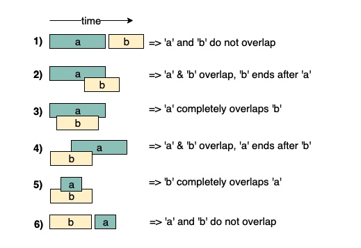
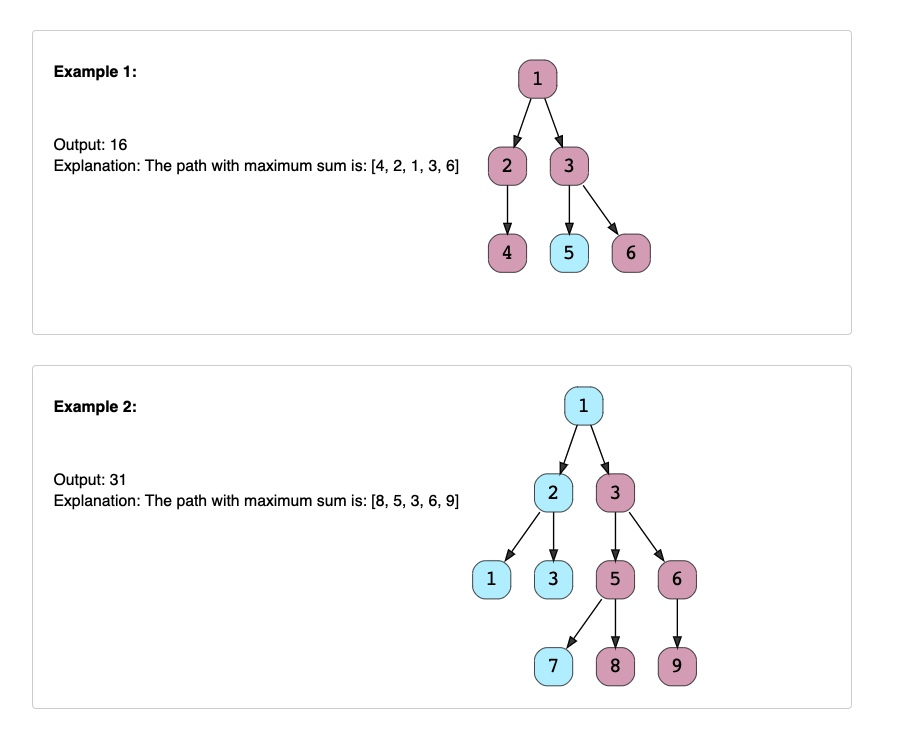
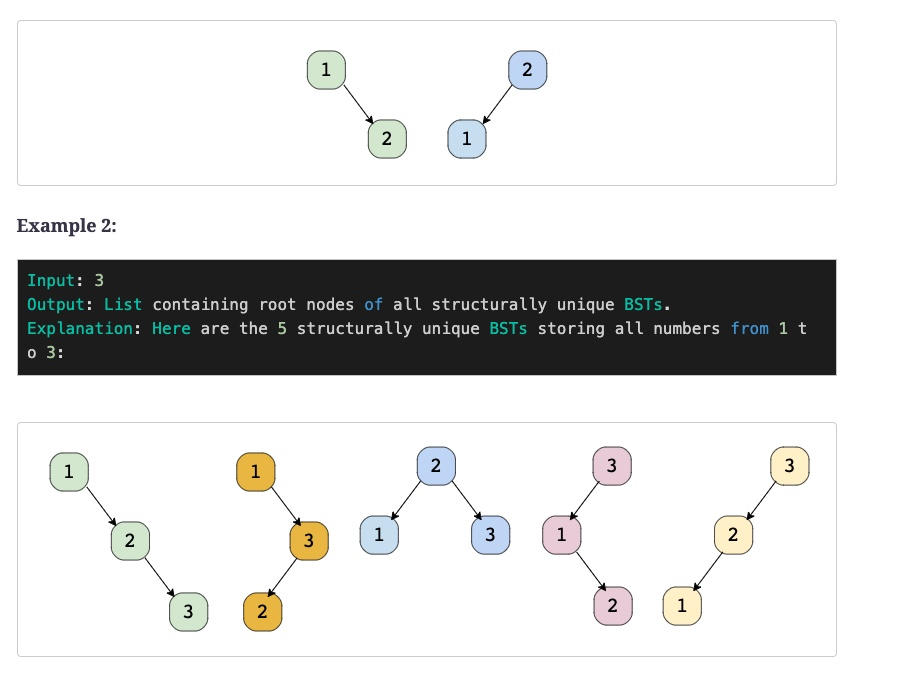

# Coding Problem Patterns

1. 16 patterns of problem
   1. Sliding Window
   2. Two Pointer
   3. Fast and Slow Pointers
   4. Mege Intervals
   5. Cyclic Sort
   6. In-Place reversal of LinkedList
   7. BFS
   8. DFS
   9. Two heaps
   10. Combinations and Permutations
   11. Binary Search
   12. Bitwise XOR
   13. Top K elements
   14. Merge sorted lists
   15. 0/1 knapsack problem
   16. Topological Sort

## Sliding Window

Contiguous subarrays or substring computation

1. Window Average
   1. Given an array, find the average of all contiguous subarrays of size ‘K’ in it.

    ```java
    import java.util.Arrays;

    class AverageOfSubarrayOfSizeK {
    public static double[] findAverages(int K, int[] arr) {
        double[] result = new double[arr.length - K + 1];
        double windowSum = 0;
        int windowStart = 0;
        for (int windowEnd = 0; windowEnd < arr.length; windowEnd++) {
            windowSum += arr[windowEnd]; // add the next element
            // slide the window, we don't need to slide if we've not hit the required window size of 'k'
            if (windowEnd >= K - 1) {
                result[windowStart] = windowSum / K; // calculate the average
                windowSum -= arr[windowStart]; // subtract the element going out
                windowStart++; // slide the window ahead
            }
        }

        return result;
    }

    public static void main(String[] args) {
        double[] result = AverageOfSubarrayOfSizeK.findAverages(5, new int[] { 1, 3, 2, 6, -1, 4, 1, 8, 2 });
        System.out.println("Averages of subarrays of size K: " + Arrays.toString(result));
    }
    }
    ```

2. Maximum Sum Subarray of Size K (easy)
    1. Given an array of positive numbers and a positive number ‘k,’ find the maximum sum of any contiguous subarray of size ‘k’.

    ```java
    class MaxSumSubArrayOfSizeK {
        public static int findMaxSumSubArray(int k, int[] arr) {
            int windowSum = 0, maxSum = 0;
            int windowStart = 0;
            for (int windowEnd = 0; windowEnd < arr.length; windowEnd++) {
                windowSum += arr[windowEnd]; // add the next element
                // slide the window, we don't need to slide if we've not hit the required window size of 'k'
                if (windowEnd >= k - 1) {
                    maxSum = Math.max(maxSum, windowSum);
                    windowSum -= arr[windowStart]; // subtract the element going out
                    windowStart++; // slide the window ahead
                }
            }

            return maxSum;
        }

        public static void main(String[] args) {
            System.out.println("Maximum sum of a subarray of size K: "
                + MaxSumSubArrayOfSizeK.findMaxSumSubArray(3, new int[] { 2, 1, 5, 1, 3, 2 }));
            System.out.println("Maximum sum of a subarray of size K: "
                + MaxSumSubArrayOfSizeK.findMaxSumSubArray(2, new int[] { 2, 3, 4, 1, 5 }));
        }
    }
    ```

3. Smallest Subarray with a given sum (easy)
   1. Given an array of positive numbers and a positive number ‘S,’ find the length of the smallest contiguous subarray whose sum is greater than or equal to ‘S’. Return 0 if no such subarray exists.

    ```java
    class MinSizeSubArraySum {
        public static int findMinSubArray(int S, int[] arr) {
            int windowSum = 0, minLength = Integer.MAX_VALUE;
            int windowStart = 0;
            for (int windowEnd = 0; windowEnd < arr.length; windowEnd++) {
                windowSum += arr[windowEnd]; // add the next element
                // shrink the window as small as possible until the 'windowSum' is smaller than 'S'
                while (windowSum >= S) {
                    minLength = Math.min(minLength, windowEnd - windowStart + 1);
                    windowSum -= arr[windowStart]; // subtract the element going out
                    windowStart++; // slide the window ahead
                }
            }

            return minLength == Integer.MAX_VALUE ? 0 : minLength;
        }

        public static void main(String[] args) {
            int result = MinSizeSubArraySum.findMinSubArray(7, new int[] { 2, 1, 5, 2, 3, 2 });
            System.out.println("Smallest subarray length: " + result);
            result = MinSizeSubArraySum.findMinSubArray(7, new int[] { 2, 1, 5, 2, 8 });
            System.out.println("Smallest subarray length: " + result);
            result = MinSizeSubArraySum.findMinSubArray(8, new int[] { 3, 4, 1, 1, 6 });
            System.out.println("Smallest subarray length: " + result);
        }
    }

    ```

4. Longest Substring with K Distinct Characters (medium)
   1. Given a string, find the length of the longest substring in it with no more than K distinct characters.
   2. You can assume that K is less than or equal to the length of the given string.

    ```java
    class LongestSubstringKDistinct {
        public static int findLength(String str, int k) {
            if (str == null || str.length() == 0 || str.length() < k)
            throw new IllegalArgumentException();

            int windowStart = 0, maxLength = 0;
            Map<Character, Integer> charFrequencyMap = new HashMap<>();
            // in the following loop we'll try to extend the range [windowStart, windowEnd]
            for (int windowEnd = 0; windowEnd < str.length(); windowEnd++) {
                char rightChar = str.charAt(windowEnd);
                charFrequencyMap.put(rightChar, charFrequencyMap.getOrDefault(rightChar, 0) + 1);
                // shrink the sliding window, until we are left with 'k' distinct characters in the frequency map
                while (charFrequencyMap.size() > k) {
                    char leftChar = str.charAt(windowStart);
                    charFrequencyMap.put(leftChar, charFrequencyMap.get(leftChar) - 1);
                    if (charFrequencyMap.get(leftChar) == 0) {
                        charFrequencyMap.remove(leftChar);
                    }
                    windowStart++; // shrink the window
                }
                maxLength = Math.max(maxLength, windowEnd - windowStart + 1); // remember the maximum length so far
            }

            return maxLength;
        }

        public static void main(String[] args) {
            System.out.println("Length of the longest substring: " + LongestSubstringKDistinct.findLength("araaci", 2));
            System.out.println("Length of the longest substring: " + LongestSubstringKDistinct.findLength("araaci", 1));
            System.out.println("Length of the longest substring: " + LongestSubstringKDistinct.findLength("cbbebi", 3));
        }
    }

    ```

5. Fruits into Baskets (medium)
   1. Given an array of characters where each character represents a fruit tree, you are given two baskets, and your goal is to put maximum number of fruits in each basket. The only restriction is that each basket can have only one type of fruit.
   2. You can start with any tree, but you can’t skip a tree once you have started. You will pick one fruit from each tree until you cannot, i.e., you will stop when you have to pick from a third fruit type.
   3. Write a function to return the maximum number of fruits in both baskets.

    ```java
    class MaxFruitCountOf2Types {
        public static int findLength(char[] arr) {
            int windowStart = 0, maxLength = 0;
            Map<Character, Integer> fruitFrequencyMap = new HashMap<>();
            // try to extend the range [windowStart, windowEnd]
            for (int windowEnd = 0; windowEnd < arr.length; windowEnd++) {
                fruitFrequencyMap.put(arr[windowEnd], fruitFrequencyMap.getOrDefault(arr[windowEnd], 0) + 1);
                // shrink the sliding window, until we are left with '2' fruits in the frequency map
                while (fruitFrequencyMap.size() > 2) {
                    fruitFrequencyMap.put(arr[windowStart], fruitFrequencyMap.get(arr[windowStart]) - 1);
                    if (fruitFrequencyMap.get(arr[windowStart]) == 0) {
                    fruitFrequencyMap.remove(arr[windowStart]);
                    }
                    windowStart++; // shrink the window
                }
                maxLength = Math.max(maxLength, windowEnd - windowStart + 1);
            }

            return maxLength;
        }

        public static void main(String[] args) {
            System.out.println("Maximum number of fruits: " + 
                                MaxFruitCountOf2Types.findLength(new char[] { 'A', 'B', 'C', 'A', 'C' }));
            System.out.println("Maximum number of fruits: " + 
                                MaxFruitCountOf2Types.findLength(new char[] { 'A', 'B', 'C', 'B', 'B', 'C' }));
        }
    }
    ```

6. No-repeat Substring (hard)
   1. Given a string, find the length of the longest substring, which has no repeating characters.

    ```java
    class NoRepeatSubstring {
        public static int findLength(String str) {
            int windowStart = 0, maxLength = 0;
            Map<Character, Integer> charIndexMap = new HashMap<>();
            // try to extend the range [windowStart, windowEnd]
            for (int windowEnd = 0; windowEnd < str.length(); windowEnd++) {
                char rightChar = str.charAt(windowEnd);
                // if the map already contains the 'rightChar', shrink the window from the beginning so that
                // we have only one occurrence of 'rightChar'
                if (charIndexMap.containsKey(rightChar)) {
                    // this is tricky; in the current window, we will not have any 'rightChar' after its previous index
                    // and if 'windowStart' is already ahead of the last index of 'rightChar', we'll keep 'windowStart'
                    windowStart = Math.max(windowStart, charIndexMap.get(rightChar) + 1);
                }
                charIndexMap.put(rightChar, windowEnd); // insert the 'rightChar' into the map
                maxLength = Math.max(maxLength, windowEnd - windowStart + 1); // remember the maximum length so far
            }

            return maxLength;
        }

        public static void main(String[] args) {
            System.out.println("Length of the longest substring: " + NoRepeatSubstring.findLength("aabccbb"));
            System.out.println("Length of the longest substring: " + NoRepeatSubstring.findLength("abbbb"));
            System.out.println("Length of the longest substring: " + NoRepeatSubstring.findLength("abccde"));
        }
    }
    ```

7. Longest Substring with Same Letters after Replacement (hard)
   1. Given a string with lowercase letters only, if you are allowed to replace no more than ‘k’ letters with any letter, find the length of the longest substring having the same letters after replacement.

    ```java
    class CharacterReplacement {
        public static int findLength(String str, int k) {
            int windowStart = 0, maxLength = 0, maxRepeatLetterCount = 0;
            Map<Character, Integer> letterFrequencyMap = new HashMap<>();
            // try to extend the range [windowStart, windowEnd]
            for (int windowEnd = 0; windowEnd < str.length(); windowEnd++) {
                char rightChar = str.charAt(windowEnd);
                letterFrequencyMap.put(rightChar, letterFrequencyMap.getOrDefault(rightChar, 0) + 1);
                maxRepeatLetterCount = Math.max(maxRepeatLetterCount, letterFrequencyMap.get(rightChar));

                // current window size is from windowStart to windowEnd, overall we have a letter which is
                // repeating 'maxRepeatLetterCount' times, this means we can have a window which has one letter 
                // repeating 'maxRepeatLetterCount' times and the remaining letters we should replace.
                // if the remaining letters are more than 'k', it is the time to shrink the window as we
                // are not allowed to replace more than 'k' letters
                if (windowEnd - windowStart + 1 - maxRepeatLetterCount > k) {
                    char leftChar = str.charAt(windowStart);
                    letterFrequencyMap.put(leftChar, letterFrequencyMap.get(leftChar) - 1);
                    windowStart++;
                }

                maxLength = Math.max(maxLength, windowEnd - windowStart + 1);
            }

            return maxLength;
        }

        public static void main(String[] args) {
            System.out.println(CharacterReplacement.findLength("aabccbb", 2));
            System.out.println(CharacterReplacement.findLength("abbcb", 1));
            System.out.println(CharacterReplacement.findLength("abccde", 1));
        }
    }
    ```

8. Longest Subarray with Ones after Replacement (hard)
   1. Given an array containing 0s and 1s, if you are allowed to replace no more than ‘k’ 0s with 1s, find the length of the longest contiguous subarray having all 1s.

    ```java
    class ReplacingOnes {
        public static int findLength(int[] arr, int k) {
            int windowStart = 0, maxLength = 0, maxOnesCount = 0;
            // try to extend the range [windowStart, windowEnd]
            for (int windowEnd = 0; windowEnd < arr.length; windowEnd++) {
                if (arr[windowEnd] == 1)
                    maxOnesCount++;

                // current window size is from windowStart to windowEnd, overall we have a maximum of 1s
                // repeating a maximum of 'maxOnesCount' times, this means that we can have a window with
                // 'maxOnesCount' 1s and the remaining are 0s which should replace with 1s.
                // now, if the remaining 0s are more than 'k', it is the time to shrink the window as we
                // are not allowed to replace more than 'k' Os
                if (windowEnd - windowStart + 1 - maxOnesCount > k) {
                    if (arr[windowStart] == 1)
                    maxOnesCount--;
                    windowStart++;
                }

                maxLength = Math.max(maxLength, windowEnd - windowStart + 1);
            }

            return maxLength;
        }

        public static void main(String[] args) {
            System.out.println(ReplacingOnes.findLength(new int[] { 0, 1, 1, 0, 0, 0, 1, 1, 0, 1, 1 }, 2));
            System.out.println(ReplacingOnes.findLength(new int[] { 0, 1, 0, 0, 1, 1, 0, 1, 1, 0, 0, 1, 1 }, 3));
        }
    }
    ```

9. Permutation in a String (hard)
    1. Given a string and a pattern, find out if the string contains any permutation of the pattern.
    2. If a string has ‘n’ distinct characters, it will have n!n! permutations.

    ```java
    class StringPermutation {
        public static boolean findPermutation(String str, String pattern) {
            int windowStart = 0, matched = 0;
            Map<Character, Integer> charFrequencyMap = new HashMap<>();
            for (char chr : pattern.toCharArray())
            charFrequencyMap.put(chr, charFrequencyMap.getOrDefault(chr, 0) + 1);

            // our goal is to match all the characters from the 'charFrequencyMap' with the current window
            // try to extend the range [windowStart, windowEnd]
            for (int windowEnd = 0; windowEnd < str.length(); windowEnd++) {
                char rightChar = str.charAt(windowEnd);
                if (charFrequencyMap.containsKey(rightChar)) {
                    // decrement the frequency of the matched character
                    charFrequencyMap.put(rightChar, charFrequencyMap.get(rightChar) - 1);
                    if (charFrequencyMap.get(rightChar) == 0) // character is completely matched
                    matched++;
                }

                if (matched == charFrequencyMap.size())
                    return true;

                if (windowEnd >= pattern.length() - 1) { // shrink the window by one character
                    char leftChar = str.charAt(windowStart++);
                    if (charFrequencyMap.containsKey(leftChar)) {
                    if (charFrequencyMap.get(leftChar) == 0)
                        matched--; // before putting the character back, decrement the matched count
                    // put the character back for matching
                    charFrequencyMap.put(leftChar, charFrequencyMap.get(leftChar) + 1);
                    }
                }
            }

            return false;
        }

        public static void main(String[] args) {
            System.out.println("Permutation exist: " + StringPermutation.findPermutation("oidbcaf", "abc"));
            System.out.println("Permutation exist: " + StringPermutation.findPermutation("odicf", "dc"));
            System.out.println("Permutation exist: " + StringPermutation.findPermutation("bcdxabcdy", "bcdyabcdx"));
            System.out.println("Permutation exist: " + StringPermutation.findPermutation("aaacb", "abc"));
        }
    }

    ```

10. String Anagrams (hard)
    1. Given a string and a pattern, find all anagrams of the pattern in the given string.

    ```java
    class StringAnagrams {
        public static List<Integer> findStringAnagrams(String str, String pattern) {
            int windowStart = 0, matched = 0;
            Map<Character, Integer> charFrequencyMap = new HashMap<>();
            for (char chr : pattern.toCharArray())
            charFrequencyMap.put(chr, charFrequencyMap.getOrDefault(chr, 0) + 1);

            List<Integer> resultIndices = new ArrayList<Integer>();
            // our goal is to match all the characters from the map with the current window
            for (int windowEnd = 0; windowEnd < str.length(); windowEnd++) {
                char rightChar = str.charAt(windowEnd);
                // decrement the frequency of the matched character
                if (charFrequencyMap.containsKey(rightChar)) {
                    charFrequencyMap.put(rightChar, charFrequencyMap.get(rightChar) - 1);
                    if (charFrequencyMap.get(rightChar) == 0)
                    matched++;
                }

                if (matched == charFrequencyMap.size()) // have we found an anagram?
                    resultIndices.add(windowStart);

                if (windowEnd >= pattern.length() - 1) { // shrink the window
                    char leftChar = str.charAt(windowStart++);
                    if (charFrequencyMap.containsKey(leftChar)) {
                        if (charFrequencyMap.get(leftChar) == 0)
                            matched--; // before putting the character back, decrement the matched count
                        // put the character back
                        charFrequencyMap.put(leftChar, charFrequencyMap.get(leftChar) + 1);
                    }
                }
            }

            return resultIndices;
        }

        public static void main(String[] args) {
            System.out.println(StringAnagrams.findStringAnagrams("ppqp", "pq"));
            System.out.println(StringAnagrams.findStringAnagrams("abbcabc", "abc"));
        }
    }

    ```

11. Smallest Window containing Substring (hard)
    1. Given a string and a pattern, find the smallest substring in the given string which has all the characters of the given pattern.

    ```java
    class MinimumWindowSubstring {
        public static String findSubstring(String str, String pattern) {
            int windowStart = 0, matched = 0, minLength = str.length() + 1, subStrStart = 0;
            Map<Character, Integer> charFrequencyMap = new HashMap<>();
            for (char chr : pattern.toCharArray())
                charFrequencyMap.put(chr, charFrequencyMap.getOrDefault(chr, 0) + 1);

            // try to extend the range [windowStart, windowEnd]
            for (int windowEnd = 0; windowEnd < str.length(); windowEnd++) {
                char rightChar = str.charAt(windowEnd);
                if (charFrequencyMap.containsKey(rightChar)) {
                    charFrequencyMap.put(rightChar, charFrequencyMap.get(rightChar) - 1);
                    if (charFrequencyMap.get(rightChar) >= 0) // count every matching of a character
                        matched++;
                }

                // shrink the window if we can, finish as soon as we remove a matched character
                while (matched == pattern.length()) {
                    if (minLength > windowEnd - windowStart + 1) {
                        minLength = windowEnd - windowStart + 1;
                        subStrStart = windowStart;
                    }

                    char leftChar = str.charAt(windowStart++);
                    if (charFrequencyMap.containsKey(leftChar)) {
                        // note that we could have redundant matching characters, therefore we'll decrement the
                        // matched count only when a useful occurrence of a matched character is going out of the window
                        if (charFrequencyMap.get(leftChar) == 0)
                            matched--;
                        charFrequencyMap.put(leftChar, charFrequencyMap.get(leftChar) + 1);
                    }
                }
            }

            return minLength > str.length() ? "" : str.substring(subStrStart, subStrStart + minLength);
        }

        public static void main(String[] args) {
            System.out.println(MinimumWindowSubstring.findSubstring("aabdec", "abc"));
            System.out.println(MinimumWindowSubstring.findSubstring("abdbca", "abc"));
            System.out.println(MinimumWindowSubstring.findSubstring("adcad", "abc"));
        }
    }

    ```

12. Words Concatenation (hard)
    1. Given a string and a list of words, find all the starting indices of substrings in the given string that are a concatenation of all the given words exactly once without any overlapping of words. It is given that all words are of the same length.

    ```java
    class WordConcatenation {
        public static List<Integer> findWordConcatenation(String str, String[] words) {
            Map<String, Integer> wordFrequencyMap = new HashMap<>();
            for (String word : words)
            wordFrequencyMap.put(word, wordFrequencyMap.getOrDefault(word, 0) + 1);

            List<Integer> resultIndices = new ArrayList<Integer>();
            int wordsCount = words.length, wordLength = words[0].length();

            for (int i = 0; i <= str.length() - wordsCount * wordLength; i++) {
                Map<String, Integer> wordsSeen = new HashMap<>();
                for (int j = 0; j < wordsCount; j++) {
                    int nextWordIndex = i + j * wordLength;
                    // get the next word from the string
                    String word = str.substring(nextWordIndex, nextWordIndex + wordLength);
                    if (!wordFrequencyMap.containsKey(word)) // break if we don't need this word
                        break;

                    wordsSeen.put(word, wordsSeen.getOrDefault(word, 0) + 1); // add the word to the 'wordsSeen' map

                    // no need to process further if the word has higher frequency than required 
                    if (wordsSeen.get(word) > wordFrequencyMap.getOrDefault(word, 0))
                        break;

                    if (j + 1 == wordsCount) // store index if we have found all the words
                        resultIndices.add(i);
                }
            }

            return resultIndices;
        }

        public static void main(String[] args) {
            List<Integer> result = WordConcatenation.findWordConcatenation("catfoxcat", new String[] { "cat", "fox" });
            System.out.println(result);
            result = WordConcatenation.findWordConcatenation("catcatfoxfox", new String[] { "cat", "fox" });
            System.out.println(result);
        }
    }
    ```

## Two Pointers

Can be used while dealing with sorted array or list

1. Pair with Target Sum (easy)
   1. Given an array of sorted numbers and a target sum, find a pair in the array whose sum is equal to the given target.

    ```java
    class PairWithTargetSum {

        public static int[] search(int[] arr, int targetSum) {
            int left = 0, right = arr.length - 1;
            while (left < right) {
                int currentSum = arr[left] + arr[right];
                if (currentSum == targetSum)
                    return new int[] { left, right }; // found the pair

                if (targetSum > currentSum)
                    left++; // we need a pair with a bigger sum
                else
                    right--; // we need a pair with a smaller sum
            }
            return new int[] { -1, -1 };
        }

        public static void main(String[] args) {
            int[] result = PairWithTargetSum.search(new int[] { 1, 2, 3, 4, 6 }, 6);
            System.out.println("Pair with target sum: [" + result[0] + ", " + result[1] + "]");
            result = PairWithTargetSum.search(new int[] { 2, 5, 9, 11 }, 11);
            System.out.println("Pair with target sum: [" + result[0] + ", " + result[1] + "]");
        }
    }
    ```

2. Remove Duplicates (easy)
   1. Given an array of sorted numbers, remove all duplicates from it. You should not use any extra space; after removing the duplicates in-place return the length of the subarray that has no duplicate in it.

    ```java
    class RemoveDuplicates {

        public static int remove(int[] arr) {
            int nextNonDuplicate = 1; // index of the next non-duplicate element
            for (int i = 1; i < arr.length; i++) {
                if (arr[nextNonDuplicate - 1] != arr[i]) {
                    arr[nextNonDuplicate] = arr[i];
                    nextNonDuplicate++;
                }
            }

            return nextNonDuplicate;
        }

        public static void main(String[] args) {
            int[] arr = new int[] { 2, 3, 3, 3, 6, 9, 9 };
            System.out.println(RemoveDuplicates.remove(arr));

            arr = new int[] { 2, 2, 2, 11 };
            System.out.println(RemoveDuplicates.remove(arr));
        }
    }

    ```

3. Squaring a Sorted Array (easy)
   1. Given a sorted array, create a new array containing squares of all the numbers of the input array in the sorted order.

    ```java
    class SortedArraySquares {

        public static int[] makeSquares(int[] arr) {
            int n = arr.length;
            int[] squares = new int[n];
            int highestSquareIdx = n - 1;
            int left = 0, right = arr.length - 1;
            while (left <= right) {
                int leftSquare = arr[left] * arr[left];
                int rightSquare = arr[right] * arr[right];
                if (leftSquare > rightSquare) {
                    squares[highestSquareIdx--] = leftSquare;
                    left++;
                } else {
                    squares[highestSquareIdx--] = rightSquare;
                    right--;
                }
            }
            return squares;
        }

        public static void main(String[] args) {

            int[] result = SortedArraySquares.makeSquares(new int[] { -2, -1, 0, 2, 3 });
            for (int num : result)
            System.out.print(num + " ");
            System.out.println();

            result = SortedArraySquares.makeSquares(new int[] { -3, -1, 0, 1, 2 });
            for (int num : result)
            System.out.print(num + " ");
            System.out.println();
        }
    }

    ```

4. Triplet Sum to Zero (medium)
   1. Given an array of unsorted numbers, find all unique triplets in it that add up to zero.

    ```java
    class TripletSumToZero {

        public static List<List<Integer>> searchTriplets(int[] arr) {
            Arrays.sort(arr);
            List<List<Integer>> triplets = new ArrayList<>();
            for (int i = 0; i < arr.length - 2; i++) {
                if (i > 0 && arr[i] == arr[i - 1]) // skip same element to avoid duplicate triplets
                    continue;
                searchPair(arr, -arr[i], i + 1, triplets);
            }

            return triplets;
        }

        private static void searchPair(int[] arr, int targetSum, int left, List<List<Integer>> triplets) {
            int right = arr.length - 1;
            while (left < right) {
                int currentSum = arr[left] + arr[right];
                if (currentSum == targetSum) { // found the triplet
                    triplets.add(Arrays.asList(-targetSum, arr[left], arr[right]));
                    left++;
                    right--;
                    while (left < right && arr[left] == arr[left - 1])
                    left++; // skip same element to avoid duplicate triplets
                    while (left < right && arr[right] == arr[right + 1])
                    right--; // skip same element to avoid duplicate triplets
                } else if (targetSum > currentSum)
                    left++; // we need a pair with a bigger sum
                else
                    right--; // we need a pair with a smaller sum
            }
        }

        public static void main(String[] args) {
            System.out.println(TripletSumToZero.searchTriplets(new int[] { -3, 0, 1, 2, -1, 1, -2 }));
            System.out.println(TripletSumToZero.searchTriplets(new int[] { -5, 2, -1, -2, 3 }));
        }
    }
    ```

5. Triplet Sum Close to Target (medium)
   1. Given an array of unsorted numbers and a target number, find a triplet in the array whose sum is as close to the target number as possible, return the sum of the triplet. If there are more than one such triplet, return the sum of the triplet with the smallest sum.

    ```java
    class TripletSumCloseToTarget {

        public static int searchTriplet(int[] arr, int targetSum) {
            if (arr == null || arr.length < 3)
                throw new IllegalArgumentException();

            Arrays.sort(arr);
            int smallestDifference = Integer.MAX_VALUE;
            for (int i = 0; i < arr.length - 2; i++) {
                int left = i + 1, right = arr.length - 1;
                while (left < right) {
                    // comparing the sum of three numbers to the 'targetSum' can cause overflow
                    // so, we will try to find a target difference
                    int targetDiff = targetSum - arr[i] - arr[left] - arr[right];
                    if (targetDiff == 0) //  we've found a triplet with an exact sum
                        return targetSum - targetDiff; // return sum of all the numbers

                    // the second part of the above 'if' is to handle the smallest sum when we have more than one solution
                    if (Math.abs(targetDiff) < Math.abs(smallestDifference)
                        || (Math.abs(targetDiff) == Math.abs(smallestDifference) && targetDiff > smallestDifference))
                        smallestDifference = targetDiff; // save the closest and the biggest difference  

                    if (targetDiff > 0)
                    left++; // we need a triplet with a bigger sum
                    else
                    right--; // we need a triplet with a smaller sum
                }
            }
            return targetSum - smallestDifference;
        }

        public static void main(String[] args) {
            System.out.println(TripletSumCloseToTarget.searchTriplet(new int[] { -2, 0, 1, 2 }, 2));
            System.out.println(TripletSumCloseToTarget.searchTriplet(new int[] { -3, -1, 1, 2 }, 1));
            System.out.println(TripletSumCloseToTarget.searchTriplet(new int[] { 1, 0, 1, 1 }, 100));
        }
    }
    ```

6. Triplets with Smaller Sum (medium)
   1. Given an array arr of unsorted numbers and a target sum, count all triplets in it such that arr[i] + arr[j] + arr[k] < target where i, j, and k are three different indices. Write a function to return the count of such triplets.

    ```java
    class TripletWithSmallerSum {

        public static int searchTriplets(int[] arr, int target) {
            Arrays.sort(arr);
            int count = 0;
            for (int i = 0; i < arr.length - 2; i++) {
                count += searchPair(arr, target - arr[i], i);
            }
            return count;
        }

        private static int searchPair(int[] arr, int targetSum, int first) {
            int count = 0;
            int left = first + 1, right = arr.length - 1;
            while (left < right) {
                if (arr[left] + arr[right] < targetSum) { // found the triplet
                    // since arr[right] >= arr[left], therefore, we can replace arr[right] by any number between 
                    // left and right to get a sum less than the target sum
                    count += right - left;
                    left++;
                } else {
                    right--; // we need a pair with a smaller sum
                }
            }
            return count;
        }

        public static void main(String[] args) {
            System.out.println(TripletWithSmallerSum.searchTriplets(new int[] { -1, 0, 2, 3 }, 3));
            System.out.println(TripletWithSmallerSum.searchTriplets(new int[] { -1, 4, 2, 1, 3 }, 5));
        }
    }
    ```

7. Subarrays with Product Less than a Target (medium)
   1. Given an array with positive numbers and a target number, find all of its contiguous subarrays whose product is less than the target number.

    ```java
    class SubarrayProductLessThanK {

        public static List<List<Integer>> findSubarrays(int[] arr, int target) {
            List<List<Integer>> result = new ArrayList<>();
            int product = 1, left = 0;
            for (int right = 0; right < arr.length; right++) {
                product *= arr[right];
                while (product >= target && left < arr.length)
                    product /= arr[left++];
                // since the product of all numbers from left to right is less than the target therefore,
                // all subarrays from left to right will have a product less than the target too; to avoid
                // duplicates, we will start with a subarray containing only arr[right] and then extend it
                List<Integer> tempList = new LinkedList<>();
                for (int i = right; i >= left; i--) {
                    tempList.add(0, arr[i]);
                    result.add(new ArrayList<>(tempList));
                }
            }
            return result;
        }

        public static void main(String[] args) {
            System.out.println(SubarrayProductLessThanK.findSubarrays(new int[] { 2, 5, 3, 10 }, 30));
            System.out.println(SubarrayProductLessThanK.findSubarrays(new int[] { 8, 2, 6, 5 }, 50));
        }
    }
    ```

8. Dutch National Flag Problem (medium)
   1. Given an array containing 0s, 1s and 2s, sort the array in-place. You should treat numbers of the array as objects, hence, we can’t count 0s, 1s, and 2s to recreate the array.
   2. The flag of the Netherlands consists of three colors: red, white and blue; and since our input array also consists of three different numbers that is why it is called Dutch National Flag problem.

    ```java
    class DutchFlag {

        public static void sort(int[] arr) {
            // all elements < low are 0 and all elements > high are 2
            // all elements from >= low < i are 1
            int low = 0, high = arr.length - 1;
            for (int i = 0; i <= high;) {
                if (arr[i] == 0) {
                    swap(arr, i, low);
                    // increment 'i' and 'low'
                    i++;
                    low++;
                } else if (arr[i] == 1) {
                    i++;
                } else { // the case for arr[i] == 2
                    swap(arr, i, high);
                    // decrement 'high' only, after the swap the number at index 'i' could be 0, 1 or 2
                    high--;
                }
            }
        }

        private static void swap(int[] arr, int i, int j) {
            int temp = arr[i];
            arr[i] = arr[j];
            arr[j] = temp;
        }

        public static void main(String[] args) {
            int[] arr = new int[] { 1, 0, 2, 1, 0 };
            DutchFlag.sort(arr);
            for (int num : arr)
            System.out.print(num + " ");
            System.out.println();

            arr = new int[] { 2, 2, 0, 1, 2, 0 };
            DutchFlag.sort(arr);
            for (int num : arr)
            System.out.print(num + " ");
        }
    }

    ```

9. Comparing Strings containing Backspaces (medium)
   1. Given two strings containing backspaces (identified by the character ‘#’), check if the two strings are equal.

    ```java
    class BackspaceCompare {

        public static boolean compare(String str1, String str2) {
            // use two pointer approach to compare the strings
            int index1 = str1.length() - 1, index2 = str2.length() - 1;
            while (index1 >= 0 || index2 >= 0) {

                int i1 = getNextValidCharIndex(str1, index1);
                int i2 = getNextValidCharIndex(str2, index2);

                if (i1 < 0 && i2 < 0) // reached the end of both the strings
                    return true;

                if (i1 < 0 || i2 < 0) // reached the end of one of the strings
                    return false;

                if (str1.charAt(i1) != str2.charAt(i2)) // check if the characters are equal
                    return false;

                index1 = i1 - 1;
                index2 = i2 - 1;
            }

            return true;
        }

        private static int getNextValidCharIndex(String str, int index) {
            int backspaceCount = 0;
            while (index >= 0) {
                if (str.charAt(index) == '#') // found a backspace character
                    backspaceCount++;
                else if (backspaceCount > 0) // a non-backspace character
                    backspaceCount--;
                else
                    break;

                index--; // skip a backspace or a valid character
            }
            return index;
        }

        public static void main(String[] args) {
            System.out.println(BackspaceCompare.compare("xy#z", "xzz#"));
            System.out.println(BackspaceCompare.compare("xy#z", "xyz#"));
            System.out.println(BackspaceCompare.compare("xp#", "xyz##"));    
            System.out.println(BackspaceCompare.compare("xywrrmp", "xywrrmu#p"));
        }
    }
    ```

10. Minimum Window Sort (medium)
    1. Given an array, find the length of the smallest subarray in it which when sorted will sort the whole array.

    ```java
    class ShortestWindowSort {

        public static int sort(int[] arr) {
            int low = 0, high = arr.length - 1;
            // find the first number out of sorting order from the beginning
            while (low < arr.length - 1 && arr[low] <= arr[low + 1])
                low++;

            if (low == arr.length - 1) // if the array is sorted
                return 0;

            // find the first number out of sorting order from the end
            while (high > 0 && arr[high] >= arr[high - 1])
                high--;

            // find the maximum and minimum of the subarray
            int subarrayMax = Integer.MIN_VALUE, subarrayMin = Integer.MAX_VALUE;
            for (int k = low; k <= high; k++) {
                subarrayMax = Math.max(subarrayMax, arr[k]);
                subarrayMin = Math.min(subarrayMin, arr[k]);
            }

            // extend the subarray to include any number which is bigger than the minimum of the subarray 
            while (low > 0 && arr[low - 1] > subarrayMin)
                low--;
            // extend the subarray to include any number which is smaller than the maximum of the subarray
            while (high < arr.length - 1 && arr[high + 1] < subarrayMax)
                high++;

            return high - low + 1;
        }

        public static void main(String[] args) {
            System.out.println(ShortestWindowSort.sort(new int[] { 1, 2, 5, 3, 7, 10, 9, 12 }));
            System.out.println(ShortestWindowSort.sort(new int[] { 1, 3, 2, 0, -1, 7, 10 }));
            System.out.println(ShortestWindowSort.sort(new int[] { 1, 2, 3 }));
            System.out.println(ShortestWindowSort.sort(new int[] { 3, 2, 1 }));
        }
    }
    ```

## Fast and Slow Pointers

Useful when dealing with cyclic LinkedLists or arrays.useful when dealing with cyclic LinkedLists or arrays.

1. LinkedList Cycle (easy)
   1. Given the head of a Singly LinkedList, write a function to determine if the LinkedList has a cycle in it or not.

    ```java
    public static boolean hasCycle(ListNode head) {
        ListNode slow = head;
        ListNode fast = head;
        while (fast != null && fast.next != null) {
        fast = fast.next.next;
        slow = slow.next;
        if (slow == fast)
            return true; // found the cycle
        }
        return false;
    }
    ```

2. Start of LinkedList Cycle (medium)

    ```java
    public ListNode detectCycle(ListNode head) {
        ListNode fast = head;
        ListNode slow = head;
        
        while(fast != null && fast.next != null) {
            fast = fast.next.next;
            slow = slow.next;
            if(fast == slow) {
                fast = head;
                while(fast != slow) {
                    fast = fast.next;
                    slow = slow.next;
                }
                return fast;
            }
        }
        
        return null;
    }
    ```

3. Happy Number (medium)
   1. Any number will be called a happy number if, after repeatedly replacing it with a number equal to the sum of the square of all of its digits, leads us to number ‘1’. All other (not-happy) numbers will never reach ‘1’. Instead, they will be stuck in a cycle of numbers which does not include ‘1’.

    ```java
    public static boolean find(int num) {
        int slow = num, fast = num;
        do {
            slow = findSquareSum(slow); // move one step
            fast = findSquareSum(findSquareSum(fast)); // move two steps
        } while (slow != fast); // found the cycle

        return slow == 1; // see if the cycle is stuck on the number '1'
    }

    private static int findSquareSum(int num) {
        int sum = 0, digit;
        while (num > 0) {
            digit = num % 10;
            sum += digit * digit;
            num /= 10;
        }
        return sum;
    }
    ```

4. Middle of the LinkedList (easy)

    ```java
    public static ListNode findMiddle(ListNode head) {
        ListNode slow = head;
        ListNode fast = head;
        while (fast != null && fast.next != null) {
        slow = slow.next;
        fast = fast.next.next;
        }

        return slow;
    }
    ```

5. Palindrome LinkedList (medium

    ```java
    public static boolean isPalindrome(ListNode head) {
        if (head == null || head.next == null)
        return true;

        // find middle of the LinkedList
        ListNode slow = head;
        ListNode fast = head;
        while (fast != null && fast.next != null) {
            slow = slow.next;
            fast = fast.next.next;
        }

        ListNode headSecondHalf = reverse(slow); // reverse the second half
        ListNode copyHeadSecondHalf = headSecondHalf; // store the head of reversed part to revert back later

        // compare the first and the second half
        while (head != null && headSecondHalf != null) {
            if (head.value != headSecondHalf.value) {
                break; // not a palindrome
            }
            head = head.next;
            headSecondHalf = headSecondHalf.next;
        }

        reverse(copyHeadSecondHalf); // revert the reverse of the second half
        if (head == null || headSecondHalf == null) // if both halves match
        return true;
        return false;
    }

    private static ListNode reverse(ListNode head) {
        ListNode prev = null;
        while (head != null) {
            ListNode next = head.next;
            head.next = prev;
            prev = head;
            head = next;
        }
        return prev;
    }
    ```

6. Rearrange a LinkedList (medium)
   1. Given the head of a Singly LinkedList, write a method to modify the LinkedList such that the nodes from the second half of the LinkedList are inserted alternately to the nodes from the first half in reverse order. So if the LinkedList has nodes 1 -> 2 -> 3 -> 4 -> 5 -> 6 -> null, your method should return 1 -> 6 -> 2 -> 5 -> 3 -> 4 -> null.

    ```java
    public static void reorder(ListNode head) {
        if (head == null || head.next == null)
        return;

        // find the middle of the LinkedList
        ListNode slow = head, fast = head;
        while (fast != null && fast.next != null) {
            slow = slow.next;
            fast = fast.next.next;
        }

        // slow is now pointing to the middle node
        ListNode headSecondHalf = reverse(slow); // reverse the second half
        ListNode headFirstHalf = head;

        // rearrange to produce the LinkedList in the required order
        while (headFirstHalf != null && headSecondHalf != null) {
            ListNode temp = headFirstHalf.next;
            headFirstHalf.next = headSecondHalf;
            headFirstHalf = temp;

            temp = headSecondHalf.next;
            headSecondHalf.next = headFirstHalf;
            headSecondHalf = temp;
        }

        // set the next of the last node to 'null'
        if (headFirstHalf != null)
            headFirstHalf.next = null;
    }

    private static ListNode reverse(ListNode head) {
        ListNode prev = null;
        while (head != null) {
            ListNode next = head.next;
            head.next = prev;
            prev = head;
            head = next;
        }
        return prev;
    }

    ```

7. Cycle in a Circular Array (hard)
   1. We are given an array containing positive and negative numbers. Suppose the array contains a number ‘M’ at a particular index. Now, if ‘M’ is positive we will move forward ‘M’ indices and if ‘M’ is negative move backwards ‘M’ indices. You should assume that the array is circular which means two things:
   2. If, while moving forward, we reach the end of the array, we will jump to the first element to continue the movement.
   3. If, while moving backward, we reach the beginning of the array, we will jump to the last element to continue the movement.

    ```java
    public static boolean loopExists(int[] arr) {
        for (int i = 0; i < arr.length; i++) {
            boolean isForward = arr[i] >= 0; // if we are moving forward or not
            int slow = i, fast = i;

            // if slow or fast becomes '-1' this means we can't find cycle for this number
            do {
                slow = findNextIndex(arr, isForward, slow); // move one step for slow pointer
                fast = findNextIndex(arr, isForward, fast); // move one step for fast pointer
                if (fast != -1)
                    fast = findNextIndex(arr, isForward, fast); // move another step for fast pointer
            } while (slow != -1 && fast != -1 && slow != fast);

            if (slow != -1 && slow == fast)
                return true;
        }

        return false;
    }

    private static int findNextIndex(int[] arr, boolean isForward, int currentIndex) {
        boolean direction = arr[currentIndex] >= 0;
        if (isForward != direction)
            return -1; // change in direction, return -1

        int nextIndex = (currentIndex + arr[currentIndex]) % arr.length;
        if (nextIndex < 0)
            nextIndex += arr.length; // wrap around for negative numbers

        // one element cycle, return -1 
        if (nextIndex == currentIndex)
            nextIndex = -1;

        return nextIndex;
    }
    ```

## Merge Intervals

Given two intervals (‘a’ and ‘b’), there will be six different ways the two intervals can relate to each other:



1. Merge Intervals (medium)

    ```java
    public int[][] merge(int[][] intervals) {
        
        if(intervals.length == 0) return new int[0][0];
        
        LinkedList<int[]> result = new LinkedList<>();
        
        Arrays.sort(intervals, new Comparator<int[]>() {
            @Override
            public int compare(int[] a, int[] b) {
                return a[0] - b[0];
            }
        });
        
        for(int it=0; it<intervals.length; it++) {
            int[] current = intervals[it];
            
            if(result.isEmpty() || result.getLast()[1] < current[0]) {
                result.add(current);
            } else {
                result.getLast()[1] = Math.max(result.getLast()[1], current[1]);
            }
        }
        return result.toArray(new int[result.size()][]);
    }
    ```

2. Insert Intervals (medium)

    ```java
    public int[][] insert(int[][] intervals, int[] newInterval) {
        
        LinkedList<int[]> result = new LinkedList<>();
        int iterator = 0;
        while(iterator < intervals.length && intervals[iterator][1] < newInterval[0])
            result.add(intervals[iterator++]);
        
        if(iterator == intervals.length) {
            result.add(newInterval);
            return result.toArray(new int[result.size()][]);
        }
        
        if(intervals[iterator][0] < newInterval[1]) {
            newInterval[0] = Math.min(newInterval[0], intervals[iterator][0]);
            newInterval[1] = Math.max(newInterval[1], intervals[iterator][1]);
            result.add(newInterval);

            iterator++;
        } else {
            result.add(newInterval);
        }
        
        
        while(iterator < intervals.length && result.getLast()[1] >= intervals[iterator][0]) {
            result.getLast()[1] = Math.max(result.getLast()[1], intervals[iterator][1]);
            iterator++;
        }
        
        while(iterator < intervals.length)
            result.add(intervals[iterator++]);
        
        return result.toArray(new int[result.size()][]);
    }
    ```

3. Intervals Intersection (medium)

    ```java
    public static Interval[] merge(Interval[] arr1, Interval[] arr2) {
        List<Interval> result = new ArrayList<Interval>();
        int i = 0, j = 0;
        while (i < arr1.length && j < arr2.length) {
            // check if the interval arr[i] intersects with arr2[j]
            // check if one of the interval's start time lies within the other interval
            if ((arr1[i].start >= arr2[j].start && arr1[i].start <= arr2[j].end)
                || (arr2[j].start >= arr1[i].start && arr2[j].start <= arr1[i].end)) {
                // store the intersection part
                result.add(new Interval(Math.max(arr1[i].start, arr2[j].start), Math.min(arr1[i].end, arr2[j].end)));
            }

            // move next from the interval which is finishing first
            if (arr1[i].end < arr2[j].end)
                i++;
            else
                j++;
        }

        return result.toArray(new Interval[result.size()]);
    }
    ```

4. Conflicting Appointments (medium)

    ```java
    public static boolean canAttendAllAppointments(Interval[] intervals) {
        // sort the intervals by start time
        Arrays.sort(intervals, (a, b) -> Integer.compare(a.start, b.start));

        // find any overlapping appointment
        for (int i = 1; i < intervals.length; i++) {
            if (intervals[i].start < intervals[i - 1].end) {
                // please note the comparison above, it is "<" and not "<="
                // while merging we needed "<=" comparison, as we will be merging the two
                // intervals having condition "intervals[i].start == intervals[i - 1].end" but
                // such intervals don't represent conflicting appointments as one starts right
                // after the other
                return false;
            }
        }
        return true;
    }
    ```

5. Minimum Meeting Rooms (hard)

    ```java
     public int minMeetingRooms(int[][] intervals) {
        if(intervals.length <= 0) return 0;
        
        Arrays.sort(intervals, new Comparator<int[]>() {
           @Override
            public int compare(int[] first, int[] second) {
                return first[0] - second[0];
            }
        });
        
        PriorityQueue<Integer> pq = new PriorityQueue<>();
        pq.add(intervals[0][1]);
        for(int it=1; it < intervals.length; it++) {
            
            if(pq.peek()  <= intervals[it][0]) {
                pq.poll();
            }
            
            pq.add(intervals[it][1]);
        }
        return pq.size();
    }
    ```

6. Maximum CPU Load (hard)
   1. We are given a list of Jobs. Each job has a Start time, an End time, and a CPU load when it is running. Our goal is to find the maximum CPU load at any time if all the jobs are running on the same machine.

    ```java
    public static int findMaxCPULoad(List<Job> jobs) {
        // sort the jobs by start time
        Collections.sort(jobs, (a, b) -> Integer.compare(a.start, b.start));

        int maxCPULoad = 0;
        int currentCPULoad = 0;
        PriorityQueue<Job> minHeap = new PriorityQueue<>(jobs.size(), (a, b) -> Integer.compare(a.end, b.end));
        for (Job job : jobs) {
            // remove all jobs that have ended
            while (!minHeap.isEmpty() && job.start > minHeap.peek().end)
                currentCPULoad -= minHeap.poll().cpuLoad;

            // add the current job into the minHeap
            minHeap.offer(job);
            currentCPULoad += job.cpuLoad;
            maxCPULoad = Math.max(maxCPULoad, currentCPULoad);
        }
        return maxCPULoad;
    }
    ```

7. Employee Free Time (hard)
   1. For ‘K’ employees, we are given a list of intervals representing each employee’s working hours. Our goal is to determine if there is a free interval which is common to all employees. You can assume that each list of employee working hours is sorted on the start time.

    ```java
    public static List<Interval> findEmployeeFreeTime(List<List<Interval>> schedule) {
        List<Interval> result = new ArrayList<>();
        // PriorityQueue to store one interval from each employee
        PriorityQueue<EmployeeInterval> minHeap = new PriorityQueue<>(
            (a, b) -> Integer.compare(a.interval.start, b.interval.start));

        // insert the first interval of each employee to the queue
        for (int i = 0; i < schedule.size(); i++)
            minHeap.offer(new EmployeeInterval(schedule.get(i).get(0), i, 0));

        Interval previousInterval = minHeap.peek().interval;
        while (!minHeap.isEmpty()) {
            EmployeeInterval queueTop = minHeap.poll();
            // if previousInterval is not overlapping with the next interval, insert a free interval
            if (previousInterval.end < queueTop.interval.start) {
                result.add(new Interval(previousInterval.end, queueTop.interval.start));
                previousInterval = queueTop.interval;
            } else { // overlapping intervals, update the previousInterval if needed
                if (previousInterval.end < queueTop.interval.end)
                previousInterval = queueTop.interval;
            }

            // if there are more intervals available for the same employee, add their next interval
            List<Interval> employeeSchedule = schedule.get(queueTop.employeeIndex);
            if (employeeSchedule.size() > queueTop.intervalIndex + 1) {
                minHeap.offer(new EmployeeInterval(employeeSchedule.get(queueTop.intervalIndex + 1), queueTop.employeeIndex,
                    queueTop.intervalIndex + 1));
            }
        }

        return result;
    }
    ```

## Cyclic sort

Arrays containing numbers in a given range

1. Cyclic Sort (easy)

    ```java
    public static void sort(int[] nums) {
        int i = 0;
        while (i < nums.length) {
            int j = nums[i] - 1;
            if (nums[i] != nums[j])
                swap(nums, i, j);
            else
                i++;
        }
    }

    private static void swap(int[] arr, int i, int j) {
        int temp = arr[i];
        arr[i] = arr[j];
        arr[j] = temp;
    }
    ```

2. Find the Missing Number (easy)

    ```java
    public static int findMissingNumber(int[] nums) {
        int i = 0;
        while (i < nums.length) {
            if (nums[i] < nums.length && nums[i] != nums[nums[i]])
                swap(nums, i, nums[i]);
            else
                i++;
        }

        // find the first number missing from its index, that will be our required number
        for (i = 0; i < nums.length; i++)
            if (nums[i] != i)
                return i;

        return nums.length;
    }

    private static void swap(int[] arr, int i, int j) {
        int temp = arr[i];
        arr[i] = arr[j];
        arr[j] = temp;
    }
    ```

3. Find all Missing Numbers (easy)

    ```java
    public static List<Integer> findNumbers(int[] nums) {
        int i = 0;
        while (i < nums.length) {
            if (nums[i] != nums[nums[i] - 1])
                swap(nums, i, nums[i] - 1);
            else
                i++;
        }

        List<Integer> missingNumbers = new ArrayList<>();
        for (i = 0; i < nums.length; i++)
            if (nums[i] != i + 1)
                missingNumbers.add(i + 1);

        return missingNumbers;
    }

    private static void swap(int[] arr, int i, int j) {
        int temp = arr[i];
        arr[i] = arr[j];
        arr[j] = temp;
    }
    ```

4. Find the Duplicate Number (easy)

    ```java
    public static int findNumber(int[] nums) {
        int i = 0;
        while (i < nums.length) {
            if (nums[i] != i + 1) {
                if (nums[i] != nums[nums[i] - 1])
                swap(nums, i, nums[i] - 1);
                else // we have found the duplicate
                return nums[i];
            } else {
                i++;
            }
        }

        return -1;
    }

    private static void swap(int[] arr, int i, int j) {
        int temp = arr[i];
        arr[i] = arr[j];
        arr[j] = temp;
    }
    ```

5. Find all Duplicate Numbers (easy)

    ```java
    public static List<Integer> findNumbers(int[] nums) {
        int i = 0;
        while (i < nums.length) {
        if (nums[i] != nums[nums[i] - 1])
            swap(nums, i, nums[i] - 1);
        else
            i++;
        }

        List<Integer> duplicateNumbers = new ArrayList<>();
        for (i = 0; i < nums.length; i++) {
        if (nums[i] != i + 1)
            duplicateNumbers.add(nums[i]);
        }

        return duplicateNumbers;
    }

    private static void swap(int[] arr, int i, int j) {
        int temp = arr[i];
        arr[i] = arr[j];
        arr[j] = temp;
    }
    ```

6. Find the Smallest Missing Positive Number (medium)

    ```java
    public static int findNumber(int[] nums) {
        int i = 0;
        while (i < nums.length) {
        if (nums[i] > 0 && nums[i] <= nums.length && nums[i] != nums[nums[i] - 1])
            swap(nums, i, nums[i] - 1);
        else
            i++;
        }
        
        for (i = 0; i < nums.length; i++)
        if (nums[i] != i + 1)
            return i + 1;

        return nums.length + 1;
    }

    private static void swap(int[] arr, int i, int j) {
        int temp = arr[i];
        arr[i] = arr[j];
        arr[j] = temp;
    }
    ```

## In-place reversal of Linked List

Used in problems like Palindrome, re arrange and merge K sorted linked list etc.

1. Reverse a LinkedList (easy)

    ```java
    public static ListNode reverse(ListNode head) {
        ListNode current = head; // current node that we will be processing
        ListNode previous = null; // previous node that we have processed
        ListNode next = null; // will be used to temporarily store the next node

        while (current != null) {
        next = current.next; // temporarily store the next node
        current.next = previous; // reverse the current node
        previous = current; // before we move to the next node, point previous to the current node
        current = next; // move on the next node
        }
        // after the loop current will be pointing to 'null' and 'previous' will be the new head
        return previous;
    }
    ```

2. Reverse a Sub-list (medium)

    ```java
    public static ListNode reverse(ListNode head, int p, int q) {
        if (p == q)
        return head;

        // after skipping 'p-1' nodes, current will point to 'p'th node
        ListNode current = head, previous = null;
        for (int i = 0; current != null && i < p - 1; ++i) {
            previous = current;
            current = current.next;
        }

        // we are interested in three parts of the LinkedList, part before index 'p', part between 'p' and 
        // 'q', and the part after index 'q'
        ListNode lastNodeOfFirstPart = previous; // points to the node at index 'p-1'
        // after reversing the LinkedList 'current' will become the last node of the sub-list
        ListNode lastNodeOfSubList = current;
        ListNode next = null; // will be used to temporarily store the next node
        // reverse nodes between 'p' and 'q'
        for (int i = 0; current != null && i < q - p + 1; i++) {
            next = current.next;
            current.next = previous;
            previous = current;
            current = next;
        }

        // connect with the first part
        if (lastNodeOfFirstPart != null)
            lastNodeOfFirstPart.next = previous; // 'previous' is now the first node of the sub-list
        else // this means p == 1 i.e., we are changing the first node (head) of the LinkedList
            head = previous;

        // connect with the last part
        lastNodeOfSubList.next = current;

        return head;
    }
    ```

3. Reverse every K-element Sub-list (medium)

    ```java
    public static ListNode reverse(ListNode head, int k) {
        if (k <= 1 || head == null)
        return head;

        ListNode current = head, previous = null;
        while (true) {
            ListNode lastNodeOfPreviousPart = previous;
            // after reversing the LinkedList 'current' will become the last node of the sub-list
            ListNode lastNodeOfSubList = current;
            ListNode next = null; // will be used to temporarily store the next node
            // reverse 'k' nodes
            for (int i = 0; current != null && i < k; i++) {
                next = current.next;
                current.next = previous;
                previous = current;
                current = next;
            }

            // connect with the previous part
            if (lastNodeOfPreviousPart != null)
                lastNodeOfPreviousPart.next = previous; // 'previous' is now the first node of the sub-list
            else // this means we are changing the first node (head) of the LinkedList
                head = previous;

            // connect with the next part
            lastNodeOfSubList.next = current;

            if (current == null) // break, if we've reached the end of the LinkedList
                break;
            // prepare for the next sub-list
            previous = lastNodeOfSubList;
        }

        return head;
    }
    ```

4. Rotate a LinkedList (medium)

    ```java
    public static ListNode rotate(ListNode head, int rotations) {
        if (head == null || head.next == null || rotations <= 0)
            return head;

        // find the length and the last node of the list
        ListNode lastNode = head;
        int listLength = 1;
        while (lastNode.next != null) {
            lastNode = lastNode.next;
            listLength++;
        }

        lastNode.next = head; // connect the last node with the head to make it a circular list
        rotations %= listLength; // no need to do rotations more than the length of the list
        int skipLength = listLength - rotations;
        ListNode lastNodeOfRotatedList = head;
        for (int i = 0; i < skipLength - 1; i++)
            lastNodeOfRotatedList = lastNodeOfRotatedList.next;

        // 'lastNodeOfRotatedList.next' is pointing to the sub-list of 'k' ending nodes
        head = lastNodeOfRotatedList.next;
        lastNodeOfRotatedList.next = null;
        return head;
    }
    ```

## Breadth First Search

Any problem involving the traversal of a tree in a level-by-level order can be efficiently solved using this approach

1. Zigzag Traversal (medium)

    ```java
    public static List<List<Integer>> traverse(TreeNode root) {
        List<List<Integer>> result = new ArrayList<List<Integer>>();
        if (root == null)
        return result;

        Queue<TreeNode> queue = new LinkedList<>();
        queue.offer(root);
        boolean leftToRight = true;
        while (!queue.isEmpty()) {
            int levelSize = queue.size();
            List<Integer> currentLevel = new LinkedList<>();
            for (int i = 0; i < levelSize; i++) {
                TreeNode currentNode = queue.poll();

                // add the node to the current level based on the traverse direction
                if (leftToRight)
                currentLevel.add(currentNode.val);
                else
                currentLevel.add(0, currentNode.val);

                // insert the children of current node in the queue
                if (currentNode.left != null)
                queue.offer(currentNode.left);
                if (currentNode.right != null)
                queue.offer(currentNode.right);
            }
            result.add(currentLevel);
            // reverse the traversal direction
            leftToRight = !leftToRight;
        }

        return result;
    }
    ```

2. Level Order Successor (easy)

    ```java
    public static TreeNode findSuccessor(TreeNode root, int key) {
        if (root == null)
            return null;

        Queue<TreeNode> queue = new LinkedList<>();
        queue.offer(root);
        while (!queue.isEmpty()) {
            TreeNode currentNode = queue.poll();
            // insert the children of current node in the queue
            if (currentNode.left != null)
                queue.offer(currentNode.left);
            if (currentNode.right != null)
                queue.offer(currentNode.right);

            // break if we have found the key
            if (currentNode.val == key)
                break;
        }

        return queue.peek();
    }
    ```

3. Connect All Level Order Siblings (medium)

    ```java
    public static void connect(TreeNode root) {
        if (root == null)
            return;

        Queue<TreeNode> queue = new LinkedList<>();
        queue.offer(root);
        TreeNode currentNode = null, previousNode = null;
        while (!queue.isEmpty()) {
            currentNode = queue.poll();
            if (previousNode != null)
                previousNode.next = currentNode;
            previousNode = currentNode;

            // insert the children of current node in the queue
            if (currentNode.left != null)
                queue.offer(currentNode.left);
            if (currentNode.right != null)
                queue.offer(currentNode.right);
        }
    }
    ```

## Depth First Search

We will be using recursion (or we can also use a stack for the iterative approach) to keep track of all the previous (parent) nodes while traversing

1. Binary Tree Path Sum (easy)

    ```java
    public static boolean hasPath(TreeNode root, int sum) {
        if (root == null)
            return false;

        // if the current node is a leaf and its value is equal to the sum, we've found a path
        if (root.val == sum && root.left == null && root.right == null)
            return true;

        // recursively call to traverse the left and right sub-tree
        // return true if any of the two recursive call return true
        return hasPath(root.left, sum - root.val) || hasPath(root.right, sum - root.val);
    }
    ```

2. All Paths for a Sum (medium)

    ```java
    private static void findPathsRecursive(TreeNode currentNode, int sum, List<Integer> currentPath,
        List<List<Integer>> allPaths) {
        if (currentNode == null)
            return;

        // add the current node to the path
        currentPath.add(currentNode.val);

        // if the current node is a leaf and its value is equal to sum, save the current path
        if (currentNode.val == sum && currentNode.left == null && currentNode.right == null) {
            allPaths.add(new ArrayList<Integer>(currentPath));
        } else {
            // traverse the left sub-tree
            findPathsRecursive(currentNode.left, sum - currentNode.val, currentPath, allPaths);
            // traverse the right sub-tree
            findPathsRecursive(currentNode.right, sum - currentNode.val, currentPath, allPaths);
        }

        // remove the current node from the path to backtrack, 
        // we need to remove the current node while we are going up the recursive call stack.
        currentPath.remove(currentPath.size() - 1);
    }
    ```

3. Sum of Path Numbers (medium)

    ```java
    private static int findRootToLeafPathNumbers(TreeNode currentNode, int pathSum) {
        if (currentNode == null)
        return 0;

        // calculate the path number of the current node
        pathSum = 10 * pathSum + currentNode.val;

        // if the current node is a leaf, return the current path sum.
        if (currentNode.left == null && currentNode.right == null) {
        return pathSum;
        }

        // traverse the left and the right sub-tree
        return findRootToLeafPathNumbers(currentNode.left, pathSum) +
            findRootToLeafPathNumbers(currentNode.right, pathSum);
    }
    ```

4. Count Paths for a Sum (medium)

    ```java
    private static int countPathsRecursive(TreeNode currentNode, int S, List<Integer> currentPath) {
        if (currentNode == null)
            return 0;

        // add the current node to the path
        currentPath.add(currentNode.val);
        int pathCount = 0, pathSum = 0;
        // find the sums of all sub-paths in the current path list
        ListIterator<Integer> pathIterator = currentPath.listIterator(currentPath.size());
        while (pathIterator.hasPrevious()) {
            pathSum += pathIterator.previous();
            // if the sum of any sub-path is equal to 'S' we increment our path count.
            if (pathSum == S) {
                pathCount++;
            }
        }

        // traverse the left sub-tree
        pathCount += countPathsRecursive(currentNode.left, S, currentPath);
        // traverse the right sub-tree
        pathCount += countPathsRecursive(currentNode.right, S, currentPath);

        // remove the current node from the path to backtrack, 
        // we need to remove the current node while we are going up the recursive call stack.
        currentPath.remove(currentPath.size() - 1);

        return pathCount;
    }
    ```

5. Tree Diameter (medium)
   1. 

    ```java
    public static int findDiameter(TreeNode root) {
        calculateHeight(root);
        return treeDiameter;
    }

    private static int calculateHeight(TreeNode currentNode) {
        if (currentNode == null)
        return 0;

        int leftTreeHeight = calculateHeight(currentNode.left);
        int rightTreeHeight = calculateHeight(currentNode.right);

        // if the current node doesn't have a left or right subtree, we can't have
        // a path passing through it, since we need a leaf node on each side
        if (leftTreeHeight != 0 && rightTreeHeight != 0) {

            // diameter at the current node will be equal to the height of left subtree +
            // the height of right sub-trees + '1' for the current node
            int diameter = leftTreeHeight + rightTreeHeight + 1;

            // update the global tree diameter
            treeDiameter = Math.max(treeDiameter, diameter);
        }

        // height of the current node will be equal to the maximum of the heights of
        // left or right subtrees plus '1' for the current node
        return Math.max(leftTreeHeight, rightTreeHeight) + 1;
    }
    ```

6. Path with Maximum Sum (hard)
   1. 

    ```java
    public static int findMaximumPathSum(TreeNode root) {
        globalMaximumSum = Integer.MIN_VALUE;
        findMaximumPathSumRecursive(root);
        return globalMaximumSum;
    }

    private static int findMaximumPathSumRecursive(TreeNode currentNode) {
        if (currentNode == null)
        return 0;

        int maxPathSumFromLeft = findMaximumPathSumRecursive(currentNode.left);
        int maxPathSumFromRight = findMaximumPathSumRecursive(currentNode.right);

        // ignore paths with negative sums, since we need to find the maximum sum we should
        // ignore any path which has an overall negative sum.
        maxPathSumFromLeft = Math.max(maxPathSumFromLeft, 0);
        maxPathSumFromRight = Math.max(maxPathSumFromRight, 0);

        // maximum path sum at the current node will be equal to the sum from the left subtree +
        // the sum from right subtree + val of current node
        int localMaximumSum = maxPathSumFromLeft + maxPathSumFromRight + currentNode.val;

        // update the global maximum sum
        globalMaximumSum = Math.max(globalMaximumSum, localMaximumSum);

        // maximum sum of any path from the current node will be equal to the maximum of 
        // the sums from left or right subtrees plus the value of the current node
        return Math.max(maxPathSumFromLeft, maxPathSumFromRight) + currentNode.val;
    }
    ```

## Two Heaps

Given a set of elements such that we can divide them into two parts.
The smallest element in one part and the biggest element in the other part.

1. Find the Median of a Number Stream (medium)

    ```java
    PriorityQueue<Integer> maxHeap; //containing first half of numbers
    PriorityQueue<Integer> minHeap; //containing second half of numbers

    public MedianOfAStream() {
        maxHeap = new PriorityQueue<>((a, b) -> b - a);
        minHeap = new PriorityQueue<>((a, b) -> a - b);
    }

    public void insertNum(int num) {
        if (maxHeap.isEmpty() || maxHeap.peek() >= num)
            maxHeap.add(num);
        else
            minHeap.add(num);

        // either both the heaps will have equal number of elements or max-heap will have one 
        // more element than the min-heap
        if (maxHeap.size() > minHeap.size() + 1)
            minHeap.add(maxHeap.poll());
        else if (maxHeap.size() < minHeap.size())
            maxHeap.add(minHeap.poll());
    }

    public double findMedian() {
        if (maxHeap.size() == minHeap.size()) {
            // we have even number of elements, take the average of middle two elements
            return maxHeap.peek() / 2.0 + minHeap.peek() / 2.0;
        }
        // because max-heap will have one more element than the min-heap
        return maxHeap.peek();
    }
    ```

2. Sliding Window Median (hard)

    ```java
    PriorityQueue<Integer> maxHeap = new PriorityQueue<>(Collections.reverseOrder());
    PriorityQueue<Integer> minHeap = new PriorityQueue<>();

    public double[] findSlidingWindowMedian(int[] nums, int k) {
        double[] result = new double[nums.length - k + 1];
        for (int i = 0; i < nums.length; i++) {
            if (maxHeap.size() == 0 || maxHeap.peek() >= nums[i]) {
                maxHeap.add(nums[i]);
            } else {
                minHeap.add(nums[i]);
            }
            rebalanceHeaps();

            if (i - k + 1 >= 0) { // if we have at least 'k' elements in the sliding window
                // add the median to the the result array
                if (maxHeap.size() == minHeap.size()) {
                    // we have even number of elements, take the average of middle two elements
                    result[i - k + 1] = maxHeap.peek() / 2.0 + minHeap.peek() / 2.0;
                } else { // because max-heap will have one more element than the min-heap
                    result[i - k + 1] = maxHeap.peek();
                }

                // remove the element going out of the sliding window
                int elementToBeRemoved = nums[i - k + 1];
                if (elementToBeRemoved <= maxHeap.peek()) {
                    maxHeap.remove(elementToBeRemoved);
                } else {
                    minHeap.remove(elementToBeRemoved);
                }
                rebalanceHeaps();
            }
        }
        return result;
    }
    ```

3. Maximize Capital (hard)
   1. Given a set of investment projects with their respective profits, we need to find the most profitable projects. We are given an initial capital and are allowed to invest only in a fixed number of projects. Our goal is to choose projects that give us the maximum profit. Write a function that returns the maximum total capital after selecting the most profitable projects.
   2. We can start an investment project only when we have the required capital. Once a project is selected, we can assume that its profit has become our capital.
   3. Example 1:
      1. Input: Project Capitals=[0,1,2], Project Profits=[1,2,3], Initial Capital=1, Number of Projects=2
      2. Output: 6
      3. Explanation: With initial capital of ‘1’, we will start the second project which will give us profit of ‘2’. Once we selected our first project, our total capital will become 3 (profit + initial capital). With ‘3’ capital, we will select the third project, which will give us ‘3’ profit. After the completion of the two projects, our total capital will be 6 (1+2+3).

    ```java
    public static int findMaximumCapital(int[] capital, int[] profits, int numberOfProjects, int initialCapital) {
        int n = profits.length;
        PriorityQueue<Integer> minCapitalHeap = new PriorityQueue<>(n, (i1, i2) -> capital[i1] - capital[i2]);
        PriorityQueue<Integer> maxProfitHeap = new PriorityQueue<>(n, (i1, i2) -> profits[i2] - profits[i1]);

        // insert all project capitals to a min-heap
        for (int i = 0; i < n; i++)
            minCapitalHeap.offer(i);

        // let's try to find a total of 'numberOfProjects' best projects
        int availableCapital = initialCapital;
        for (int i = 0; i < numberOfProjects; i++) {
            // find all projects that can be selected within the available capital and insert them in a max-heap
            while (!minCapitalHeap.isEmpty() && capital[minCapitalHeap.peek()] <= availableCapital)
                maxProfitHeap.add(minCapitalHeap.poll());

            // terminate if we are not able to find any project that can be completed within the available capital
            if (maxProfitHeap.isEmpty())
                break;

            // select the project with the maximum profit
            availableCapital += profits[maxProfitHeap.poll()];
        }

        return availableCapital;
    }
    ```

4. Next Interval (hard)
   1. Input: Intervals [[2,3], [3,4], [5,6]]
   2. Output: [1, 2, -1]
   3. Explanation: The next interval of [2,3] is [3,4] having index ‘1’. Similarly, the next interval of [3,4] is [5,6] having index ‘2’. There is no next interval for [5,6] hence we have ‘-1’.

    ```java
    public static int[] findNextInterval(Interval[] intervals) {
        int n = intervals.length;
        // heap for finding the maximum start
        PriorityQueue<Integer> maxStartHeap = new PriorityQueue<>(n, (i1, i2) -> intervals[i2].start - intervals[i1].start);
        // heap for finding the minimum end
        PriorityQueue<Integer> maxEndHeap = new PriorityQueue<>(n, (i1, i2) -> intervals[i2].end - intervals[i1].end);
        int[] result = new int[n];
        for (int i = 0; i < intervals.length; i++) {
            maxStartHeap.offer(i);
            maxEndHeap.offer(i);
        }

        // go through all the intervals to find each interval's next interval
        for (int i = 0; i < n; i++) {
            int topEnd = maxEndHeap.poll(); // let's find the next interval of the interval which has the highest 'end' 
            result[topEnd] = -1; // defaults to -1
            if (intervals[maxStartHeap.peek()].start >= intervals[topEnd].end) {
                int topStart = maxStartHeap.poll();
                // find the the interval that has the closest 'start'
                while (!maxStartHeap.isEmpty() && intervals[maxStartHeap.peek()].start >= intervals[topEnd].end) {
                topStart = maxStartHeap.poll();
                }
                result[topEnd] = topStart;
                maxStartHeap.add(topStart); // put the interval back as it could be the next interval of other intervals
            }
        }
        return result;
    }
    ```

## Combinations and Permutations

1. Combinations

    ```java
    private ArrayList<List<Integer>> result = new ArrayList<>();
    
    private void backtrack(int index, LinkedList<Integer> list, int[] nums) {
        
        result.add(new ArrayList<>(list));
        
        for(int it=index; it<nums.length; it++) {
            list.add(nums[it]);
            backtrack(it+1, list, nums);
            list.removeLast();
        }
    }
    
    public List<List<Integer>> combine(int[] nums) {
        backtrack(0, new LinkedList<>(), nums);
        return result;
    }
    ```

2. Combinations with duplicates

    ```java
    public static List<List<Integer>> findSubsets(int[] nums) {
        List<List<Integer>> subsets = new ArrayList<>();
        Arrays.sort(nums);
        combinations(subsets, new LinkedList<Integer>(), nums, 0);
        return subsets;
    }

    private static void combinations(List<List<Integer>> subsets, LinkedList<Integer> curr, int[] nums, int index) {
        
        subsets.add(new ArrayList<>(curr));

        for(int it=index; it<nums.length; it++) {
            if(it > index  && nums[it - 1] == nums[it])
                continue;
            curr.add(nums[it]);
            combinations(subsets, curr, nums, it + 1);
            curr.removeLast();
        }
    }
    ```

3. Permutations

    ```java
    private void backtrack(int[] nums, int start, ArrayList<List<Integer>> result) {
        
        if(start == nums.length - 1) {
            ArrayList<Integer> list = new ArrayList<>();
            for(int n : nums){
                list.add(n);
            }
            result.add(list);
            return;
        }
        
        for(int it=start; it<nums.length; it++) {
            
            swap(nums, start, it);
            backtrack(nums, start+1, result);
            swap(nums, start, it);
        }
    }
    
    private void swap(int[] arr, int index1, int index2) {
        int temp = arr[index1];
        arr[index1] = arr[index2];
        arr[index2] = temp;
    }
    
    public List<List<Integer>> permute(int[] nums) {
        ArrayList<List<Integer>> result = new ArrayList<>();
        backtrack(nums, 0, result);
        return result;
    }
    ```

4. Balanced Parentheses (hard)

    ```java
    List<String> result;
    
    public List<String> generateParenthesis(int n) {
        result = new ArrayList<>();
        if(n == 0)
            return result;
        
        recur("(", n, 1, n-1);
        
        return result;
    }
    
    private void recur(String curr, int n, int balance, int opensLeft) {
        if(n == 0) {
            result.add(curr);
            return;
        }
    
        if(balance > 0)
            recur(curr + ")", n - 1, balance-1, opensLeft);

        if(opensLeft > 0)
            recur(curr+"(", n, balance + 1, opensLeft - 1);
    }
    ```

5. Unique Generalized Abbreviations (hard)
   1. Input: "BAT", Output: "BAT", "BA1", "B1T", "B2", "1AT", "1A1", "2T", "3"
   2. Input: "code", Output: "code", "cod1", "co1e", "co2", "c1de", "c1d1", "c2e", "c3", "1ode", "1od1", "1o1e", "1o2", "2de", "2d1", "3e", "4"

    ```java
    public static List<String> generateGeneralizedAbbreviation(String word) {
        int wordLen = word.length();
        List<String> result = new ArrayList<String>();
        Queue<AbbreviatedWord> queue = new LinkedList<>();
        queue.add(new AbbreviatedWord(new StringBuilder(), 0, 0));
        while (!queue.isEmpty()) {
            AbbreviatedWord abWord = queue.poll();
            if (abWord.start == wordLen) {
                if (abWord.count != 0)
                abWord.str.append(abWord.count);
                result.add(abWord.str.toString());
            } else {
                // continue abbreviating by incrementing the current abbreviation count
                queue.add(new AbbreviatedWord(new StringBuilder(abWord.str), abWord.start + 1, abWord.count + 1));

                // restart abbreviating, append the count and the current character to the string
                if (abWord.count != 0)
                abWord.str.append(abWord.count);
                queue.add(
                    new AbbreviatedWord(new StringBuilder(abWord.str).append(word.charAt(abWord.start)), abWord.start + 1, 0));
            }   
        }

        return result;
    }
    ```

6. Evaluate Expression (hard)

    ```java
     public List<Integer> diffWaysToCompute(String input) {
        
        if(input.length() == 1) {
            List<Integer> res = new ArrayList<>();
            res.add(Integer.parseInt(input));
            return res;
        }
        
        List<Integer> result = new ArrayList<>();
        for(int it=0; it<input.length(); it++) {
            char ch = input.charAt(it);
            
            if(ch == '+' || ch == '-' || ch == '*') {
                
                List<Integer> left = diffWaysToCompute(input.substring(0, it));
                List<Integer> right = diffWaysToCompute(input.substring(it+1));
                
                for(int leftNum : left) {
                    for(int rightNum : right) {
                        if(ch == '+') {
                            result.add(leftNum + rightNum);
                        } else if(ch == '-') {
                            result.add(leftNum - rightNum);
                        } else {
                            result.add(leftNum * rightNum);
                        }
                     }
                }
            }
        }
        
        if(result.size() == 0) result.add(Integer.parseInt(input));
        return result;
    }
    ```

7. Structurally Unique Binary Search Trees (hard)
   1. 

    ```java
    public static List<TreeNode> findUniqueTreesRecursive(int start, int end) {
        List<TreeNode> result = new ArrayList<>();
        // base condition, return 'null' for an empty sub-tree
        // consider n=1, in this case we will have start=end=1, this means we should have only one tree
        // we will have two recursive calls, findUniqueTreesRecursive(1, 0) & (2, 1)
        // both of these should return 'null' for the left and the right child
        if (start > end) {
            result.add(null);
            return result;
        }

        for (int i = start; i <= end; i++) {
            // making 'i' root of the tree
            List<TreeNode> leftSubtrees = findUniqueTreesRecursive(start, i - 1);
            List<TreeNode> rightSubtrees = findUniqueTreesRecursive(i + 1, end);
            for (TreeNode leftTree : leftSubtrees) {
                for (TreeNode rightTree : rightSubtrees) {
                TreeNode root = new TreeNode(i);
                root.left = leftTree;
                root.right = rightTree;
                result.add(root);
                }
            }
        }
        return result;
    }
    ```

8. Count of Structurally Unique Binary Search Trees (hard)
   1. 

    ```java
    public int countTrees(int n) {
        if (n <= 1)
        return 1;
        int count = 0;
        for (int i = 1; i <= n; i++) {
            // making 'i' root of the tree
            int countOfLeftSubtrees = countTrees(i - 1);
            int countOfRightSubtrees = countTrees(n - i);
            count += (countOfLeftSubtrees * countOfRightSubtrees);
        }
        return count;
    }
    ```

## Modified Binary Search

1. Order-agnostic Binary Search (easy)

    ```java
    public static int search(int[] arr, int key) {
        int start = 0, end = arr.length - 1;
        boolean isAscending = arr[start] < arr[end];
        while (start <= end) {
            // calculate the middle of the current range
            int mid = start + (end - start) / 2;

            if (key == arr[mid])
                return mid;

            if (isAscending) { // ascending order
                if (key < arr[mid]) {
                end = mid - 1; // the 'key' can be in the first half
                } else { // key > arr[mid]
                start = mid + 1; // the 'key' can be in the second half
                }
            } else { // descending order        
                if (key > arr[mid]) {
                end = mid - 1; // the 'key' can be in the first half
                } else { // key < arr[mid]
                start = mid + 1; // the 'key' can be in the second half
                }
            }
        }
        return -1; // element not found
    }
    ```

2. Number Range (medium)

    ```java
    public static int[] findRange(int[] arr, int key) {
        int[] result = new int[] { -1, -1 };
        result[0] = search(arr, key, false);
        if (result[0] != -1) // no need to search, if 'key' is not present in the input array
        result[1] = search(arr, key, true);
        return result;
    }

    // modified Binary Search
    private static int search(int[] arr, int key, boolean findMaxIndex) {
        int keyIndex = -1;
        int start = 0, end = arr.length - 1;
        while (start <= end) {
            int mid = start + (end - start) / 2;
            if (key < arr[mid]) {
                end = mid - 1;
            } else if (key > arr[mid]) {
                start = mid + 1;
            } else { // key == arr[mid]
                keyIndex = mid;
                if (findMaxIndex)
                start = mid + 1; // search ahead to find the last index of 'key'
                else
                end = mid - 1; // search behind to find the first index of 'key'
            }
        }
        return keyIndex;
    }
    ```

3. Search in a Sorted Infinite Array (medium)

    ```java
    public static int search(ArrayReader reader, int key) {
        // find the proper bounds first
        int start = 0, end = 1;
        while (reader.get(end) < key) {
            int newStart = end + 1;
            end += (end - start + 1) * 2; // increase to double the bounds size
            start = newStart;
        }
        return binarySearch(reader, key, start, end);
    }

    private static int binarySearch(ArrayReader reader, int key, int start, int end) {
        while (start <= end) {
            int mid = start + (end - start) / 2;
            if (key < reader.get(mid)) {
                end = mid - 1;
            } else if (key > reader.get(mid)) {
                start = mid + 1;
            } else { // found the key
                return mid;
            }
        }

        return -1;
    }
    ```

4. Search Bitonic Array (medium)

    ```java
    public static int search(int[] arr, int key) {
        int maxIndex = findMax(arr);
        int keyIndex = binarySearch(arr, key, 0, maxIndex);
        if (keyIndex != -1)
            return keyIndex;
        return binarySearch(arr, key, maxIndex + 1, arr.length - 1);
    }

    // find index of the maximum value in a bitonic array
    public static int findMax(int[] arr) {
        int start = 0, end = arr.length - 1;
        while (start < end) {
            int mid = start + (end - start) / 2;
            if (arr[mid] > arr[mid + 1]) {
                end = mid;
            } else {
                start = mid + 1;
            }
        }

        // at the end of the while loop, 'start == end'
        return start;
    }

    // order-agnostic binary search
    private static int binarySearch(int[] arr, int key, int start, int end) {
        while (start <= end) {
            int mid = start + (end - start) / 2;

            if (key == arr[mid])
                return mid;

            if (arr[start] < arr[end]) { // ascending order
                if (key < arr[mid]) {
                end = mid - 1;
                } else { // key > arr[mid]
                start = mid + 1;
                }
            } else { // descending order        
                if (key > arr[mid]) {
                end = mid - 1;
                } else { // key < arr[mid]
                start = mid + 1;
                }
            }
        }
        return -1; // element is not found
    }
    ```

5. Search in Rotated Array (medium)

    ```java
    public static int search(int[] arr, int key) {
        int start = 0, end = arr.length - 1;
        while (start <= end) {
            int mid = start + (end - start) / 2;
            if (arr[mid] == key)
                return mid;

            if (arr[start] <= arr[mid]) { // left side is sorted in ascending order
                if (key >= arr[start] && key < arr[mid]) {
                    end = mid - 1;
                } else { //key > arr[mid]
                    start = mid + 1;
                }
            } else { // right side is sorted in ascending order       
                if (key > arr[mid] && key <= arr[end]) {
                    start = mid + 1;
                } else {
                    end = mid - 1;
                }
            }
        }

        // we are not able to find the element in the given array
        return -1;
    }
    ```

6. Rotation Count (medium)

    ```java
    public static int countRotations(int[] arr) {
        int start = 0, end = arr.length - 1;
        while (start < end) {
        int mid = start + (end - start) / 2;

        if (mid < end && arr[mid] > arr[mid + 1]) // if mid is greater than the next element
            return mid + 1;
        if (mid > start && arr[mid - 1] > arr[mid]) // if mid is smaller than the previous element
            return mid;

        if (arr[start] < arr[mid]) { // left side is sorted, so the pivot is on right side
            start = mid + 1;
        } else { // right side is sorted, so the pivot is on the left side     
            end = mid - 1;
        }
        }

        return 0; // the array has not been rotated
    }
    ```

## Bitwise XOR

1. Missing Number

    ```java
    public static int findMissingNumber(int[] arr) {
        int n = arr.length + 1;
        // find sum of all numbers from 1 to n.
        int x1 = 1;
        for (int i = 2; i <= n; i++)
            x1 = x1 ^ i;

        // x2 represents XOR of all values in arr
        int x2 = arr[0];
        for (int i = 1; i < n-1; i++)
            x2 = x2 ^ arr[i];

        // missing number is the xor of x1 and x2
        return x1 ^ x2;
    }

    public static void main(String[] args) {
        int[] arr = new int[] { 1, 5, 2, 6, 4 };
        System.out.print("Missing number is: " + MissingNumber.findMissingNumber(arr));
    }
    ```

2. Single Number (easy)
   1. Input: 1, 4, 2, 1, 3, 2, 3, Output: 4

    ```java
    public static int findSingleNumber(int[] arr) {
        int num = 0;
        for (int i=0; i < arr.length; i++) {
            num = num ^ arr[i];
        }
        return num;
    }
    ```

3. Two Single Numbers (medium)

    ```java
    public static int[] findSingleNumbers(int[] nums) {
        // get the XOR of the all the numbers
        int n1xn2 = 0;
        for (int num : nums) {
            n1xn2 ^= num;
        }

        // get the rightmost bit that is '1'
        int rightmostSetBit = 1;
        while ((rightmostSetBit & n1xn2) == 0) {
            rightmostSetBit = rightmostSetBit << 1;
        }
        int num1 = 0, num2 = 0;
        for (int num : nums) {
            if ((num & rightmostSetBit) != 0) // the bit is set
                num1 ^= num;
            else // the bit is not set
                num2 ^= num;
        }
        return new int[] { num1, num2 };
    }
    ```

4. Complement of Base 10 Number (medium)

    ```java
    public static int bitwiseComplement(int num) {
    // count number of total bits in 'num'
        int bitCount = 0;
        int n = num;
        while (n > 0) {
            bitCount++;
            n = n >> 1;
        }

        // for a number which is a complete power of '2' i.e., it can be written as pow(2, n), if we
        // subtract '1' from such a number, we get a number which has 'n' least significant bits set to '1'.
        // For example, '4' which is a complete power of '2', and '3' (which is one less than 4) has a binary 
        // representation of '11' i.e., it has '2' least significant bits set to '1' 
        int all_bits_set = (int) Math.pow(2, bitCount) - 1;

        // from the solution description: complement = number ^ all_bits_set
        return num ^ all_bits_set;
    } 
    ```

## Top K elements

1. Top 'K' Numbers (easy)

    ```java
    public static List<Integer> findKLargestNumbers(int[] nums, int k) {
        PriorityQueue<Integer> minHeap = new PriorityQueue<Integer>((n1, n2) -> n1 - n2);
        
        // go through the remaining numbers of the array, if the number from the array is bigger than the
        // top (smallest) number of the min-heap, remove the top number from heap and add the number from array
        for (int i = 0; i < nums.length; i++) {
            minHeap.offer(nums[i]);
            if(minHeap.size() > k)
                minHeap.poll();
        }

        // the heap has the top 'K' numbers, return them in a list
        return new ArrayList<>(minHeap);
    }
    ```

2. 'K' Closest Points to the Origin (easy)

    ```java
    public static List<Point> findClosestPoints(Point[] points, int k) {
        PriorityQueue<Point> maxHeap = new PriorityQueue<>((p1, p2) -> p2.distFromOrigin() - p1.distFromOrigin());

        // go through the remaining points of the input array, if a point is closer to the origin than the top point 
        // of the max-heap, remove the top point from heap and add the point from the input array
        for (int i = 0; i < points.length; i++) {
            maxHeap.add(points[i]);
            if(maxHeap.size() > k)
                maxHeap.poll();
        }

        // the heap has 'k' points closest to the origin, return them in a list
        return new ArrayList<>(maxHeap);
    }
    ```

3. Connect Ropes (easy)

    ```java
    public static int minimumCostToConnectRopes(int[] ropeLengths) {
        PriorityQueue<Integer> minHeap = new PriorityQueue<Integer>((n1, n2) -> n1 - n2);
        // add all ropes to the min heap
        for (int i = 0; i < ropeLengths.length; i++)
            minHeap.add(ropeLengths[i]);

        // go through the values of the heap, in each step take top (lowest) rope lengths from the min heap
        // connect them and push the result back to the min heap. 
        // keep doing this until the heap is left with only one rope
        int result = 0, temp = 0;
        while (minHeap.size() > 1) {
            temp = minHeap.poll() + minHeap.poll();
            result += temp;
            minHeap.add(temp);
        }

        return result;
    }
    ```

4. Top 'K' Frequent Numbers (medium)

    ```java
    public static List<Integer> findTopKFrequentNumbers(int[] nums, int k) {
        // find the frequency of each number
        Map<Integer, Integer> numFrequencyMap = new HashMap<>();
        for (int n : nums)
            numFrequencyMap.put(n, numFrequencyMap.getOrDefault(n, 0) + 1);

        PriorityQueue<Map.Entry<Integer, Integer>> minHeap = new PriorityQueue<Map.Entry<Integer, Integer>>(
            (e1, e2) -> e1.getValue() - e2.getValue());

        // go through all numbers of the numFrequencyMap and push them in the minHeap, which will have 
        // top k frequent numbers. If the heap size is more than k, we remove the smallest (top) number 
        for (Map.Entry<Integer, Integer> entry : numFrequencyMap.entrySet()) {
            minHeap.add(entry);
            if (minHeap.size() > k) {
                minHeap.poll();
            }
        }

        // create a list of top k numbers
        List<Integer> topNumbers = new ArrayList<>(k);
        while (!minHeap.isEmpty()) {
            topNumbers.add(minHeap.poll().getKey());
        }
        return topNumbers;
    }
    ```

5. Kth Largest Number in a Stream (medium)

    ```java
    public KthLargestNumberInStream(int[] nums, int k) {
        this.k = k;
        // add the numbers in the min heap
        for (int i = 0; i < nums.length; i++)
            add(nums[i]);
    }

    public int add(int num) {
        // add the new number in the min heap
        minHeap.add(num);

        // if heap has more than 'k' numbers, remove one number
        if (minHeap.size() > this.k)
            minHeap.poll();

        // return the 'Kth largest number
        return minHeap.peek();
    }
    ```

6. 'K' Closest Numbers (medium)
   1. Given a sorted number array and two integers ‘K’ and ‘X’, find ‘K’ closest numbers to ‘X’ in the array. Return the numbers in the sorted order. ‘X’ is not necessarily present in the array.
   2. Input: [5, 6, 7, 8, 9], K = 3, X = 7, Output: [6, 7, 8]
   3. Input: [2, 4, 5, 6, 9], K = 3, X = 6, Output: [4, 5, 6]

    ```java
    public static List<Integer> findClosestElements(int[] arr, int K, Integer X) {
        int index = binarySearch(arr, X);
        int low = index - K, high = index + K;
        low = Math.max(low, 0); // 'low' should not be less than zero
        high = Math.min(high, arr.length - 1); // 'high' should not be greater the size of the array

        PriorityQueue<Entry> minHeap = new PriorityQueue<>((n1, n2) -> n1.key - n2.key);
        // add all candidate elements to the min heap, sorted by their absolute difference from 'X'
        for (int i = low; i <= high; i++)
            minHeap.add(new Entry(Math.abs(arr[i] - X), i));

        // we need the top 'K' elements having smallest difference from 'X'
        List<Integer> result = new ArrayList<>();
        for (int i = 0; i < K; i++)
            result.add(arr[minHeap.poll().value]);

        Collections.sort(result);
        return result;
    }

    private static int binarySearch(int[] arr, int target) {
        int low = 0;
        int high = arr.length - 1;
        while (low <= high) {
            int mid = low + (high - low) / 2;
            if (arr[mid] == target)
                return mid;
            if (arr[mid] < target) {
                low = mid + 1;
            } else {
                high = mid - 1;
            }
        }
        if (low > 0) {
            return low - 1;
        }
        return low;
    }
    ```

7. Maximum Distinct Elements (medium)
   1. Given an array of numbers and a number ‘K’, we need to remove ‘K’ numbers from the array such that we are left with maximum distinct numbers.
   2. Input: [7, 3, 5, 8, 5, 3, 3], and K=2
   3. Output: 3
   4. Explanation: We can remove two occurrences of 3 to be left with 3 distinct numbers [7, 3, 8], we have to skip 5 because it is not distinct and occurred twice. Another solution could be to remove one instance of '5' and '3' each to be left with three distinct numbers [7, 5, 8], in this case, we have to skip 3 because it occurred twice.

    ```java
    public static int findMaximumDistinctElements(int[] nums, int k) {
        int distinctElementsCount = 0;
        if (nums.length <= k)
            return distinctElementsCount;

        // find the frequency of each number
        Map<Integer, Integer> numFrequencyMap = new HashMap<>();
        for (int i : nums)
            numFrequencyMap.put(i, numFrequencyMap.getOrDefault(i, 0) + 1);

        PriorityQueue<Map.Entry<Integer, Integer>> minHeap = new PriorityQueue<Map.Entry<Integer, Integer>>(
            (e1, e2) -> e1.getValue() - e2.getValue());

        // insert all numbers with frequency greater than '1' into the min-heap
        for (Map.Entry<Integer, Integer> entry : numFrequencyMap.entrySet()) {
            if (entry.getValue() == 1)
                distinctElementsCount++;
            else
                minHeap.add(entry);
        }

        // following a greedy approach, try removing the least frequent numbers first from the min-heap
        while (k > 0 && !minHeap.isEmpty()) {
            Map.Entry<Integer, Integer> entry = minHeap.poll();
            // to make an element distinct, we need to remove all of its occurrences except one
            k -= entry.getValue() - 1;
            if (k >= 0)
                distinctElementsCount++;
        }

        // if k > 0, this means we have to remove some distinct numbers
        if (k > 0)
            distinctElementsCount -= k;

        return distinctElementsCount;
    }
    ```

8. Sum of Elements (medium)
   1. Given an array, find the sum of all numbers between the K1’th and K2’th smallest elements of that array.
   2. Input: [1, 3, 12, 5, 15, 11], and K1=3, K2=6
   3. Output: 23
   4. Explanation: The 3rd smallest number is 5 and 6th smallest number 15. The sum of numbers coming between 5 and 15 is 23 (11+12).

    ```java
    public static int findSumOfElements(int[] nums, int k1, int k2) {
        PriorityQueue<Integer> minHeap = new PriorityQueue<Integer>((n1, n2) -> n1 - n2);
        // insert all numbers to the min heap
        for (int i = 0; i < nums.length; i++)
            minHeap.add(nums[i]);

        // remove k1 small numbers from the min heap
        for (int i = 0; i < k1; i++)
            minHeap.poll();

        int elementSum = 0;
        // sum next k2-k1-1 numbers
        for (int i = 0; i < k2 - k1 - 1; i++)
            elementSum += minHeap.poll();

        return elementSum;
    }
    ```

9. Rearrange String (hard)
   1. Given a string, find if its letters can be rearranged in such a way that no two same characters come next to each other.
   2. Input: "aappp"
   3. Output: "papap"
   4. Explanation: In "papap", none of the repeating characters come next to each other.

    ```java
    public static String rearrangeString(String str) {
        Map<Character, Integer> charFrequencyMap = new HashMap<>();
        for (char chr : str.toCharArray())
            charFrequencyMap.put(chr, charFrequencyMap.getOrDefault(chr, 0) + 1);

        PriorityQueue<Map.Entry<Character, Integer>> maxHeap = new PriorityQueue<Map.Entry<Character, Integer>>(
            (e1, e2) -> e2.getValue() - e1.getValue());

        // add all characters to the max heap
        maxHeap.addAll(charFrequencyMap.entrySet());

        Map.Entry<Character, Integer> previousEntry = null;
        StringBuilder resultString = new StringBuilder(str.length());
        while (!maxHeap.isEmpty()) {
            Map.Entry<Character, Integer> currentEntry = maxHeap.poll();
            // add the previous entry back in the heap if its frequency is greater than zero
            if (previousEntry != null && previousEntry.getValue() > 0)
                maxHeap.offer(previousEntry);
            // append the current character to the result string and decrement its count
            resultString.append(currentEntry.getKey());
            currentEntry.setValue(currentEntry.getValue() - 1);
            previousEntry = currentEntry;
        }

        // if we were successful in appending all the characters to the result string, return it
        return resultString.length() == str.length() ? resultString.toString() : "";
    }
    ```

10. Rearrange String K Distance Apart (hard)
    1. Given a string and a number ‘K’, find if the string can be rearranged such that the same characters are at least ‘K’ distance apart from each other.
    2. Input: "mmpp", K=2
    3. Output: "mpmp" or "pmpm"
    4. Explanation: All same characters are 2 distance apart.

    ```java
    public static String reorganizeString(String str, int k) {
        if (k <= 1)
            return str;

        Map<Character, Integer> charFrequencyMap = new HashMap<>();
        for (char chr : str.toCharArray())
            charFrequencyMap.put(chr, charFrequencyMap.getOrDefault(chr, 0) + 1);

        PriorityQueue<Map.Entry<Character, Integer>> maxHeap = new PriorityQueue<Map.Entry<Character, Integer>>(
            (e1, e2) -> e2.getValue() - e1.getValue());

        // add all characters to the max heap
        maxHeap.addAll(charFrequencyMap.entrySet());

        Queue<Map.Entry<Character, Integer>> queue = new LinkedList<>();
        StringBuilder resultString = new StringBuilder(str.length());
        while (!maxHeap.isEmpty()) {
            Map.Entry<Character, Integer> currentEntry = maxHeap.poll();
            // append the current character to the result string and decrement its count
            resultString.append(currentEntry.getKey());
            currentEntry.setValue(currentEntry.getValue() - 1);
            queue.offer(currentEntry);
            if (queue.size() == k) {
                Map.Entry<Character, Integer> entry = queue.poll();
                if (entry.getValue() > 0)
                maxHeap.add(entry);
            }
        }

        // if we were successful in appending all the characters to the result string, return it
        return resultString.length() == str.length() ? resultString.toString() : "";
    }
    ```

11. Scheduling Tasks (hard)
    1. You are given a list of tasks that need to be run, in any order, on a server. Each task will take one CPU interval to execute but once a task has finished, it has a cooling period during which it can’t be run again. If the cooling period for all tasks is ‘K’ intervals, find the minimum number of CPU intervals that the server needs to finish all tasks.
    2. If at any time the server can’t execute any task then it must stay idle.
    3. Input: [a, a, a, b, c, c], K=2
    4. Output: 7
    5. Explanation: a -> c -> b -> a -> c -> idle -> a

    ```java
    public static int scheduleTasks(char[] tasks, int k) {
        int intervalCount = 0;
        Map<Character, Integer> taskFrequencyMap = new HashMap<>();
        for (char chr : tasks)
            taskFrequencyMap.put(chr, taskFrequencyMap.getOrDefault(chr, 0) + 1);

        PriorityQueue<Map.Entry<Character, Integer>> maxHeap = new PriorityQueue<Map.Entry<Character, Integer>>(
            (e1, e2) -> e2.getValue() - e1.getValue());

        // add all tasks to the max heap
        maxHeap.addAll(taskFrequencyMap.entrySet());

        while (!maxHeap.isEmpty()) {
            List<Map.Entry<Character, Integer>> waitList = new ArrayList<>();
            int n = k + 1; // try to execute as many as 'k+1' tasks from the max-heap
            for (; n > 0 && !maxHeap.isEmpty(); n--) {
                intervalCount++;
                Map.Entry<Character, Integer> currentEntry = maxHeap.poll();
                if (currentEntry.getValue() > 1) {
                    currentEntry.setValue(currentEntry.getValue() - 1);
                    waitList.add(currentEntry);
                }
            }
            maxHeap.addAll(waitList); // put all the waiting list back on the heap
            if (!maxHeap.isEmpty())
                intervalCount += n; // we'll be having 'n' idle intervals for the next iteration
        }

        return intervalCount;
    }
    ```

12. Frequency Stack (hard)

    ```java
    class FreqStack {
        Map<Integer, Integer> freq;
        Map<Integer, Stack<Integer>> group;
        int maxfreq;

        public FreqStack() {
            freq = new HashMap();
            group = new HashMap();
            maxfreq = 0;
        }

        public void push(int x) {
            int f = freq.getOrDefault(x, 0) + 1;
            freq.put(x, f);
            if (f > maxfreq)
                maxfreq = f;

            group.computeIfAbsent(f, z-> new Stack()).push(x);
        }

        public int pop() {
            int x = group.get(maxfreq).pop();
            freq.put(x, freq.get(x) - 1);
            if (group.get(maxfreq).size() == 0)
                maxfreq--;
            return x;
        }
    }
    ```

## K way merge Sorted lists/arrays

1. Merge K Sorted Lists (medium)

    ```java
    public static ListNode merge(ListNode[] lists) {
        PriorityQueue<ListNode> minHeap = new PriorityQueue<ListNode>((n1, n2) -> n1.value - n2.value);

        // put the root of each list in the min heap
        for (ListNode root : lists)
            if (root != null)
                minHeap.add(root);

        // take the smallest (top) element form the min-heap and add it to the result; 
        // if the top element has a next element add it to the heap
        ListNode resultHead = null, resultTail = null;
        while (!minHeap.isEmpty()) {
            ListNode node = minHeap.poll();
            if (resultHead == null) {
                resultHead = resultTail = node;
            } else {
                resultTail.next = node;
                resultTail = resultTail.next;
            }
            if (node.next != null)
                minHeap.add(node.next);
        }

        return resultHead;
    }
    ```

2. Kth Smallest Number in M Sorted Lists (Medium)

    ```java
    public static int findKthSmallest(List<Integer[]> lists, int k) {
        PriorityQueue<Node> minHeap = new PriorityQueue<Node>(
            (n1, n2) -> lists.get(n1.arrayIndex)[n1.elementIndex] - lists.get(n2.arrayIndex)[n2.elementIndex]);

        // put the 1st element of each array in the min heap
        for (int i = 0; i < lists.size(); i++)
            if (lists.get(i) != null)
                minHeap.add(new Node(0, i));

        // take the smallest (top) element form the min heap, if the running count is equal to k return the number
        // if the array of the top element has more elements, add the next element to the heap
        int numberCount = 0, result = 0;
        while (!minHeap.isEmpty()) {
            Node node = minHeap.poll();
            result = lists.get(node.arrayIndex)[node.elementIndex];
            if (++numberCount == k)
                break;
            node.elementIndex++;
            if (lists.get(node.arrayIndex).length > node.elementIndex)
                minHeap.add(node);
        }
        return result;
    }
    ```

3. Smallest Number Range (Hard)
   1. Given ‘M’ sorted arrays, find the smallest range that includes at least one number from each of the ‘M’ lists.
   2. Input: L1=[1, 5, 8], L2=[4, 12], L3=[7, 8, 10]
   3. Output: [4, 7]
   4. Explanation: The range [4, 7] includes 5 from L1, 4 from L2 and 7 from L3.

    ```java
    public static int[] findSmallestRange(List<Integer[]> lists) {
        PriorityQueue<Node> minHeap = new PriorityQueue<Node>(
            (n1, n2) -> lists.get(n1.arrayIndex)[n1.elementIndex] - lists.get(n2.arrayIndex)[n2.elementIndex]);

        int rangeStart = 0, rangeEnd = Integer.MAX_VALUE, currentMaxNumber = Integer.MIN_VALUE;
        // put the 1st element of each array in the min heap
        for (int i = 0; i < lists.size(); i++)
            if (lists.get(i) != null) {
                minHeap.add(new Node(0, i));
                currentMaxNumber = Math.max(currentMaxNumber, lists.get(i)[0]);
            }

        // take the smallest (top) element form the min heap, if it gives us smaller range, update the ranges
        // if the array of the top element has more elements, insert the next element in the heap
        while (minHeap.size() == lists.size()) {
            Node node = minHeap.poll();
            if (rangeEnd - rangeStart > currentMaxNumber - lists.get(node.arrayIndex)[node.elementIndex]) {
                rangeStart = lists.get(node.arrayIndex)[node.elementIndex];
                rangeEnd = currentMaxNumber;
            }
            node.elementIndex++;
            if (lists.get(node.arrayIndex).length > node.elementIndex) {
                minHeap.add(node); // insert the next element in the heap
                currentMaxNumber = Math.max(currentMaxNumber, lists.get(node.arrayIndex)[node.elementIndex]);
            }
        }
        return new int[] { rangeStart, rangeEnd };
    }
    ```

4. K Pairs with Largest Sums (Hard)
   1. Given two sorted arrays in descending order, find ‘K’ pairs with the largest sum where each pair consists of numbers from both the arrays.
   2. Input: L1=[9, 8, 2], L2=[6, 3, 1], K=3
   3. Output: [9, 3], [9, 6], [8, 6]
   4. Explanation: These 3 pairs have the largest sum. No other pair has a sum larger than any of these.

    ```java
     public static List<int[]> findKLargestPairs(int[] nums1, int[] nums2, int k) {
        PriorityQueue<int[]> minHeap = new PriorityQueue<int[]>((p1, p2) -> (p1[0] + p1[1]) - (p2[0] + p2[1]));
        for (int i = 0; i < nums1.length && i < k; i++) {
            for (int j = 0; j < nums2.length && j < k; j++) {
                if (minHeap.size() < k) {
                    minHeap.add(new int[] { nums1[i], nums2[j] });
                } else {
                    // if the sum of the two numbers from the two arrays is smaller than the smallest (top) element of
                    // the heap, we can 'break' here. Since the arrays are sorted in the descending order, we'll not be
                    // able to find a pair with a higher sum moving forward.
                    if (nums1[i] + nums2[j] < minHeap.peek()[0] + minHeap.peek()[1]) {
                        break;
                    } else { // else: we have a pair with a larger sum, remove top and insert this pair in the heap
                        minHeap.poll();
                        minHeap.add(new int[] { nums1[i], nums2[j] });
                    }
                }
            }
        }
        return new ArrayList<>(minHeap);
    }
    ```
