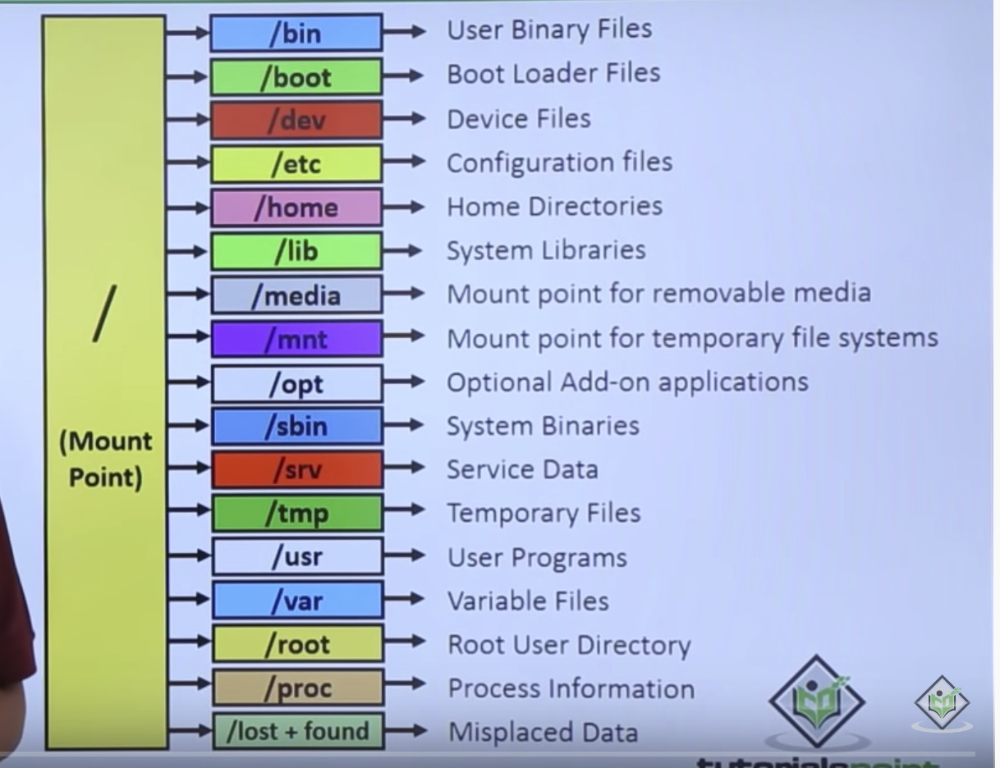

# Linux Prep

1. Directory Structure
    1. Filesystem Hierarchy Standard (FHS)
    1. bin -> binaries are here (etc: ls,cd..)
    1. sbin -> system binaries for sys admins standard users cannot have access without perm
    1. boot -> bootloaders
    1. dev -> all devices are here (Everything is a file)
    1. etc -> conf files are here (System wide)
    1. lib -> libraries (Application use)
    1. media -> removalbe media managed by OS
    1. mnt -> for mounting manually
    1. opt -> Optional Add-on applications (Virtualbox guest software, drivers)
    1. proc -> sudo files, Every process will have a directory here.
    1. root -> root user home folder
    1. run -> new, tmpfs is a temporary file storage paradigm implemented in many Unix-like operating systems. It is intended to appear as a mounted file system, but data is stored in volatile memory instead of a persistent storage device. Everything is gone when system is shut down.
    1. snap -> snap pacakges managed by ubuntu
    1. srv -> service directory, only has files if you run a server
    1. sys -> way to interact with kernel like run its volatile
    1. temp -> temp directory. writing a document.
    1. usr -> user application (User space)
    1. var -> files taht grow in size. (eg: crash file)
    1. home -> user has individual users. Has personal files.
1. Ubuntu
    1. LTS -> 5 years
    1. Non LTS -> 9 months
    1. Offically recognized ubuntu distro and unofficial
    1. Official -> kubuntu,ubuntu studio, lubuntu, zubuntu, Unofficial -> mint
    1. Unity is desktop environment of Ubuntu
    1. Kubuntu has kde
    1. Cinnamon for mint
    1. Elementary is like Mac Interface
    1. Kernel is linux for all
    1. Kernel translate between software and hardware

1. debian
    1. one of the first
    1. Early 90s
    1. .deb files and red hat has .rpm files

1. Virtual box networking
    1. NAT - creates individual NAT for each VM and new ip is given to the VM.
    1. NAT Network - multiple VM can have same NAT
    1. Bridged Adapter - It bypasses host and acts as a new device to outside network
    1. Internal Network - Only other VMs can access.
    1. Host-only Adapter - Only host and other VM can access
    1. Ping wont work because it works on ICMP and it is level 3 and does not have port

1. Terminal
    1. (dot)run files can be run directly from the terminal
    1. (dot)/ current directory
    1. PWD - Print Working Directory
    1. CD - Change Directory
        1. / - root
        1. ./ - current directory
        1. ~  - User Home
        1. .. - go back
    1. LS - List
        1. -l - long list
        1. -r - reverse alphabetical order
        1. -p - file types
        1. -s - file size sort
        1. -d - directory
    1. sudo - super user do
        1. sudo !! - runs the last failed command
    1. su - switch user
        1. sudo su - change to root account
    1. apt-get - package manager (Aptitude)
        1. canonical maintains the servers and a repository of the applications indexed.
        1. install - used to install a package with name
        1. remove - used to uninstall a package
        1. upgrade - to update the package
    1. apt-cache - to search and check package details from repository
        1. apt-cache seatch regex - to search a package
        1. apt-cache policy name - installed and official version
    1. dpkg - install .deb files
        1. -i - install
    1. rm - remove
        1. -r - recursive
        1. -f - force
    1. touch - to create new files
    1. cp - to copy files
        1. cp source destination (with name)
        1. -r recursive
    1. mv - move
        1. mv source destination (with name)
        1. -r recursive
    1. mkdir - make directory
        1. mkdir name or path
    1. find - to find file (recursive)
        1. find directory -type -name
        1. -type - type for file
            1. f - file
            1. d - directory
        1. -name - name of file (case sentive)
        1. -iname - name of file (case insentive)
        1. -perm - to specify permision in find
        1. -size - +1M
        1. -not - Operator
        1. -maxdepth - to specify depth
        1. -exec ... {} +  - to execute another command over the results (ex: grep)
    1. grep - to find things inside the file
        1. grep "What" where1 where2 where3 ...
        1. -i - ignore case
        1. -n - line number
    1. Pipes (|)
        1. The way this works is that when the shell sees the pipe symbol, it creates a temporary file on the hard disk
        1. all we are saying is that the system should use different files instead of standard input
        1. This can be used to link multiple commands
    1. Redirection (lt or gt)
        1. This redirects the output to a file or gets input from a file
    1. More
        1. Gives a good experience whil reading long output
    1. tee
        1. redirects output to stdout as well as the file
    1. tar
        1. xvf - extract verbos file
        1. used to extract or create archieves

1. File permissions and ownership
    1. owner - group - public
    1. chown - changes the file ownership
        1. user:group - changest to specified user and group
    1. chmod - changes the file permissions
        1. 6 - read and write
        1. 4 - read
        1. 7 - directory

1. Processes
    1. Top
        1. To see realtime processes
    1. ps
        1. To get all the running process snapshot
        1. -a - all
        1. -u - user details
        1. -x - allusers
    1. pgrep  - returns the process IDs of all the processes with the name
        1. pgrep commandname
    1. kill
        1. kill sends a signal to a specified process
        1. SIGHUP 1 Hangup
        1. SIGINT 2 Interrupt from keyboard
        1. SIGKILL 9 Kill signal
        1. SIGTERM 15 Termination signal
        1. SIGSTOP 17,19,23 Stop the process
    1. kilall
        1. killall commandname

1. Services
    1. Type of linux process
    1. Starts and waits to invoke
    1. service name start - starts the service
    1. service name stop - stops the service
    1. service name restart - restarts the service
    1. systemctl start name - starts the service with system control
    1. systemctl stop name - stops the service with system control
    1. systemctl restart name - restarts the serive with sytem control

1. Scheduled tasks
    1. crontab -e
        1. m h dom mon dow command
        1. Crontab stands for “cron table, ” because it uses the job scheduler cron to execute tasks; cron itself is named after “chronos, ” the Greek word for time
        1. cron is the system process which will automatically perform tasks for you according to a set schedule

1. Hosts
    1. /etc/hosts file changes the dns

1. Users
    1. Standard (no sudo) and Administrator (with sudo)
    1. adduser - add new user
    1. su - switch user
    1. adduser name sudo - adds the user to sudoers
    1. deluser - delets a user
    1. passwd - change password
    1. groupadd - add a new group

1. Networking
    1. url -> isp -> dns -> server
    1. protocol://host(levels of domain.domain)/uri
    1. inter connection of networks
    1. IP addresses
        1. 192.168.0.1 private ips
        1. 127.0.0.1 local host
    1. ping
        1. Uses icmp
        1. The ping command resolves the domain name into an IP address and starts sending ICMP packages to the destination IP
        1. -c - number of packets
        1. -I - interface
        1. -4 - force IPv4
        1. -6 - force IPv6
    1. ifconfig
        1. each entry specifies and interface stats
        1. shows ipv4 address and ipv6 address
        1. shows broadcast ip
        1. shows RX and TX
    1. tcpdump
        1. prints all the tcp packets and displays
        1. -c - number of packets to capture
        1. -A - to print packets in ascii
        1. -v - verbous
        1. -i - Interface
        1. -XX - to print packets in hex
        1. port - to specify port number
    1. netstat
        1. -n - to print ip address
        1. -r - shows kernel IP routing table
        1. -i - kernel interface stats
        1. -t - active internet connections
    1. hosts
        1. /etc/hosts
        1. hosts -> router -> ISP -> dns
        1. IP address .. domain .. alias
    1. Traceroute
        1. Traces the route of the request
    1. Nmap Network mapper
        1. Gives details about ports status for the given IP
        1. -v - verbous
        1. comma seprated ip address
        1. range of ip as well
        1. -A - Gives more infor about the devices
    1. SSH - Secure Shell
        1. To take control over remote computer terminal
    1. SFTP
        1. lls - local listing
        1. put file -> uploads to the remote host
        1. get file -> gets the filde from remote host
    1. SSH server
        1. /etc/ssh/sshd_config
        1. restart ssh service

1. Linux VS Unix
    1. Unix
        1. 1960s, bell labs. ken thomson(Go language and UTF-8) and dennis ritchie.
        1. Uniplexed Information and Computing Service (UNICS). Idea of pipes. One program one output.
        1. AT&T sold commercial versions (System V)
        1. BSD version (berkley)
        1. BSD started replacing the licensed AT&T files
        1. BSD 4.4 lite (Pure without AT&T)
        1. Portal Operating System Interface (POSIX) specification
        1. GNU is Not Unix (GNU) Free from BSD and System V
        1. Linux came from Minux
