# Networking

## Five layer model

1. Physical layer - all about wiring and wireless mediums
1. Data Link Layer - Responsible for defining a common way interpreting these signals
    1. Ethernet - a protocol responsible for getting data to nodes on same network or link
1. Network - Alias Internet Layer, Allows different networks to communicate with each other with devices called routeres
    1. IP - Internet Protocol
    1. Client server architecture.
    1. Single node can have multiple clients and servers.
1. Transport layer - Sorts out which client and server program should get what
    1. TCP
    1. UDP
1. Application Layer - Application specific
    1. HTTP, SMTP.. etc
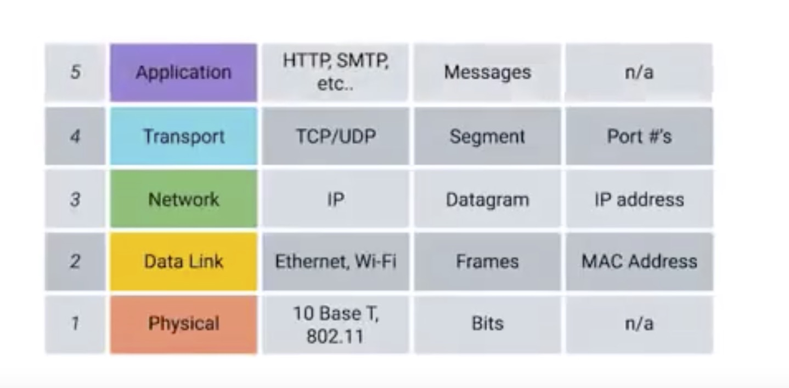

## The Physical Layer

1. Cables
    1. Copper Twisted Cables
        1. Voltage differences
        1. Cat5, Cat5e and Cat6 (Category)
        1. Cross Talk - When an electric pulse on one wire is accidently detected on another wire.
        1. Cat5e has low cross talk
        1. Cat6 cable can transfer most faster and reliably but short maximum distance.
    1. Fiber
        1. Contains individual optical cables made of tiny tubes made out of glass.
        1. Pulses of light.
        1. Faster and epensive and fragile.
1. Hubs and switches
    1. Hub
        1. 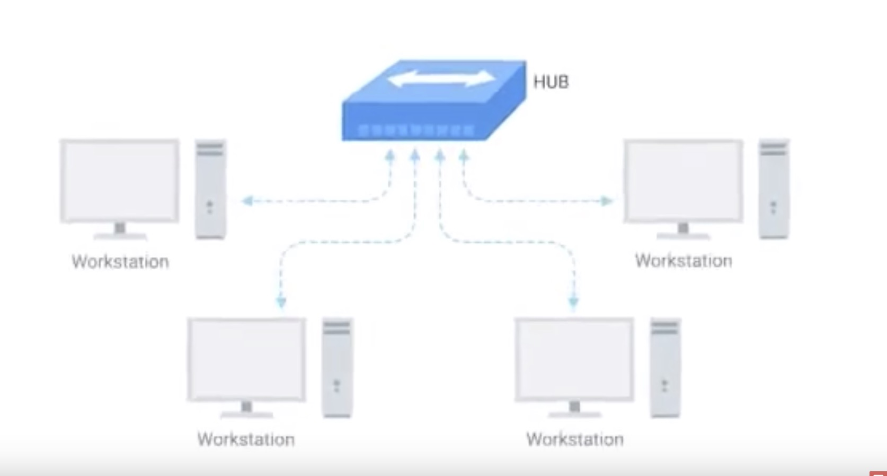
        1. Comunication for many computer at once
        1. Collision Domain - where only one device can communicate at a time.
        1. Hub has a lot of collision
        1. Very slow and are just historical artifacts these days.
    1. Network Switch
        1. 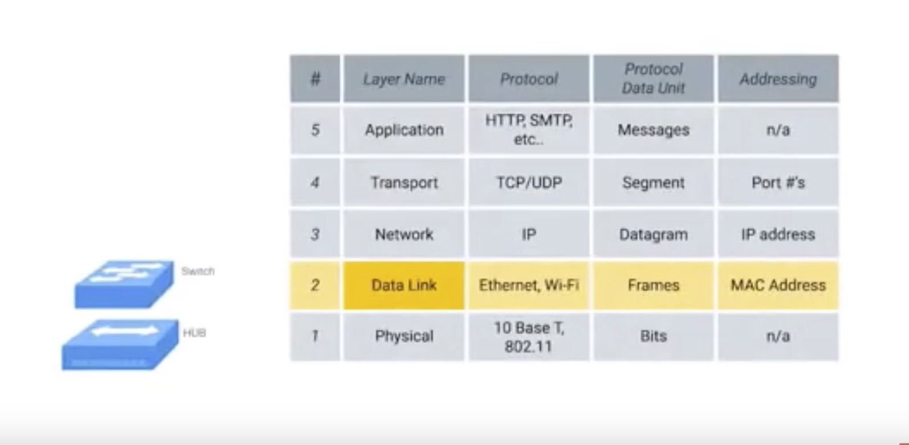
        1. Switch can inspect the content of the ethernet protocol data and get destination information so collision is almost eliminated.
    1. Routers
        1. A device that knows how to farward data between independant networks.
        1. It operates at Network layer
        1. It can inspect IP data to determine where to send data.
        1. They store internal tables.
        1. Home routers are simple and not complex more sophesticated outers are present at ISP
        1. Core routers
            1. Back bone of the internet.
            1. It has connection with many other routers at many other locations.
        1. Border Gateway Protocol (BGP)
            1. This helps router decie the most optimal path
    1. Servers and clients
        1. A node can be both server or client but we clasify them based on their core purpose.
1. Moving bits accross the wire
    1. Modulation is a way of varying the voltage of a charge moving accross the cable
    1. Line Coding
    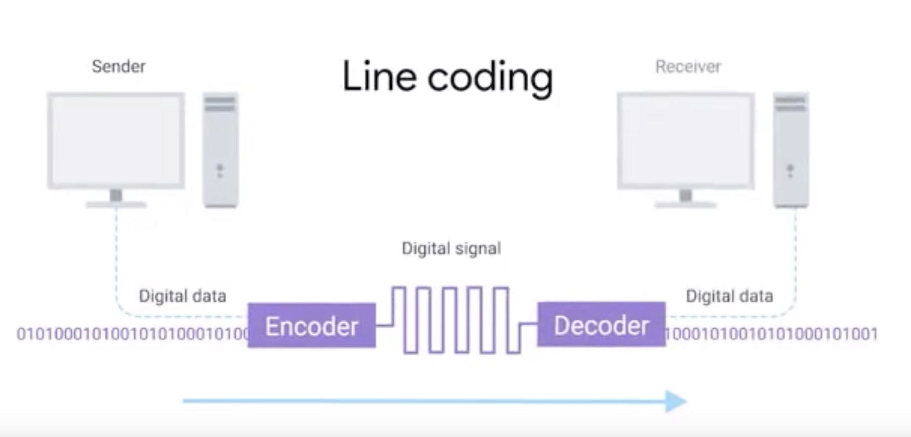
1. Twisted Pair Cabling and Duplexing
    1. Pairs of copper cables twisted together. Twisted because they reduce cross talk and interference.
    1. Copper Cable - 8 wires (4 pairs)
    1. Duplex communication
    1. one or two pait is used for one direction and the other is used for another direction.
1. Plugs and Ports
    1. RJ45 port and plug
    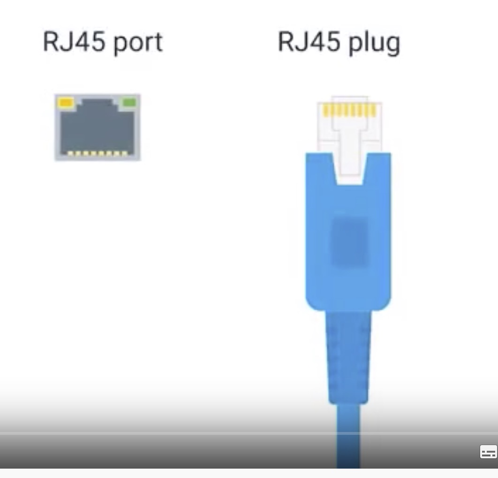
    1. Link LED and Activity LED
    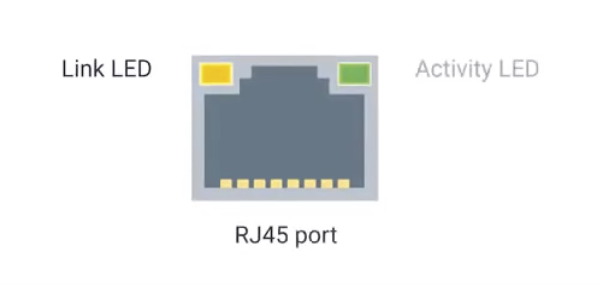
    1. Link -> when properly connected
    1. Activity -> flash when data is activily transmitted
    1. Patch Paenl - Container for end points
    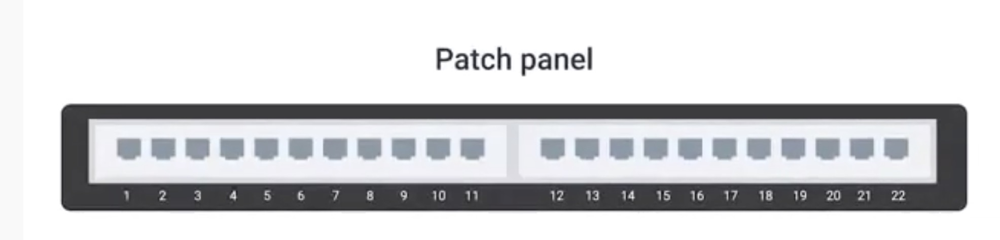

## Data Link Layer

1. Ethernet and Mac Addresses
    1. Ethernet Protocol
        1. Abstracts the physical layer to the upper layers.
        1. Carrier Sense Multiple Access Collision Dectection (CSMA/DC)
            1. It is used to determne when a communication channel is clear to send data.
            1. If no data is curently being transmitted through the channel, the node will send the data.
            1. If a collision happens, the nodes detect the collision and stop sending data for a random interval of time.
    1. Mac Address
        1. A Globally unique ID attached to an individual network interface.
        1. 48 bit number, 6 grouping of 2 hex numbers
        1. Octet is any number that can be represented by 8 bits.
        1. Organisationally Unique Identifier (OUI) - first 3 octets.
        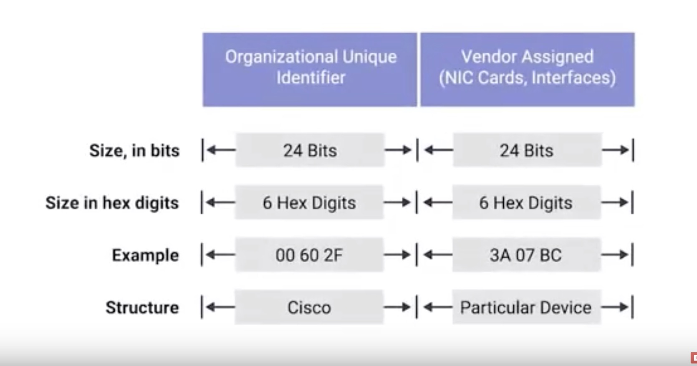
    1. Unicast, multicast and broadcast
        1. If the least significant bit of the first octet of the destination address is set to zero then it is meant for one destination.
        1. If the least significant bit of the first octet of the destination address is set to one then it is meant for multiple destination and each device will acepted based on the criteria (MAC Address).
        1. If the address is FF:FF:FF:FF:FF:FF then it is broadcast to all the nodes.
    1. Disecting an Ethernet Frame
        1. Data packet is any single set of binary data sent across a network link
        1. Data packet at ethernet level are Ethernet Frames
        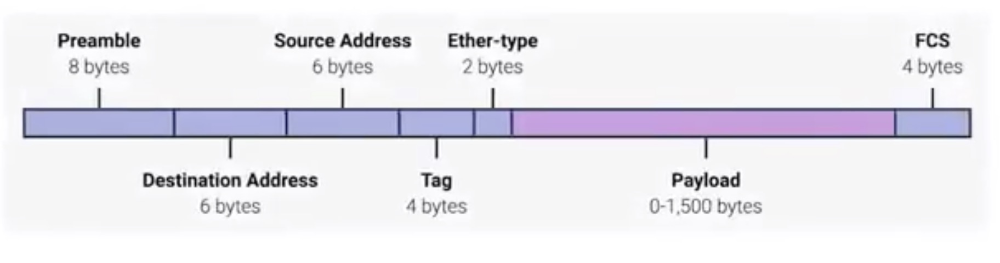
        1. Preamble -> 2 sections -> first alternating ones and zeros -> Start frame delimeter (SFD)
        1. Destination mac address 
        1. source mac address
        1. ether type -> protocol of contents of frame
        1. Vlan -> if present frame is called Vlan frame -> vtype field follows only if vlan is present
        1. VLan -> virtual LAN (Multiple logical LANS)
        1. Payload -> actual data and all the data from the upper layer
        1. FCS -> Frame check sequence  (Checksum value fcalculated from CRC)
        1. CRC -> for data integrity -> polynomial devision to create a number that represents a large data
        1. Ethernet only performs data integrity not recovery.

## Network Layer

1. Intro
    1. MAC addresses are OK for LAN but won't scale as there are no particular patterns followed by the MAC address.
    1. This is where network layer comes in.
1. IP Addresses
    1. IPv4 address are 32 bit data with 4 octets represented in decimal format seperated by dots. (dotted decimal notation)
    1. IP addresses belog to networks not to the devices that are attached to those networks.
    1. DHCP and static IP address (reserved for servers)
1. IP datagrams and Encapsulation
    1. Packet under IP is refered as IP datagram
    1. Below is datagram header
    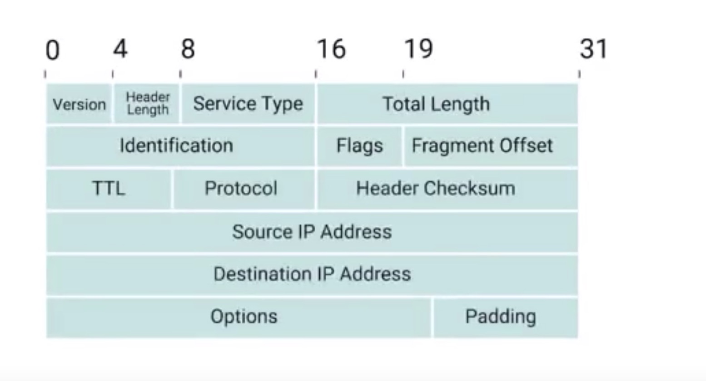
    1. version -> what internet protocol is being used (IPv4 or IPv6).
    1. header lenght -> header len (20 bytes for IPv4)
    1. service type -> QOS
    1. Total lenght -> total lenght of datagram
    1. ID -> used to grp messages together since lenght of datagram is 2^16, this helps to relate messages with more datagrams.
    1. flag -> allowed to be fragmented? - A process of splitting a single IP datagram into several smaller datagrams.
    1. This is necessary because different networks will have different datagram sizes. So large datagram size networks can fragment and send to small datagram networks.
    1. fragmentation offset -> to group all fragments.
    1. TTL -> Time To Live (No of hops)
    1. protocol -> Transport layer protocol (TCP, UDP..)
    1. Header checksum -> CRC checksum
    1. Source and destination IP -> self explanatory
    1. options -> optional field for testing purposes
    1. Padding -> series of zero to fill the header lenght.
    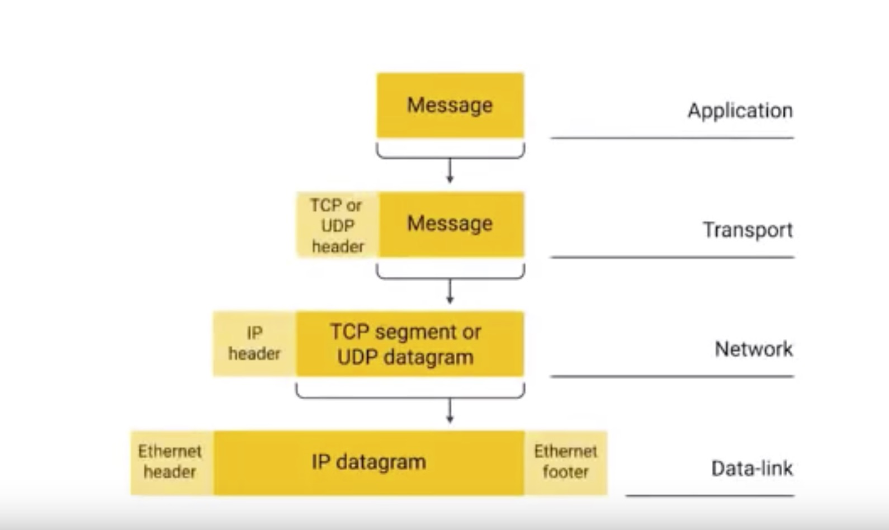
1. IP Address Classes
    1. Network ID and Host ID
    1. IBM own all IP with 9 as first octet
    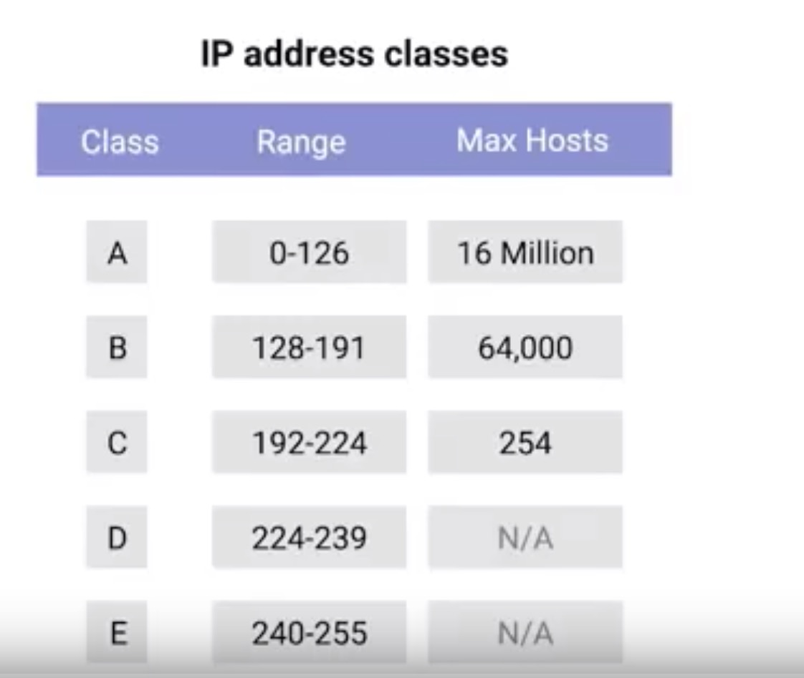
    1. Class A
        1. First octet is used for network ID
    1. Class B
        1. First 2 octets are used for network ID
    1. Class C
        1. First 3 octets are used for netowork ID
    
    1. Class D
        1. multicasting
    1. Class E
        1. Scientific
1. Address Resolution Protocol
    1. To discover the hardward address of a node with certain IP address
    1. ARP table -> list of IP and MAC addresses
    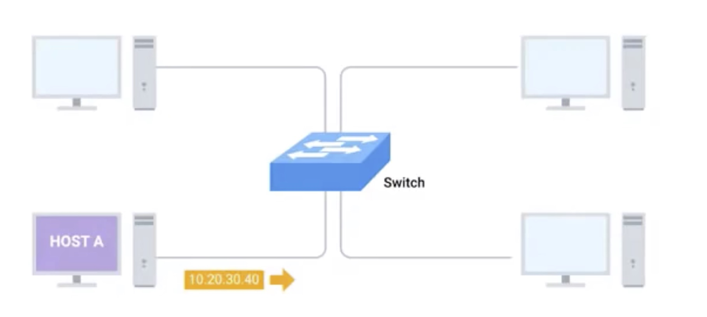
    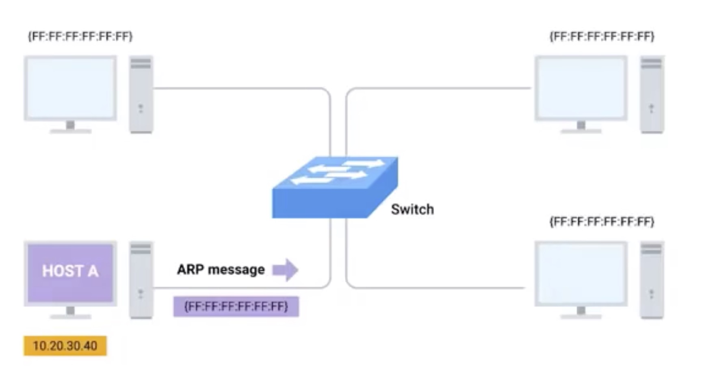
    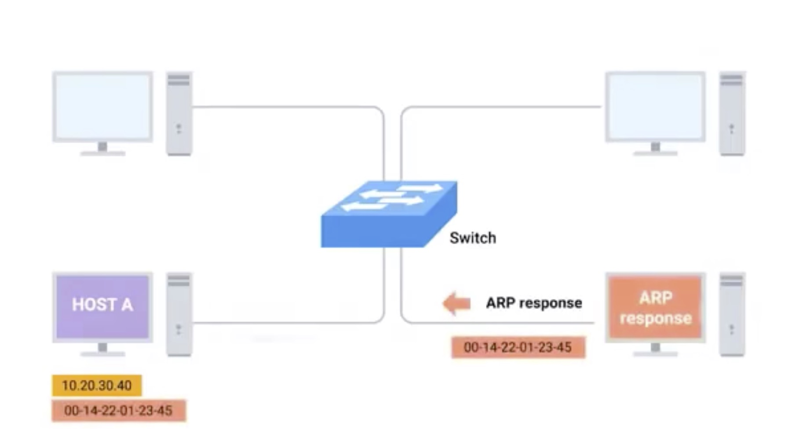
1. Subnetting
    1. Splitting a large network into subnetworks.
1. Subnet Masks
    1. Subnet masks shows the part of ip address that should be considered as host ID
    1. It also shows the part of IP address which is a subnet ID
    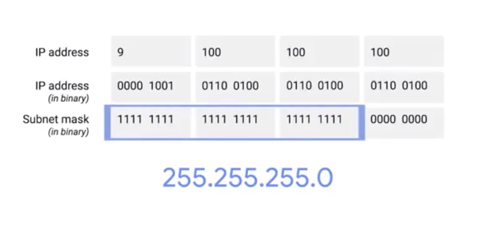
1. Basic Binary Math
    1. Only different notations
    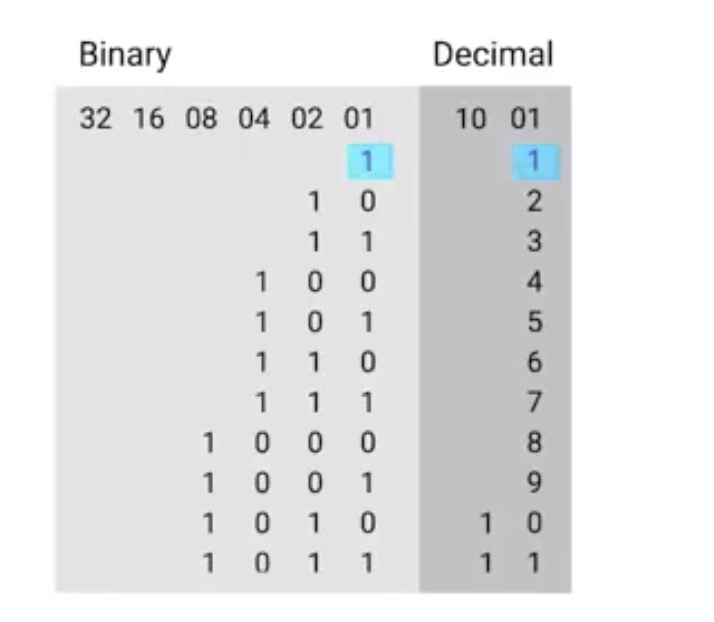
    1. OR and And Logical gate
    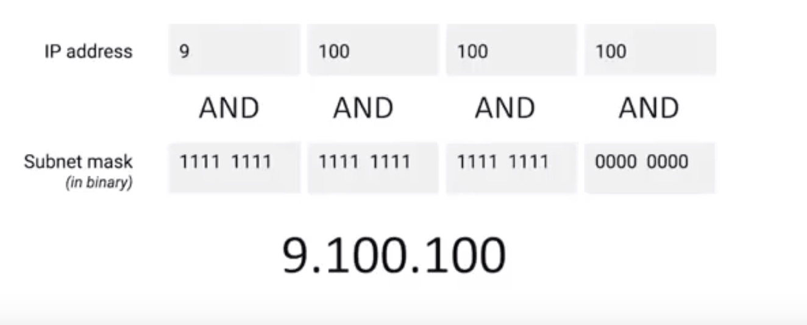
1. CIDR
    1. The address lasses are completely ignored.
    1. So to find the network ID and Host ID we use network mask
    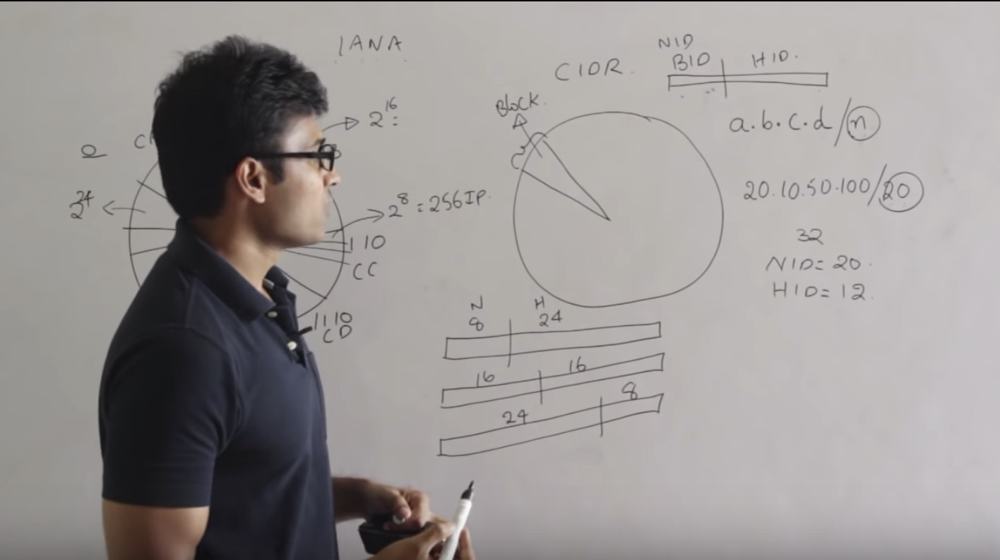
    1. All Ip address must be contigeous
    1. 2^n IP address
    1. First IP address should be evenly divisible by size of block. Basically HID must be all 0 for first IP
1. Routing
    1. Router is a device that forwards the traffic depending on the destination address of that traffic
    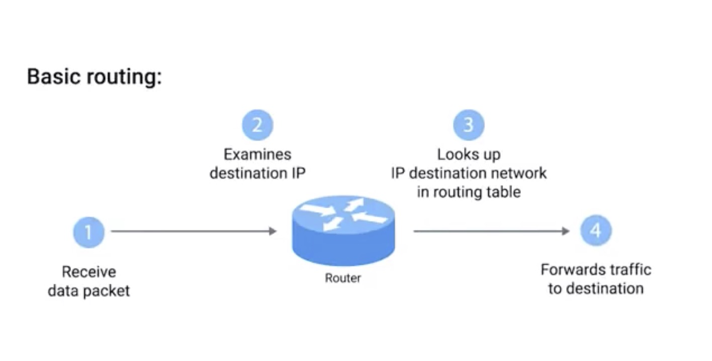
    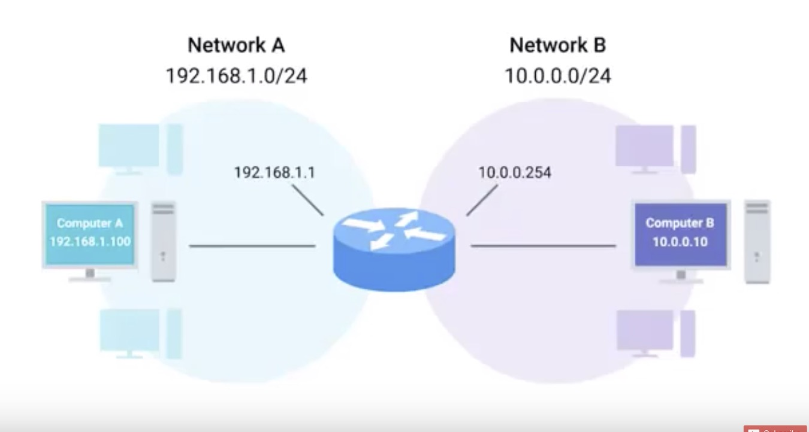
    1. Computer knows and sends to router -> Current netowrk gateway router and sees that destination is its -> strips data link layer -> gets destination IP -> looks into routing table -> reduce TTL -> new ethernet frame -> next network.
    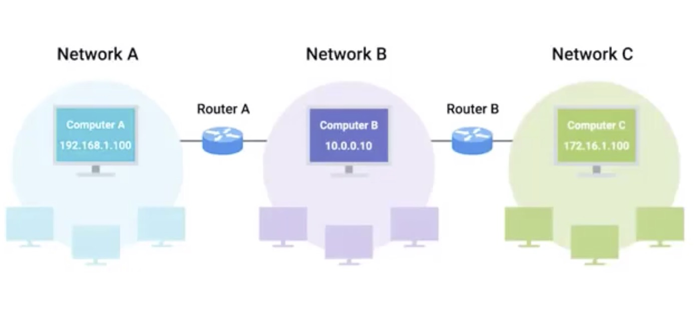
    1. Gateway in first knows that it should send to middle router to send to the destination.
1. Routing Tables
    1. Destination network -> a row for each destination it knows about
    1. next hop -> next hop
    1. Total hops -> total number of hops
    1. Interface
1. Routing Protocol
    1. Interior gateway prototcols
        1. Under the same organisation
        1. distance-vector prtocol (old)
            1. Jsut hops are sent to neighbouring routers
            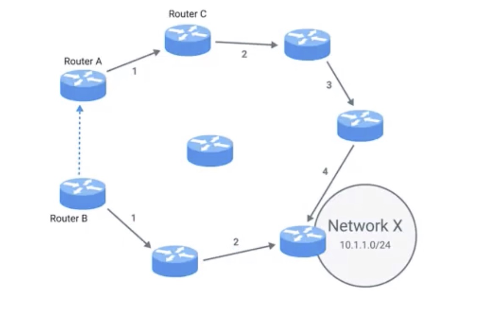
        1. link state routing protocol
            1. Sends all the information to all other rounters and computed
            1. Requires more processing power and memory
            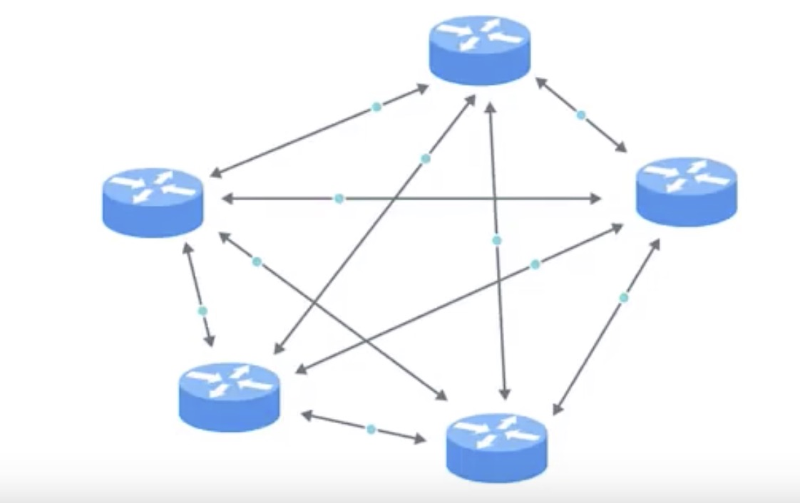
    1. Exterior gateway protocol
        1. Under diffirent organisation
        1. Internet Assigned Numbers Authority (IANA) - IP address allocation
        1. Also responsible for ASN (Autonomous System Number) allocation
1. Non Routable Address Space
    1. 3 ranges of IP address and anyone can use them
    1. 10.0.0.0/8 , 172.16.0.0/12, 192.168.0.0/16

## Transport Layer

1. Intro
    1. Transport Layer
        1. Allows traffic to be directed to specific network applications
    1. Application Layer
        1. Allows these applications to communicate in a way they understand
    1. Long running connections.
    1. Data Integrity through error checking and data verification
    1. TCP and UDP
    1. Firewalls
1. Multiplexing and demultiplexing
    1. It is done with the concept of ports
    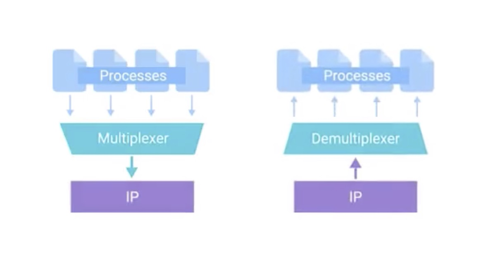
    1. Port
        1. 16-bit number to direct traffic to specific services running on a networked computer
        1. http - 80
        1. colon - 10.1.1.100:80 - Socket address
        1. ftp - 21
1. Dissection of a TCP Segment
    1. TCP Segment -> TCP header + data section
    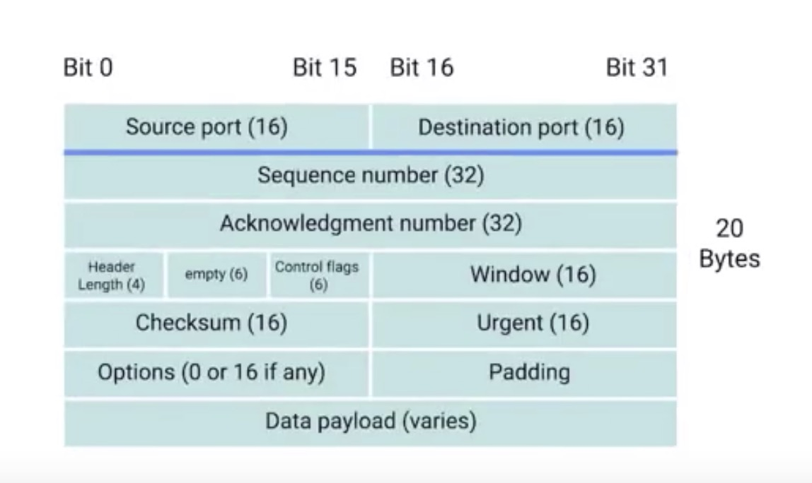
    1. Source -> A high-numbered port chosen from a special section of ports known as ephemeral ports.
    1. destination port -> self explanatorty
    1. Sequence Number -> self explanatory
    1. Acknowledgment number -> the next sequence number request
    1. Data offset -> TCP header lenght to specify data start
    1. Control flags -> TCP control flags
    1. Window -> The range of sequence numbers that might be sent before an ack is required
    1. checksum -> self explanatory
    1. urgent pointer -> used conjunction with TCP control flags (Not adopted)
    1. Options -> rarely used for flow control
    1. Padding -> to meet header lenght
1. TCP control flags and 3 way handshake
    1. URG -> urgent -> 1 - urgent
    1. ACK -> 1 - acknowledgement number should be examined
    1. PSH -> push -> 1 - push the bufferd data to receiving app asap
    1. RST -> reset -> 1 - reset connection
    1. SYN -> synchronize -> while establishing connection
    1. FIN -> Finish -> close connection
    1. 3 way handshake (Open connection)
    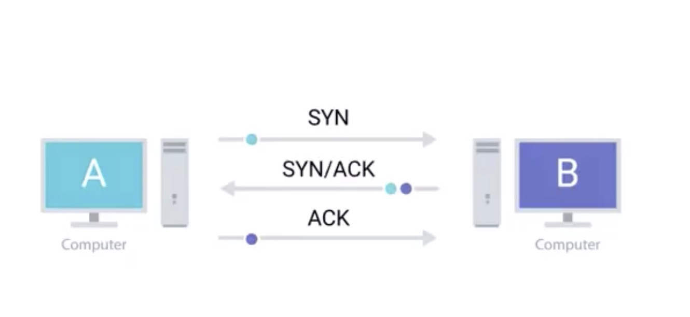
    1. 4 way handshake (Close Connection)
    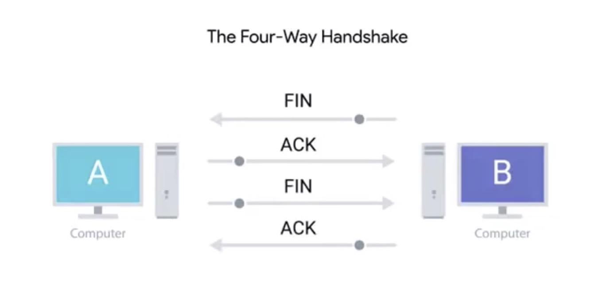
1. TCP Socket States
    1. An end-point in a potential TCP connection
    1. Socket must be open at the port to send data
    1. Listen -> socket is ready and listening for incoming connections (Server Side)
    1. SYN_SENT -> sync reqeust send but connection hasn't been established yet (Client Side)
    1. SYN_RECEIVED -> Listen state over an SYN received (Server)
    1. ESTABLISHED -> both server and client
    1. FIN_WAIT -> FIN set ACK not received
    1. CLOSE_WAIT -> Connection is closed at TCP layer but the application hasn't released its hold on the socket yet
    1. CLOSED -> fully closed
1. Connection Oriented and Connection less prortocol
    1. Already Known
1. Firewalls
    1. A device that blocks traffic that meets a specific criteria
    1. Can operate in different layers
    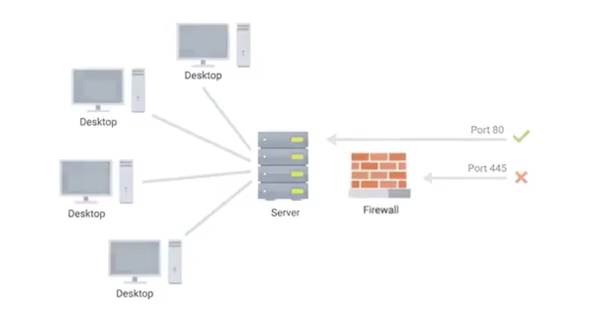

## Application Layer

1. Alot of protocols
    1. http, smtp.
    1. both client and server use http
    1. various servers apache,nginx and iis
    1. clients are chrome, firefox, safari
1. OSI Layer
    1. Open Systems Interconnection (OSI) model
    1. It adds 2 more players to application layer
    1. There is no encapsulation going on here
    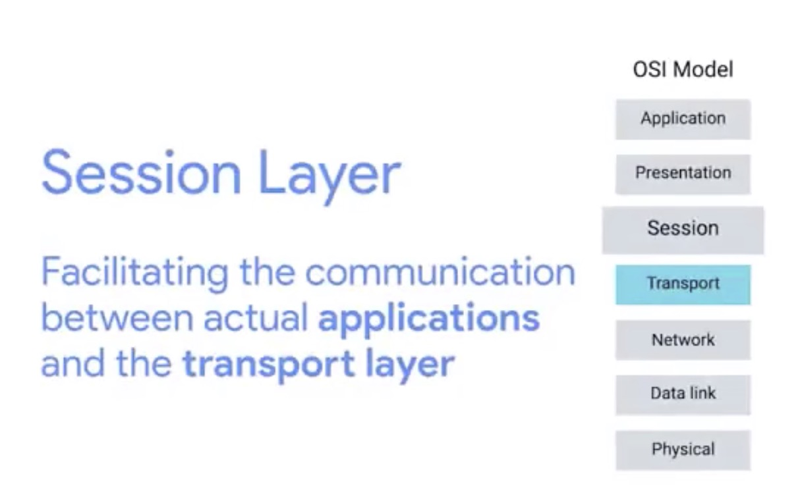
    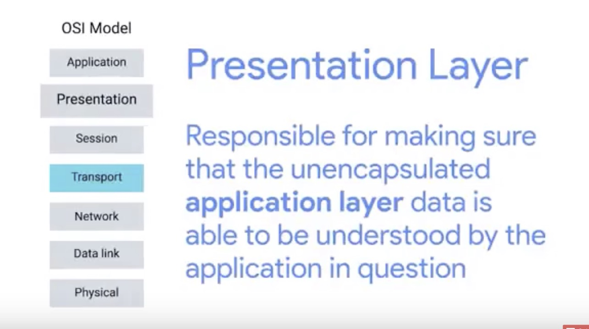
1. The full demo of a SYN tcp packet
    1. Refer the video for full flow [Video Link](https://www.youtube.com/watch?v=QKfk7YFILws)

## Networking Services

1. Intro
    1. VPN, DHCP, proxy, DNS, DNS lookup, DNS record types and NAT

## Name resolutions

1. Domain name is a term we use for something that can be resolved by DNS
1. This helps to reduce geographical distance as dns can resolve to nearlest data center
1. What has to be configured are - IP address, subnet mask, gateway to a host, DNS server
1. Types of DNS servers
    1. Caching name servers
    1. Recursive name servers
    1. Root name servers
    1. TLD name servers
    1. Authoritative name servers
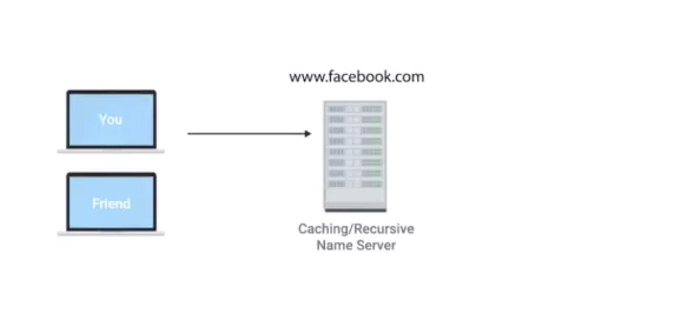
1. Caching name servers - provided by ISP to store known domain name lookups for a certain amount of time. There is also a TTL (few mins).
1. Recusive - perform full DNS resolution requests
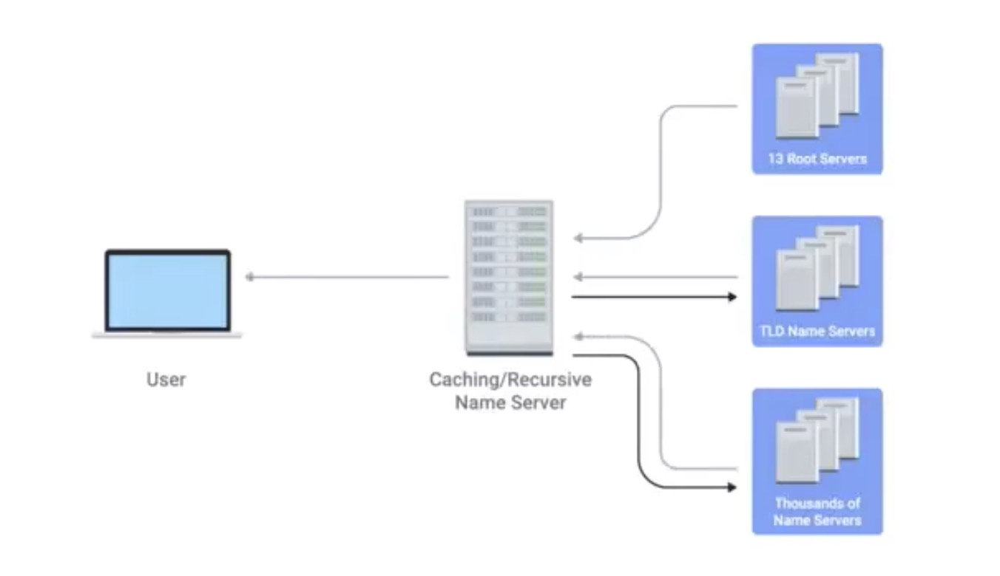
1. Local machines have temp dns cache as well
1. DNS uses UDP
    1. 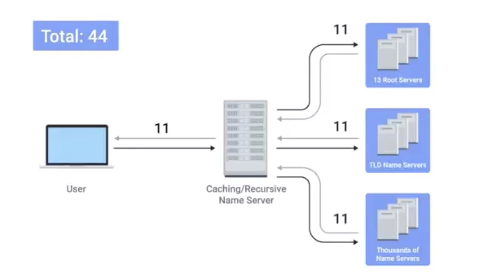
    1. 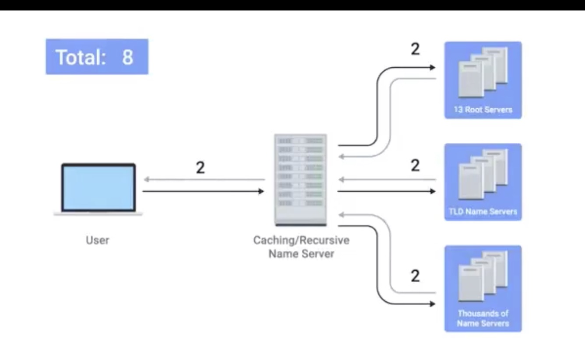
    1. Just ask again if failed
    1. If the packet is too large then the DNS will establish a TCP connection.
1. Resource records
    1. A record
        1. A record -> point a domain name to a certain IPv4 IP address
        1. A record can have multiple IPs and it will round robin it for load balancing
        1. Requesting computer will receive all the IPs and it will choose the first and if failed the next.
        1. To another requesting computer the order is switched for load balancing.
    1. AAAA - Quad A record
        1. Serves IPv6 address
    1. CNAME record
        1. Used to redirect traffic from one domain to another
        1. Canonical Name ex microsoft.com, www.microsoft.com
    1. MX record
        1. Mail Exchange
        1. Email traffic will get delivered to the actual mail server
    1. SRV record
        1. Service record
        1. Like Mail server but can defined to many different service types
    1. TXT record
        1. Text record
        1. Configuration services
    1. PTR record
        1. Pointer resource record
        1. Resolves an IP to a name
1. Anatomy of domain name
    1. Top Level Domain(TLD) -> the last part of a domain ex com,net,edu,in
    1. Vanity TLDs are also available ex: pizza,museum
    1. ICANN (The Internet Corporation for Assinged Names and Numbers)
    1. Siste to IANA(IP spaces)
    1. Domain -> second part of the domain name
    1. Subdomain -> before Domain and there can be a lot of sub domains like test.ste.tre.(Domain).(TLD)
    1. Restrictions
        1. FQDN -> combine all above
        1. DNS can support 127 levels of domain
        1. Each section can have only 63 characters
        1. Full fqdn can have 255 characters
1. DNS Zones
    1. Easier control over multiple levels of a domain
    1. 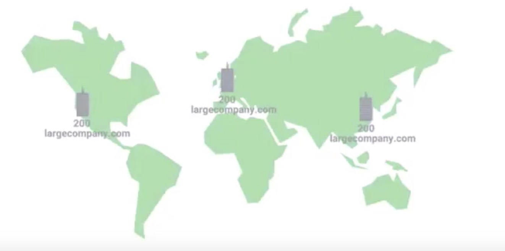
    1. Zones are confitured by Zone files
        1. SOA (Start Of Authority) -> zone and the name of the name server that is authoritative for it
        1. NS record -> other name servers
    1. Each DNS will also have FQDN
    1. Reverse lookup zone files
        1. To get FQDN from IP

## DHCP

1. It can be used more than just for IP
1. Dynamic Assignemnt -> A range of IP addresses is set aside for client devices and one of these IPs is issued to these devices when they request one.
1. Automatic Assignment -> will assign the same IP it has assigned in the past if possible.
1. Fixed Allocation -> a list of MAC address and their corresponding IPs
1. IP address , subnet mask , gateway, name server.
1. Last 3 are common
1. For gateway and servers static IP is important
1. Other client devices dynamic IP is fine
1. Working
    1. DHCP discovery -> the process by which a client configured to use DHCP atempts to get network configuration information.
    1. 
    1. 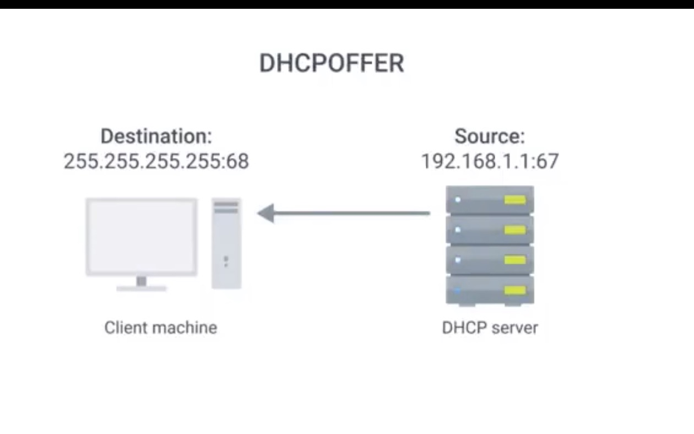
    1. 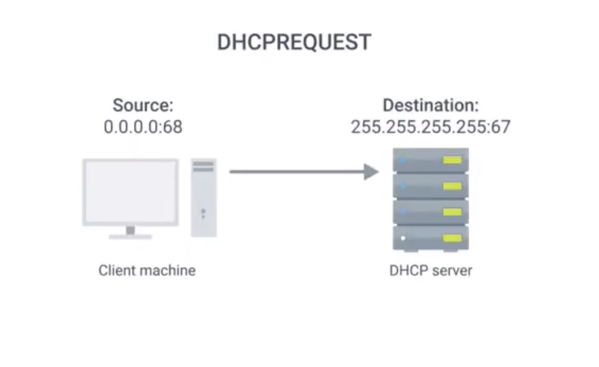
    1. 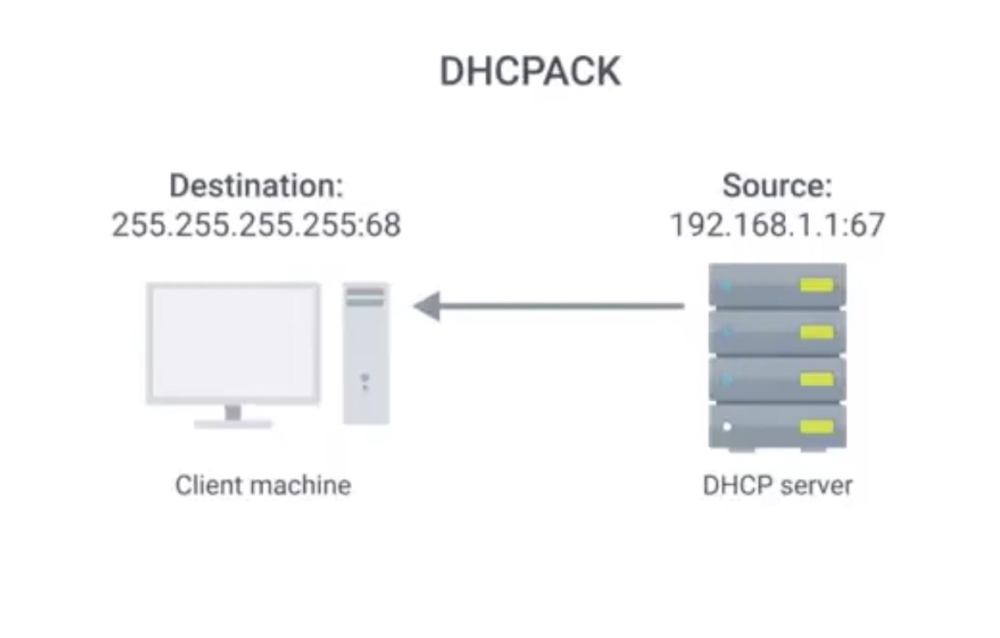
    1. DHCP lease -> like time to live
    1. It can also release the DHCP

## NAT

1. Basics
    1. A technology that allows a gateway, usually a router or firewall, to rewrite the source IP of an outgoing IP datagram while retaining the original IP in order to rewrite it into the response.
    1. It is technique not standard.
    1. Translate one IP to another to save IP spaces.
    1. IP masquerading -> the process of hiding the IP of one computer to another computer using NAT
    1. 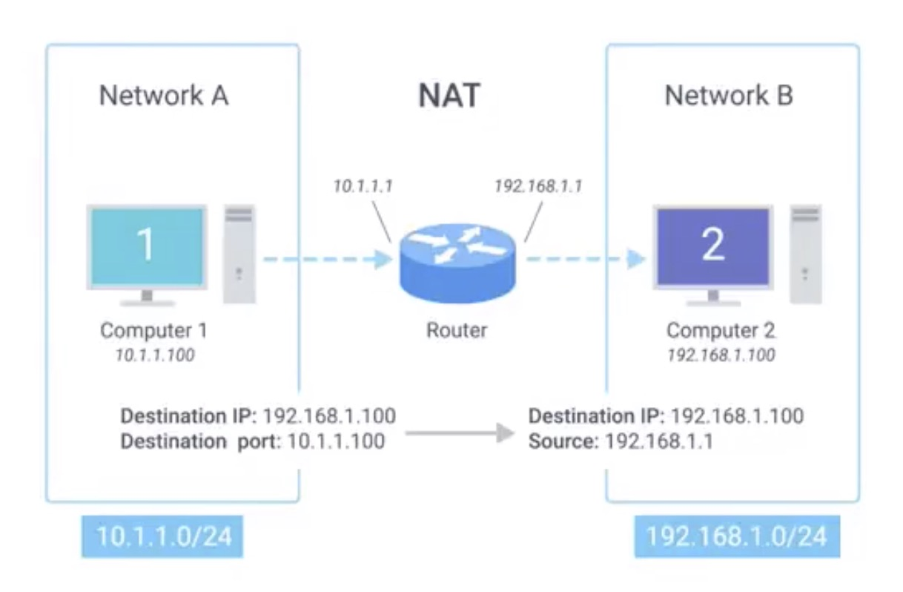
1. NAT and transport layer
    1. Port preservation -> the source port chosen by a client is the same port used by the router
    1. 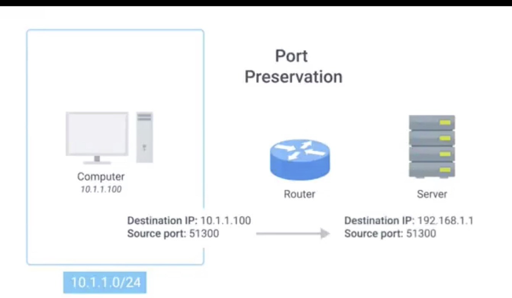
    1. Port forwarding -> specififc destination ports can be configured to always be delivered to specific nodes.
    1. 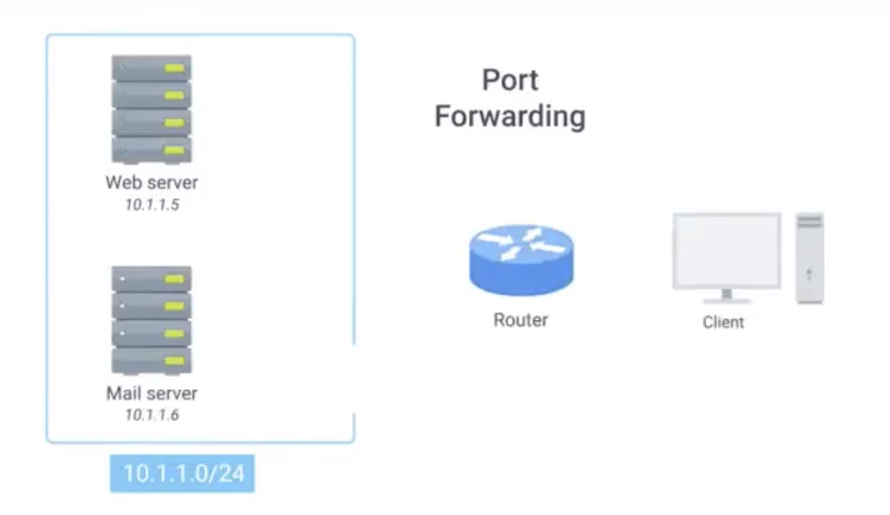
1. NAT, Non-Routable Address Space and limits of IPv4
    1. IANA gives blocks to RIR and RIR gives ips to organisations.
    1. IANA - distribution of IPs
    1. Assiging blocks to 5 Regianl Internet Registries (RIR)
    1. AFRINIC, ARIN, APNIC,LACNIC,RIPE
    1. All almost ran out of ip addresses

## VPN and proxy

1. VPN
    1. A technology that allows for a the extension of a private or local network to hosts that might not be on that local network.
    1. It is a tunneling protocol
    1. Needs vpn client and vpn server.
    1. Work by the payload section of the transport layer to carry an encrypted payload that actually contains an entire second set of packts with all layers to traverse the remote network.
    1. Two factor authentication -> more than user name and password is requried.
    1. 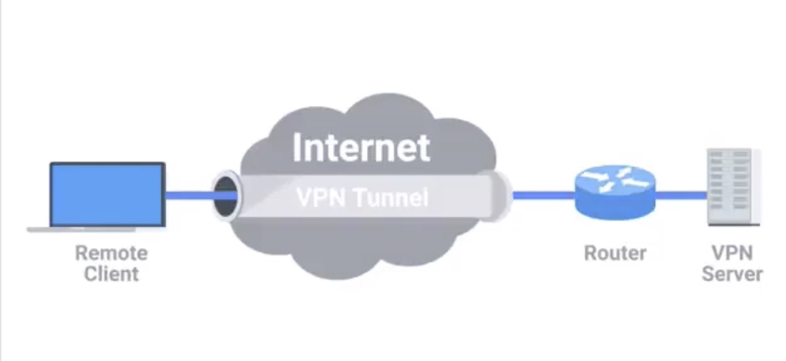
    1. 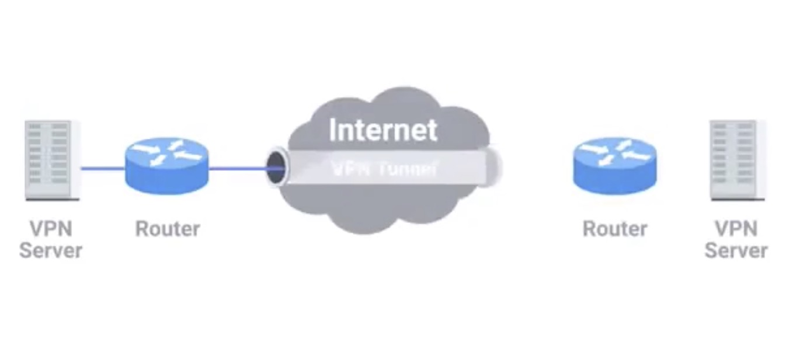
1. Proxy
    1. A server that acts on behalf of a client in order to access another service. It is just a concept.
    1. Anonymity, security, content filtering and increased performance.
    1. Web proxies -> for web traffic for caching (Office download server)
    1. Reverse proxy -> A service that might appear to be a single server to external clients, but actually represents many servers living behind it
        1. Used for load balancing
        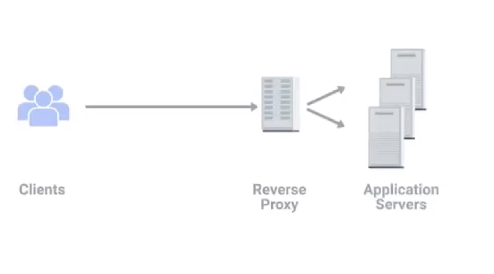
        1. Used for decrypting with hardware specifically designed for encryptiong and decryptiong.
        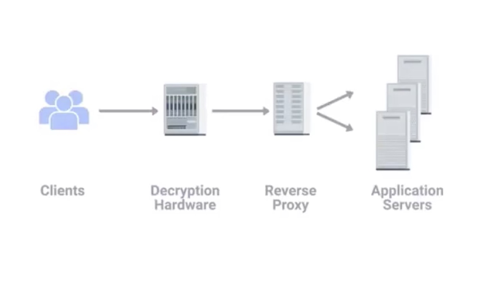

## Connecting to Internet

1. Dial-up
    1. Dial-up -> USENET -> over a telephone network.
    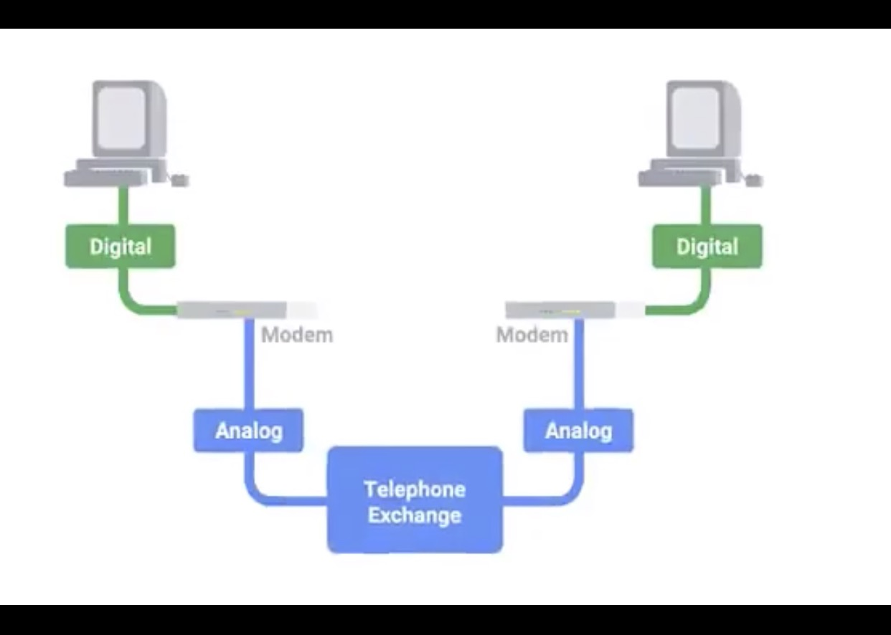
    1. Modem -> modulator demodelator.(Like line encoding)
    1. Baud rate -> A measurement of how many bits can be passed in a second.
1. Broadband
    1. Any connectivity tech that isn't dial-up internet
    1. They are longlasting connections that don't need to be established.
    1. Types
        1. T-Carrier technologies (AT&T)
            1. Lots of phone call to travel accross a single cable
            1. T1 -> came 24 simultaneous phone calls across single piece of twisted copper wire
            1. Originaly was used to connect 2 telecom companies.
            1. T3 -> 28 T1s all multiplexed.
        1. DSL (Digital Subscriber Line)
            1. Data is transfered at different frequencies which allowed more speed and simultaneous data and voice.
            1. ADSL -> Asymmetric -> faster download slower upload
            1. SDSL -> Symmetric -> Both upload and download same
            1. HDSL -> High bitrate DSL
        1. Cable broadband
            1. Cable tv lines could also transfer huge data by operating at diffrent frequency
            1. Shared Broadband Line - refer pic
            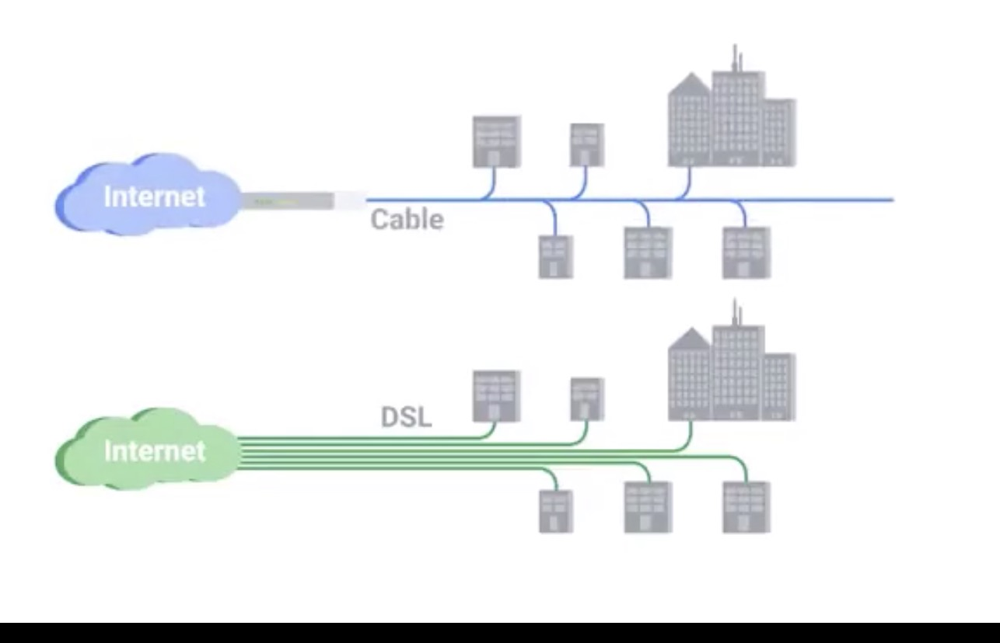
            1. Interner would be fast in night because of low usage by others.
            1. Cable Modem Termination System (CMTS) -> Connects lots of diffrent cable connections to an ISPs core network.
        1. Fiber connections
            1. FTTX -> Fiber To The X
                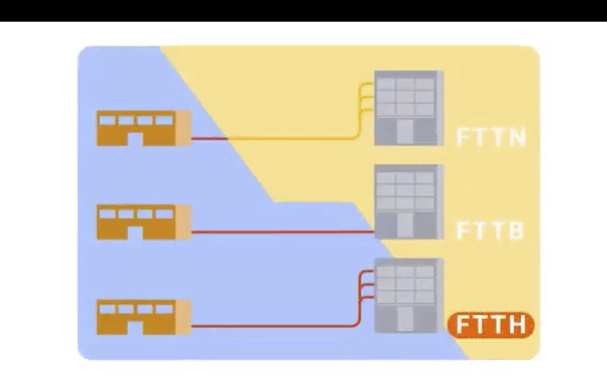
                1. FTTN -> Fiber To The Neighbourhood
                1. FTTB -> Fiber To The Building
                1. FTTH -> Fiber To The Home
            1. Optical Network Terminator -> Converts data from protocols the fiber network can understant to those that more traditional twisted pair copper networks could understand.
1. WAN
    1. It is a way to create connection between two local networks.
    1. Can be done with Point-to-Point vpns
1. Wireless Networks
    1. Specifications are IEEE 802.11
    1. Commuicate through radio waves.
    1. Frequency band -> A certain section of the radio spectrum that's been agreed upto to be used for certain communications.
    1. Wifi commonly operate on 2.5Ghz and 5Ghz band
    1. 802.11b,802.11a,802.11g,802.11n,802.11ac -> order of adoption -> higher access speed and more devices
    1. 802.11 frame is as below
    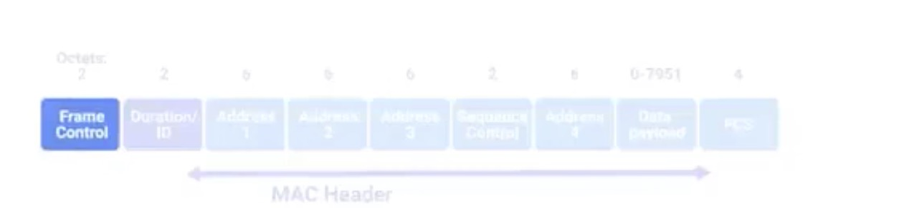
    1. Frame control -> how the frame should be processed eg. version of 802.11
    1. Duration -> how long the total frame is
    1. Address fields(4)(6 bytes long beacuase MAC address) -> source address, destination address, mac adress of AP, mac address of what ever has just transmitted the frame
    1. Wireless Access Point -> A device that bridges the wireless and wired portions of a network.
    1. Sequence Control -> self explanatory
    1. FCS -> CRC check
1. Configurations
    1. Ad-hoc networks
        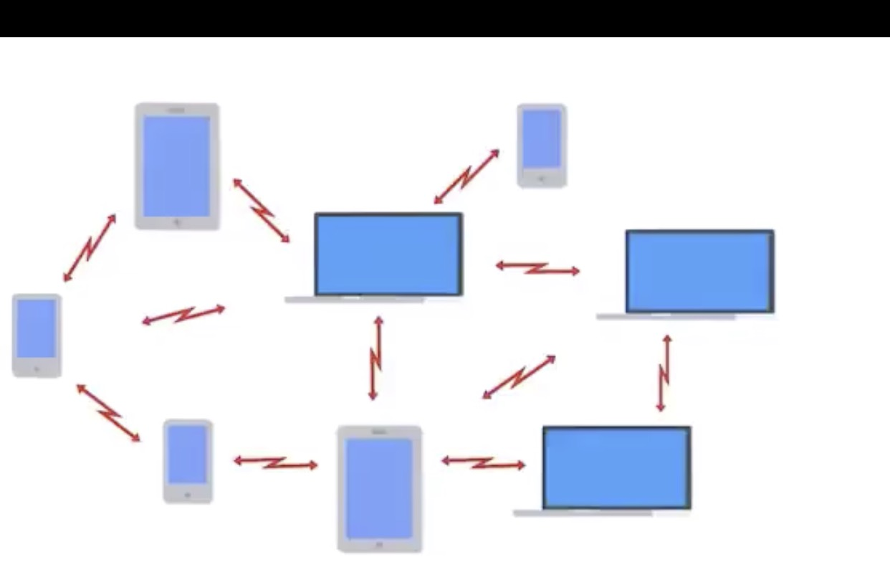
        1. Phone hotspot, iot and disaster situations.
    1. Wireless LANS(WLANS)
        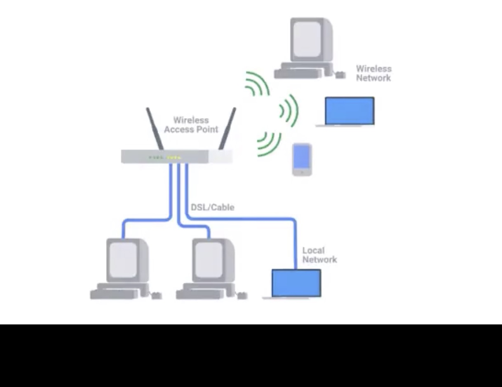
    1. Mesh networks
        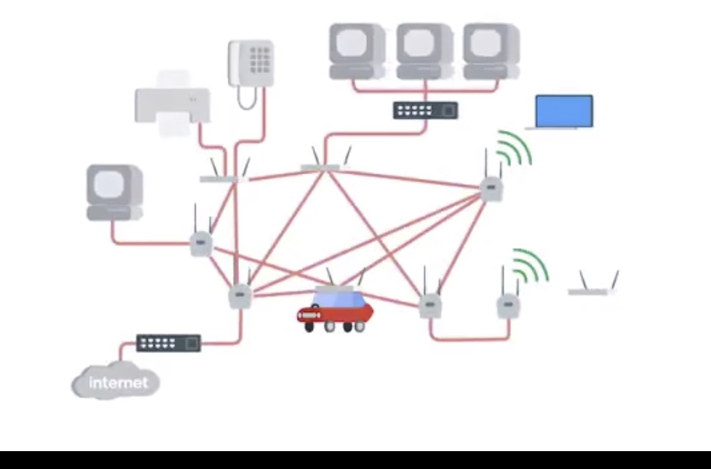
1. Wireless Channels
    1. Channels -> indiviaul smaller sections of the overall freq band used by a wireless network
    1. Collision Domains are avoided in calbes using switches not here
    1. Channels helps to kind of fix this problem
    1. Channel 1 6 and 7 never overlap in 2.4 802.11 as shown in the figure
    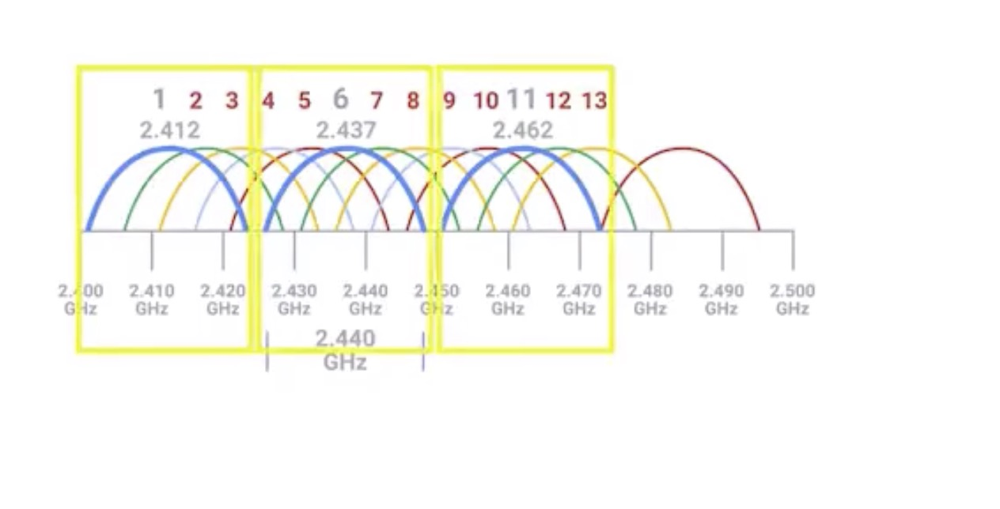
1. Wireless Security
    1. Wired Equivalent Privacy (WEP) -> an ecryption tech that provicdes very low level of privacy -> only used 40 bits keys so it was replaced
    1. Wifi Protected Access (WPA) -> 128 bit key
    1. WPA2 -> 256 bits key
    1. MAC filtering -> Configure access points to allow for connections fro ma specific set of MAC addresses.
1. Cellular Network
    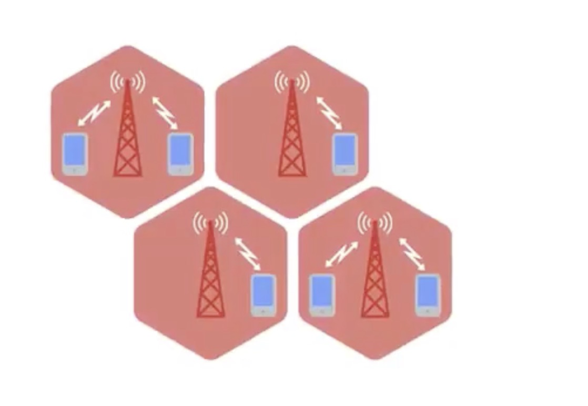
    1. These operate in the frequencies that can travel over a long distance when compared to wifi.
    1. Cell towers can be taught of as AP with much larger range.

## Troubleshooting

1. Intro
    1. Error Detection -> the ability for a protocol or program to determine that something went wrong.
    1. Error Recovery -> the ability for a protocol or program to attempt to fix it.
1. Ping (Network Layer)
    1. Internet Control Message Protocol (ICMP) -> used usually to communicate why a transmission has failed to communicate
    1. 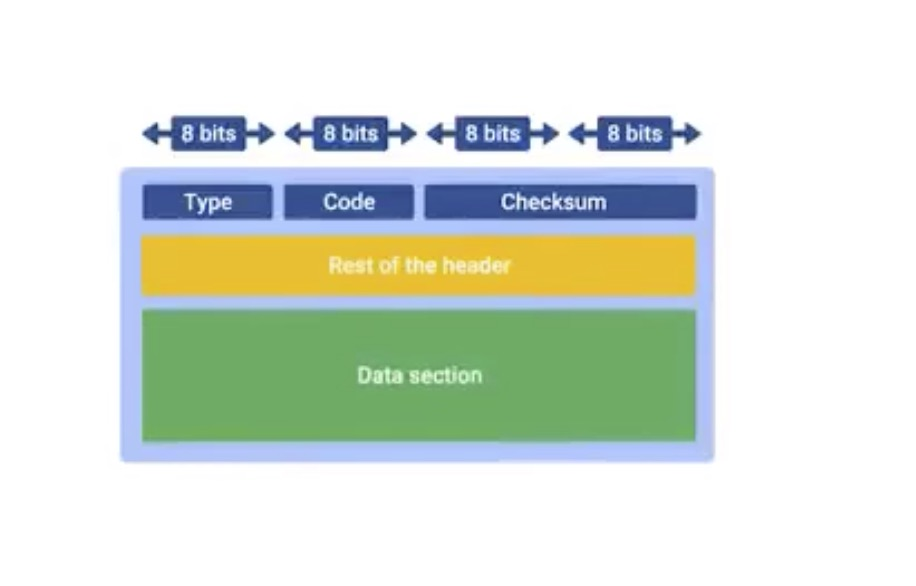
    1. Echo request is what sent in Ping
    1. ping 8.8.8.8
1. Traceroute (Network Layer)
    1. paths between 2 nodes
    1. Manipuation of TTL field
    1. TTL is set 1 for first packet and 2 for second packet (Really clever)
    1. ICMP Time exceeded is returned for each hop
    1. windows tracert
    1. similar commands -> mtr realtime (Linux/MacOS), pathping 50sec(Windows)
1. netcat(Linux/MacOS) and Test-NetConnection(Windows) (transport layer)
    1. nc google.com 80
    1. -z -> zero inpit/output
    1. -v -> verbous
    1. Test-NetConnection google.com
    1. -port -> port
1. Name Resolutions
    1. nslookup -> returns the ip address after name resolution
    1. nslookup -> has interative mode following are what you can do in interatvie mode
    1. server dnsserver -> will use the specified name server
    1. set type=MX -> sets resource record type
    1. set debug -> display full response packet
1. Public DNS Servers
    1. These are servers specifically set up so that anyone can use them for free
    1. Level 3 hosts popular public dns and their ip addresses are 4.2.1-6
    1. Google's public DNS 8.8.8.8 and 8.8.4.4
1. DNS registration
    1. Registrar -> an org responsible for assihninh individual domain names to other organization or individuals
    1. network solutions inc parent and was only one
    1. later other registrars came
    1. Fixed amount of time.
1. Hosts Files
    1. A flat file that contains, on each line, a network address followed by the host name it can be referred to as
    1. 1.2.3.5 webserver
    1. They are evaluated by the OS
    1. They are old still they are sticking atound because of loopback address
    1. 127.0.0.1 localhost
    1. ::1 localhost (ipv6)
    1. This can be used to make dns resolve to specific IP

## Cloud

1. Intro
    1. A technological approach where computing resources are provisioned in a shareable way,so that lots of users get what they need, when they need it.
    1. A huge cluster of inter connected machines that can all function as hosts for a lots of virtual guests. This gives a system that lets us share resources among all those instances.
    1. It is just a concept.
    1. Private cloud -> used by a single large corporation and generally physically hosted on its own premises.
    1. Hybrid cloud -> company will store sensitive information in private cloud and less sensitive on public cloud.
    1. Cloud computing -> A new model in computing where large clusters of machines let us use the total resources avaialbe in a better way.
1. Hardware Virtualization
    1. Virtualization -> A single physical machine, called a host, could run many individual virtual instances, called guests.
    1. Hypervisor -> A piece of software that runs and manages virtual machines, while also offering these guests a virtual operating platform that's indistinguishable from actual hardware
    1. 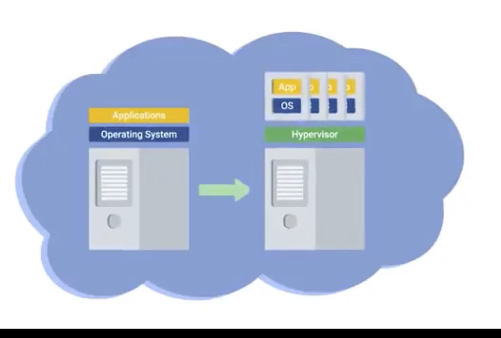
    1. 
    1. 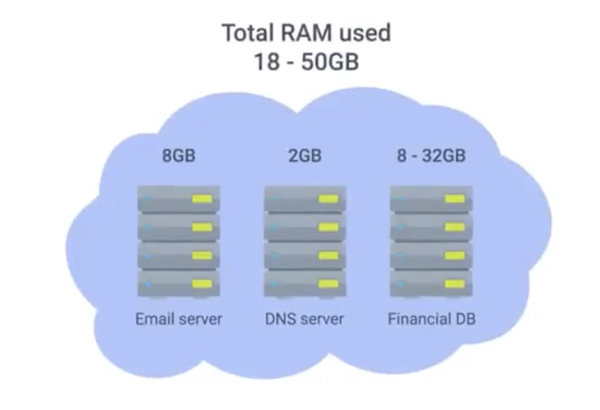

## IPv6

1. Basics
    1. IPv4 = 32 bits, IPv6 = 128 bits
    1. 8 groups of 16 bits each
    1. 2001:0db8:0000:0000:0000:ff00:0012:3456
    1. 2001:0db8 (documentation and education)
    1. Rules
        1. We can remove any leading zeros from the group -> 2001:db8:0:0:0:f00:12:3456
        1. Any group with just zeros can be replaced with just colons -> 2001:db8::f00:12:3456
    1. loopback address -> 0000:0000:0000:0000:0000:0000:0000:0001 -> ::1
    1. FF00:: -> multicast
    1. FE80:: -> link local unicast
    1. (2001:0db8:0000:0000)-> networkd id :(0000:ff00:0012:3456) -> host id
    1. subnetting also possible
1. Headers
    1. IPv5 has next header to specify the chaining of header to accomodate all 128 bits.
    1. If no more headers are remaining it will add the payload to the last header in chain
    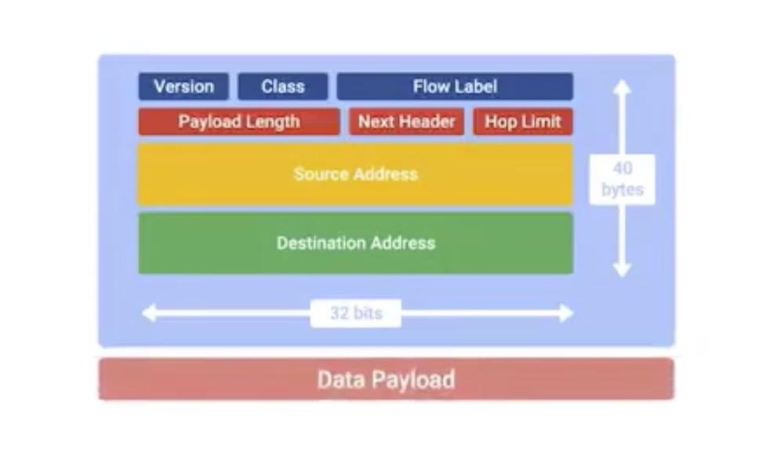
1. IPv6 and IPv4 in harmony
    1. IPv4 mapped address space. Each ipv4 address is mapped to ipv6 address
        1. 192.168.1.1 = 0:0:0:0:0:ffff:d1ad:35a7
        1. The first 4 16 bit group are 0 and 5th group is all 1 then the bits of ipv4 is followed.
    1. IPv6 tunnels
        1. Servers take incoming IPv6 traffic and encapsulate it within traditional IPv4 datagram
        1. Another Server strips and forwards
    1. IPv6 tunnerl broker
        1. Companies that provide IPv6 tunneling endpoints for you, so you don't have to introduce additional equipments to your netowrk.
