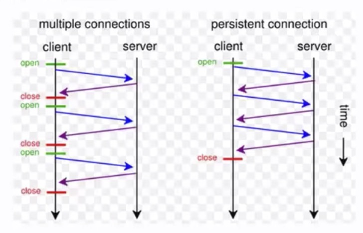
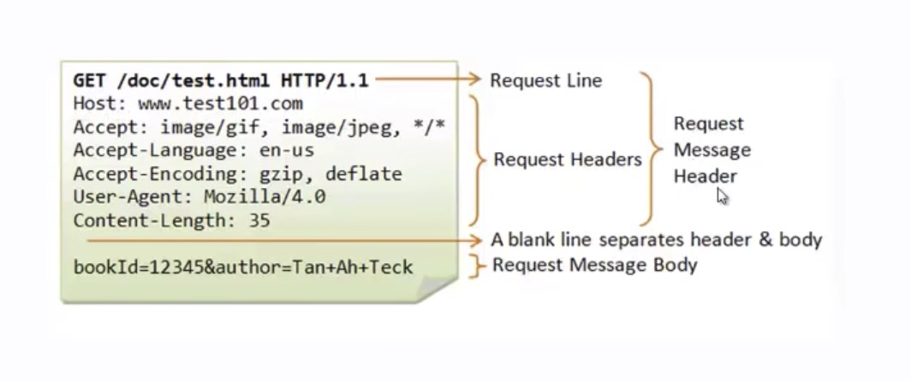
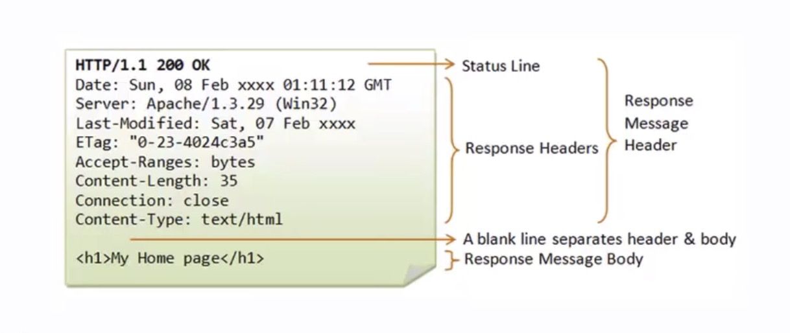
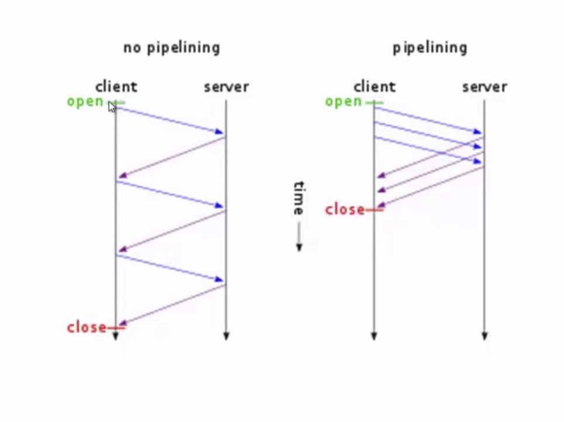

# Protocols

## http

1. Definition
    1. Application Layer Protocol
    1. Current version HTTP/2.0
    1. Default port 80
    1. TCP is the underlying protocol
    1. Request and response
1. 3 way handshake
    1. SYN -> ACK SYN -> ACK
    1. ACK -> number for next packet
1. HTTP 1.1 vs HTP 1.0
    1. Multiple Host Name Supports
    1. Persistent Connections -> 300 sec idle timeout
    1. Byte Range request -> random byte request -> seeking video
    1. Caching and Proxy support
    1. More HTTP methods
1. Persistent Connection
    1. 
1. Messages
    1. Text based
    1. General

    ```text
    <start-line>
    <message-headers>
    <empty-line>
    [<message-body>]
    ```

    1. Request

    ```text
    <request-line>
    <request-headers>
    <empty-line>
    [<message-body>]
    ```

    1. 
    1. Response

    ```text
    <status-line>
    <response-headers>
    <empty-line>
    [<message-body>]
    ```

    1. 
1. Methods
    1. Common
        1. GET
        1. HEAD -> req the server not to send the body
        1. POST
    1. Others
        1. OPTIONS
        1. PUT
        1. UPDATE
        1. DELETE
        1. TRACE -> to analyse hops
    1. Safe
        1. GET
        1. HEAD
        1. TRACE
1. Status Code
    1. 1yy -> informational message eg. continuew
    1. 2yy -> sucess
    1. 3yy -> redirection
    1. 4yy -> client error
    1. 5yy -> server error
1. Headers
    1. Request headers
        1. Clients provide info to server
        1. Accept/Accept-Charset/Accept-Encoding/Accept-Language
        1. Authorization
        1. Expect
        1. From
        1. Host -> only mandatory header
        1. if-mathc/if-modified-since/if-none-match/if-range/id-unmodified-since
        1. Max-Forwards
        1. Proxy-Authorization
    1. Response headers
        1. Provide additional data that expands upon the summary information that is present in the status line at the begin of each server reply
        1. Accept-Ranges
        1. Age
        1. Erag
        1. Location -> redirect
        1. Proxy-Authenticate
        1. Retry-After
        1. Server
        1. Vary
        1. WWW-Authenticate (401)
1. Caching
    1. ex: memcache, cdns
    1. 
1. Cookies
    1. small piece of significat data
    1. it are sent through cookie header
1. pipeling
    1. 

## REST APIs

1. Return is not html its json or xml
1. Stateless
1. Features
    1. Simpler than soap
    1. proper documentation
    1. Error messages
1. Princicples
    1. Stateless
    1. Client Server
    1. Uniform Interface
    1. Cacheable
    1. Layered System
    1. Code on demand
1. Methods
    1. CRUD
    1. resouece url/path/resource
    1. C -> POST
    1. R -> GET
    1. U -> UPDATE
    1. D -> DELETE

## SSH

1. TCP port for ssh 22
1. Replacement for Telnet and unsecure remote shell
1. It uses public-key cryptography to authenticate the remote computer.

## MAC

1. It is used for authentication

## SSL

1. It is implemented with the following protocols
    1. SSL Record protocol
    1. Handshake protocol
    1. Change cihper spec protocol
    1. Alert protocol
1. Above TCP/IP and below HTTP
1. Connection -> Transport to provive the service, Session -> association b/w client and server
1. Session
    1. Session has multiple connections
    1. Session is created by handshake protocol
    1. Session state parameters
        1. Session Identifier
        1. Peer Certificate (x.509)
        1. Compression method
        1. Cipher Spec -> encryption algorithms and authentication algo (MAC)
        1. Master Secret -> secret key shared between client and server
        1. Isresumable -> flag
1. Conection
    1. Connection state parameters
        1. Server and client random
        1. Server write MAC secret
        1. Client write MAC secret
        1. Server write key
        1. Client write key
        1. Inititalization vector
        1. Sequence Number
