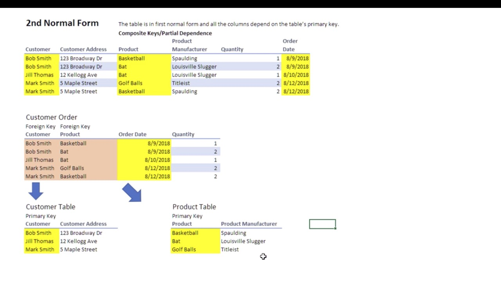
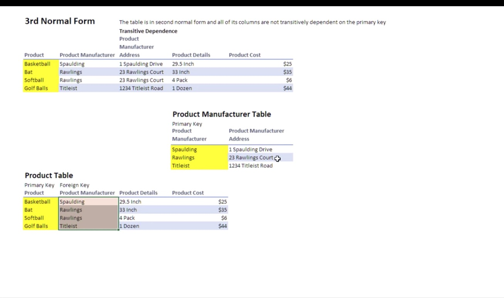
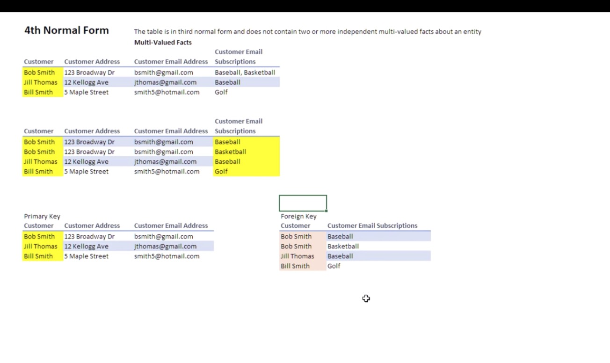

# SQL

## Common Questions

1. What is the difference between DELETE and TRUNCATE?
    1. Delete is DML Command and Truncate is DDL Command
    1. Delete can be rolledback and trucant cannot be rolled back
    1. Delete is used to delete rows with criteria and truncate delets all the rows from the table.

1. Diffrence between Drop and Truncate
    1. Drop removes a table and cannot be rolled back
    1. Truncate removes all the rows from the table and cannot be rolled back

1. What are the different subsets of SQL?
    1. DDL(Data Definition Language) -> Consists of the commands that can be used to define database schema
    1. DML(Data Manipulation Language) -> consists of commands that deals with teh manipulation of data present in database
    1. DCL(Data Control Language) -> Includes commands which deals with the rights, permissions and other controls of the database system.
    1. TCL(Transcation Command Language) -> Includes commands that mainly deal with transcation of database.

1. What do you mean by DBMS? and what are its types?
    1. Database Management System (also known as DBMS) is a software for storing and retrieving users' data by considering appropriate security measures. It allows users to create their own databases as per their requirement.
    1. Types of DBMS
        1. Hierarchical DBMS
            * A DBMS is siad to be hierarchical if the relationships amonf data in the database are established in such a way that one data item is present as subordinate of another one or a sub unit.
        1. Network DBMS
            * A DBMS is said to be a Network DBMS if the relationships among data are of type many-to-many.
        1. Object-oriented DBMSS
            * OODBMS represent significant advance over other DBMS. Other DBMS handle structured data. OODBMS is designed to store data like media.
        1. Relational DBMS
            * A DBMS is said to be a relational DBMS or RDBMS if the database relationships are treated in the form of a table.

1. What do you mean by table and field in SQL?
    1. A table refers to a collection of data in an organized manner in form of rows and columns.
    1. A field refers to the number of columns in a table.

1. What are joins in SQL?
    1. A join clause is used to combine rows from two or more tables, based on a related column between them.
    1. Types of joins
        1. Inner join
        1. Left join
        1. Right join
        1. Full join

1. What is the difference between CHAR and VARCHAR2 datatyp?
    1. Char is fixed lenght, varchar is variable lenght

1. What is a primary key?
    1. A set of attributes that can be used to uniquely identify every tuple is a primary key, if there are 3-4 candidate keys then one of those can be a primary key

1. What are Constraints?
    1. Constraints are used to specify the limit on the data type of the table. It can be set while creating or altering a table
    1. Various constraints are as follows,
        1. Not null
        1. Unique
        1. Check
        1. Default
        1. Index
        1. Primary key
        1. Foreign key

1. Difference betweek SQL and MySQl?
    1. SQL is a standard language which stands for Structured Query Language. SQL is the core of relational database which is used for accessing and managing database.
    1. MySQL is an open-source relatin database management system that works on many platforms. It provides multi-user access to support many storage engines and is backec by oracle

1. What is a unique key
    1. Unique key identifies a single row in the table.
    1. Multiple values allowed per table
    1. Null values are allowed.
    1. Duplicate values are not allowed.

1. What is a foreign key
    1. FK maintinas referential integrity by enforcing a link between the data in two tables.
    1. The foreign key in the child table references the primary key in the parent table.
    1. It prevents actions that would destroy links between child and parent tables.

1. What do you mean by data integrity?
    1. Accuracy
    1. Consistency
    1. Integrity Constraints to enforce business rules on data.

1. What is the difference between clustered and non clustered index in SQL?
    1. Clustered Index
        1. Easy retrieval of data from the database and is faster.
        1. It alters teh way the records are stored in a database as it sorts out rows by column which is set to be clustered index.
        1. One table can only have one clustered index.
    1. Non Clustered Index
        1. It is used for easy retrieval but is not as fast as clustered index.
        1. It does not sort the actual data but it creates seperate objects called RIDs and they are clustered.
        1. One table can have more than on non clustered indices

1. Write a SQL query to display current date
    1. Use GETDATE()

1. What is denormalization?
    1. It increases the performance of the entire infrastructure as it introduces redundancy.
    1. Adds the redundant data into a table by incorporating database queries that combine data from various tables into a single table

1. What are entities and relationships?
    1. A person,place or thing in real world about which data can be stored in a database. Tables store data that represent one type of entity.
    1. Relation or links betweeen entities that have something to do with each other.

1. What is an index?
    1. Performance tuning method that alows faster retrieval of records, Creates an entry for each value.

1. What are types of index?
    1. Unique Index
        1. It does not allow fields to have duplicate values if the column is unique index. Primary key automatically applies unique index.
    1. Clustered Index
        1. This index reorders the physical order of the tables and searches based on the basis of key values.
    1. Non clustered index
        1. It does not alter the physical order of the table, but maintains a logical order of the data.

1. What is normalization?
    1. The process of organizing data to avoid duplication and redundancy.
    1. Advantages
        1. Better database organization
        1. More tables with smaller rows
        1. Efficient data access
        1. Greater flexibiliy for queires
        1. Quickly find the information
        1. Easier to implement security
        1. Allows easy modification
        1. Reduction of redundant data
        1. More compact database
        1. Ensure consisten data after modification

1. What are the different types of normalization?
    1. 1 NF
        1. Each table cell should have a single value (Atomic)
        1. Columns must not be introduced for multiple values, rows should be introduced
    1. 2 NF
        1. The table is in first normal form and all the columns depend on the table's primary key. (Composite Keys/Partial Dependence)
        1. 
    1. 3 NF
        1. The talbe is in second normal form and all of its columns are not transitively dependent on the primary key (Transistive Dependence)
        1. 
    1. 4 NF
        1. The table is in third normal form and does not contain two or more independent (multi-valued facts) about an entity
        1. 

1. What is ACID property?
    1. Atomicity
    1. Consistency
    1. Isolation
    1. Durability

1. What do you mean by a trigger in SQL?
    1. Trigger in SQL are special type of stored procedures that are defined to execute automatically in place or after data modification. It allows to execute a batch of code when we insert,update or any other query is executed against a specific table.
    1. Before and After

    ```sql
    CREATE TRIGGER [schema_name.]trigger_name
    ON table_name
    AFTER  {[INSERT],[UPDATE],[DELETE]}
    [NOT FOR REPLICATION]
    AS
    {sql_statements}
    ```

1. What are different types of operator available in SQL?
    1. Arithmetic Operators
    1. Bitwise Operatores
    1. Comparison Operators
    1. Compound Operators
    1. Logical Operators

1. Are null values same as that of zero  or blank space?
    1. they are not they are unavailable, unknwon or not applicable

1. Difference between Cross join and Natural join
    1. Cross join has no ON clause so it provides a cartesian product after the join.
    1. Natural joins have an ON clause.

1. What is a subquery in SQL?
    1. A subquery is a query inside another query. Subqueries are always executed first.

1. What are types of subquery?
    1. Correlated Subquery
        1. If subquery references the columns in outer query it is called correlated subqueries
        1. It runs for every row.
    1. Non Correlated Subquery
        1. If subquery does not reference the columns in outer query it is called non correlated subqueries
        1. It runs only once.

1. Can you list the ways to get count of records in a table?
    1. Select count(*) from table;

1. List the employees which begin with 'A'
    1. Select * from table where name like 'A%'

1. SQL query to get the third highest salary of an employee

    ```sql
    SELECT TOP 1 salary
    FROM( SELECT TOP 3 salary FROM table order by salary DESC) as emp
    ORDER BY salary ASC;
    ```

1. What is the need for group functions in SQL?
    1. Group functions work on the set of rows and returns one result per group
    1. Some of group functions are,
        1. AVG
        1. COUNT
        1. MAX
        1. MIN
        1. SUM
        1. VARIANCE

1. What is relationship and types?
    1. Relation are between entities that have something to do with each other.They are defined as connection between the tables.
    1. Types of relations
        1. One to One
        1. One to Many
        1. Many to One
        1. Self-Referencing

1. How can you insert NULL values in a column while inserting the data?
    1. By omitting column from column list
    1. Explicitly specifying as NULL

1. What are the difference between 'BETWEEN' and 'IN' operator
    1. Between is used to specify a range
    1. IN is used to specify a set

1. Why are SQL functions used?
    1. To perform calculations on the data
    1. To convert data type
    1. To modify individual data items
    1. To format dates and numbers
    1. to manipulate the output

1. What is need for merge statement?
    1. for conditional update or insertion of data.

1. What do you mean by recursive stored procedure?
    1. It calls itself until some boundary condition is reached.

1. What is a clause in SQL?
    1. It helps in limiting the result set by providing a condition. eg: WHERE,HAVING

1. Difference between HAVING and WHERE
    1. Having clause was introduced because where clause could not be used with aggregate function
    1. Where clause checks the condition for each row

1. What are dynamic sql statemets?
    1. QL is a programming technique that enables you to build SQL statements dynamically at runtime

1. Lists the ways in which dynamic SQL can be executed
    1. Writing a query with parameters
    1. Using EXEC
    1. Using sp_executesql

1. What are various levels of constraints?
    1. Column level constraints.
    1. Table level constrains.

1. How to fetch common records from 2 tables?
    1. using intersect statement

1. List some case maniulation functions in SQL
    1. LOWER()
    1. UPPER()
    1. INITCAP() -> first letter upper case rest are lower case

1. What are diffrent set operators in sql?
    1. UNION
    1. INTERSECT
    1. MINUS

1. How to fetch alternate records from a table?

    ```sql
    select id from (select rowno, id from table) where mod(rowno,2)=1
    ```

1. What is used for pattern matching?
    1. % -> match 0 or more characters
    1. _ -> match exactly one character

1. How to select unique records on a table?
    1. DISTINCT

1. How to get first 5 characters of a string?
    1. SUBSTRING(string,1,5) or RIGHT(string,5)

1. Difference between SQL and PL/SQL?
    1. PL/SQL is orcle's Procedural Language SQL. Which allows to write full programs like loops and variables

1. What is a view?
    1. A view is a virtual table which consists of a subset of data contained in a table.
    1. Since views are not preset, it takes less space to store.
    1. Views can have data from more than one table.

1. What is view used for?
    1. Restricting access to data.
    1. Making complex queries simple
    1. Ensuring data independence
    1. Providing differrent views of same data.

1. What is a stored procedure
    1. Several SQL statements are consolidated into a stored procedure and are executed whenever and wherever required

1. List out the advantages and disadvantages of stored procedures.
    1. Advantages
        1. Modular programming
        1. Faster executing
        1. Reduces network traffic
    1. Disadvantages
        1. It can utilize more memory in database server

1. Types of user defined functions
    1. Scalar functions
    1. Inline Table-valued functions
    1. Multi-statement valued functions

1. What do you mean by collation?
    1. A set of rules that determine how data can be sorted or compared.

1. What are different types of collation sensitivity?
    1. Case
    1. Karna
    1. Width
    1. Accent

1. What is a datawarehouse
    1. Central repository of data where data is assembled from multiple sources of information
    1. These are made available for mining as well as online processing

1. What are auth modes in sql server?
    1. Windows Mode
    1. Mixed Mode

1. Whate are STUFF and REPLACE function?
    1. STUFF -> used to overwrite existing characters or insert strings into another string
    1. REPLACE -> self explanatory
