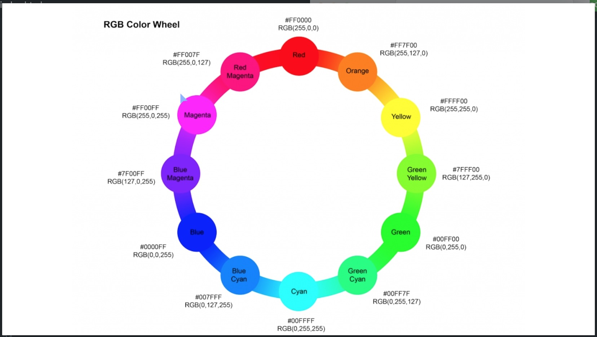
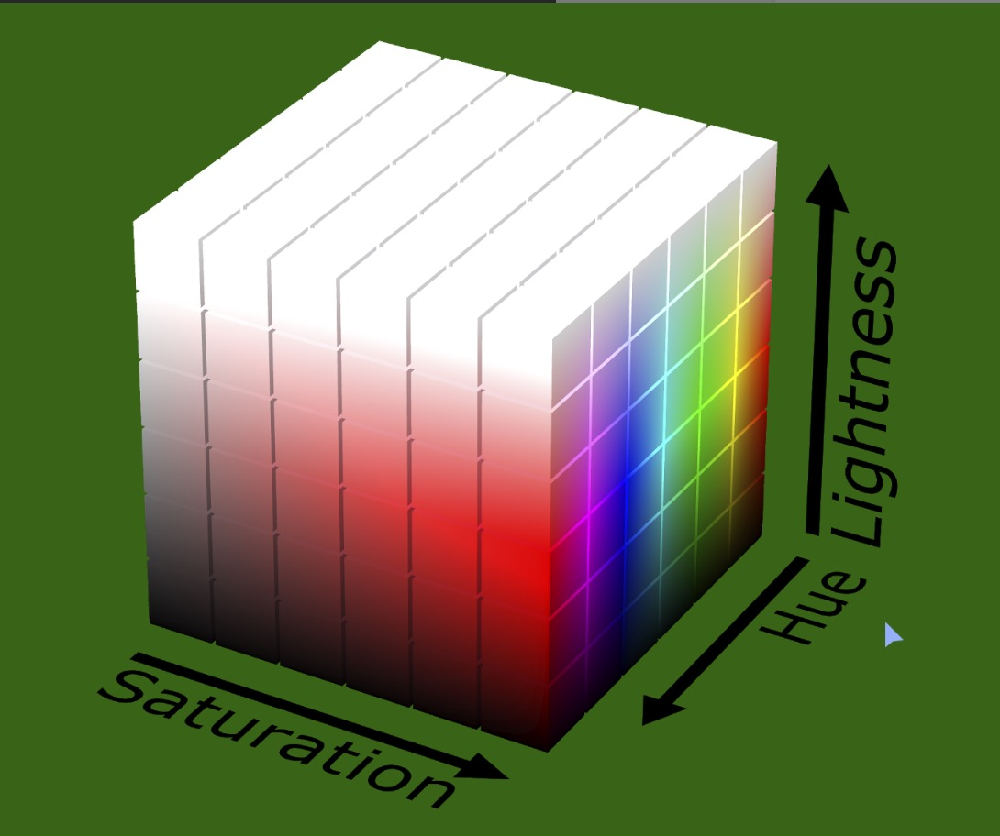

# Applied Visual Design

1. Create Visual Balance Using the text-align Property

    ```html
    <style>
        h4 {
            text-align: center;
        }
        p {
            text-align: justify;
        }
    </style>
    ```

1. Use the strong Tag to Make Text Bold

    ```html
    <p>Google was founded by Larry Page and Sergey Brin while they were Ph.D. students at <strong>Stanford University</strong>.</p>
    ```

1. Use the u Tag to Underline Text

    ```html
    <p>Google was founded by Larry Page and Sergey Brin while they were <u>Ph.D. students</u> at <strong>Stanford University</strong>.</p>
    ```

1. Use the em Tag to Italicize Text

    ```html
    <p><em>Google was founded by Larry Page and Sergey Brin while they were <u>Ph.D. students</u> at <strong>Stanford University</strong>.</em></p>
    ```

1. Use the s Tag to Strikethrough Text

    ```html
    <h4><s>Google</s> Alphabet</h4>
    ```

1. Create a Horizontal Line Using the hr Element

    ```html
    <h4><s>Google</s>Alphabet</h4>
    <hr>
    <p><em>Google was founded by Larry Page and Sergey Brin while they were <u>Ph.D. students</u> at <strong>Stanford University</strong>.</em></p>
    ```

1. Add a box-shadow to a Card-like Element

    ```html
    <style>
         #thumbnail {
            /* offset-x | offset-y | blur-radius | spread-radius | color */
            box-shadow: 0 10px 20px rgba(0,0,0,0.19), 0 6px 6px rgba(0,0,0,0.23);
        }
    </style>
    ```

1. Decrease the Opacity of an Element

    ```html
    <style>
        p {
            opacity: 0.7;
        }
    </style>
    ```

1. Use the text-transform Property to Make Text Uppercase

    ```html
    <style>
        p {
            /* lowercase, uppercase, capitalize, initial, none */
            text-transform: uppercase;
        }
    </style>
    ```

1. Set the line-height of Paragraphs

    ```html
    <style>
        p {
            font-size: 16px;
            line-height: 25px;
        }
    </style>
    ```

1. Adjust the Hover State of an Anchor Tag

    ```html
    <style>
        <style>
        a:hover {
            color: red;
        }
    </style>
    ```

1. Change an Element's Relative Position

    ```html
    <style>
        h2 {
            position: relative;
            top: 15px;
        }
    </style>
    ```

1. Lock an Element to its Parent with Absolute Positioning

    ```html
    <style>
        #searchbar {
            position: absolute;
            right: 50px;
            top: 50px;
        }
        section {
            position: relative;
        }
    </style>
    <body>
    <h1>Welcome!</h1>
    <section>
        <form id="searchbar">
        <label for="search">Search:</label>
        <input type="search" id="search" name="search">
        <input type="submit" name="submit" value="Go!">
        </form>
    </section>
    </body>
    ```

1. Lock an Element to the Browser Window with Fixed Positioning

    ```html
    <style>
        #navbar {
        position: fixed;
        top: 0px;
        left: 0px;
        width: 100%;
        background-color: #767676;
        }
    </style>
    ```

1. Push Elements Left or Right with the float Property

    ```html
    <style>
        #left {
            float: left;
            width: 50%;
        }
        #right {
            float: right;
            width: 40%;
        }
    </style>
    ```

1. Change the Position of Overlapping Elements with the z-index Property

    ```html
    <style>
        .box {
            z-index: 2;
        }
    </style>
    ```

1. Center an Element Horizontally Using the margin Property

    ```html
    <style>
        div {
            background-color: blue;
            height: 100px;
            width: 100px;
            margin: auto;
        }
    </style>
    ```

1. Learn about Complementary Colors
    * A color's complement is the color opposite to it in the color wheel.
    * 

1. Learn about Tertiary Colors
    * Primary colors are Red, Blue and Green.
    * Secondary colors are got by combining two primary colors they are cyan, magenta and yellow.
    * Tertiary colors are combination of two secondary colors they are Red Magenta, Blue Magenta, Blue cyan, Green Cyan, Green Yellow and Orange.
    * **split-complementary** colors means, pick a base color and the adjacent colors to it's complement.
    * 

1. Adjust the Hue of a Color
    * hsl color format stands for Hue, Saturation and Lightness.
    * hue is for color, saturation is amount of gray and lightness is amount of white.
    * 
    * |Color|HSL|
        |--- |--- |
        |red|hsl(0, 100%, 50%)|
        |yellow|hsl(60, 100%, 50%)|
        |green|hsl(120, 100%, 50%)|
        |cyan|hsl(180, 100%, 50%)|
        |blue|hsl(240, 100%, 50%)|
        |magenta|hsl(300, 100%, 50%)|

1. Adjust the Tone of a Color

    ```html
    <style>
        header {
            background-color: hsl(180, 90%, 35%);
            color: #FFFFFF;
        }
        nav {
            background-color: hsl(180, 80%, 25%);
        }
    </style>
    ```

1. Create a Gradual CSS Linear Gradient

    ```html
    <style>
        div{
            background: linear-gradient(35deg, #CCFFFF, #FFCCCC);
        }
    </style>
    ```

1. Use a CSS Linear Gradient to Create a Striped Element

    ```html
    <style>
        div{
            background: repeating-linear-gradient(
                45deg,
                yellow 0px,
                yellow 40px,
                black 40px,
                black 80px
            );
        }
    </style>
    ```

1. Create Texture by Adding a Subtle Pattern as a Background Image

    ```html
    <style>
        body {
            background: url(https://i.imgur.com/MJAkxbh.png);
        }
    </style>
    ```

1. Use the CSS Transform scale Property to Change the Size of an Element

    ```html
    <style>
        #ball2 {
            transform: scale(1.5);
        }
    </style>
    ```

1. Use the CSS Transform Property skewX to Skew an Element Along the X-Axis

    ```html
    <style>
        #bottom {
            transform: skewX(24deg);
            transform: skewY(-10deg);
        }
    </style>
    ```

1. Heart

    ```html
    <style>
        .heart {
            position: absolute;
            margin: auto;
            top: 0;
            right: 0;
            bottom: 0;
            left: 0;
            background-color: pink;
            height: 50px;
            width: 50px;
            transform: rotate(-45deg);
        }
        .heart::after {
            background-color: pink;
            content: "";
            border-radius: 50%;
            position: absolute;
            width: 50px;
            height: 50px;
            top: 0px;
            left: 25px;
        }
        .heart::before {
            content: "";
            background-color: pink;
            border-radius: 50%;
            position: absolute;
            width: 50px;
            height: 50px;
            top: -25px;
            left: 0px;
        }
    </style>
    <div class = "heart"></div>
    ```

1. Learn How the CSS @keyframes and animation Properties Work

    ```html
    <style>
    div {
        height: 40px;
        width: 70%;
        background: black;
        margin: 50px auto;
        border-radius: 5px;
    }
    #rect {
        animation-name: rainbow;
        animation-duration: 4s;
    }
    @keyframes rainbow{
        0% {
        background-color: blue;
        }
        50% {
        background-color: green;
        }
        100% {
        background-color: yellow;
        }
    }
    </style>
    <div id="rect"></div>
    ```

1. animation-fill-mode

    ```html
    <style>
    button {
        border-radius: 5px;
        color: white;
        background-color: #0F5897;
        padding: 5px 10px 8px 10px;
    }
    button:hover {
        animation-name: background-color;
        animation-duration: 500ms;
        /* add your code below this line */
        animation-fill-mode: forwards;
        /* add your code above this line */
    }
    @keyframes background-color {
        100% {
        background-color: #4791d0;
        }
    }
    </style>
    <button>Register</button>
    ```

1. Animate Elements Continually Using an Infinite Animation Count

    ```html
    <style>
        #ball {
            width: 100px;
            height: 100px;
            margin: 50px auto;
            position: relative;
            border-radius: 50%;
            background: linear-gradient(
            35deg,
            #ccffff,
            #ffcccc
            );
            animation-name: bounce;
            animation-duration: 1s;
            animation-iteration-count: infinite;
        }
    </style>
    ```

1. Change Animation Timing with Keywords

    ```html
    <style>
        .balls {
            border-radius: 50%;
            background: linear-gradient(
            35deg,
            #ccffff,
            #ffcccc
            );
            position: fixed;  
            width: 50px;
            height: 50px;
            margin-top: 50px;
            animation-name: bounce;
            animation-duration: 2s;
            animation-iteration-count: infinite;
        }
        #ball1 {
            left:27%;
            animation-timing-function: linear;
        }
        #ball2 {
            left:56%;
            animation-timing-function: ease-out;
        }

        @keyframes bounce {
            0% {
                top: 0px;
            }
            100% {
                top: 249px;
            }
        }
    </style>
    <div class="balls" id="ball1"></div>
    <div class="balls" id="ball2"></div>
    ```

1. Learn How Bezier Curves Work
    * cubic-bezier(x1, y1, x2, y2)
    * 