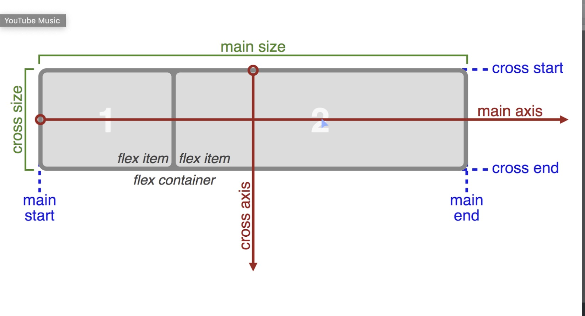

# CSS Flexbox

1. flex to Position Two Boxes

    ```html
    <style>
        #box-container {
            height: 500px;
            display: flex;
        }
    </style>
    ```

1. Use the flex-direction Property to Make a Row

    ```html
    <style>
        /* can also use row, column and column-reverse*/
        #box-container {
            display: flex;
            height: 500px;
            flex-direction: row-reverse;
        }
    </style>
    ```

1. Use the flex-direction Property to Make a Column

    ```html
    <style>
        /* can also use row, row-reverse and column-reverse*/
        #box-container {
            display: flex;
            height: 500px;
            flex-direction: column;
        }
    </style>
    ```

1. Align Elements Using the justify-content Property
    * 
    * **center** which aligns all the flex items to the center inside the flex container.
    * **flex-start** aligns items to the start of the flex container. For a row, this pushes the items to the left of the container. For a column, this pushes the items to the top of the container.
    * **flex-end** aligns items to the end of the flex container. For a row, this pushes the items to the right of the container. For a column, this pushes the items to the bottom of the container.
    * **space-between** aligns items to the center of the main axis, with extra space placed between the items. The first and last items are pushed to the very edge of the flex container. For example, in a row the first item is against the left side of the container, the last item is against the right side of the container, then the other items between them are spaced evenly.
    * **space-around** similar to space-between but the first and last items are not locked to the edges of the container, the space is distributed around all the items

    ```html
    <style>
        #box-container {
            background: gray;
            display: flex;
            height: 500px;
            justify-content: space-around;
        }
    </style>
    ```

1. Align Elements Using the align-items Property
    * **center** align items to the center. For rows, this vertically aligns items (equal space above and below the items). For columns, this horizontally aligns them (equal space to the left and right of the items).
    * **flex-start** aligns items to the start of the flex container. For rows, this aligns items to the top of the container. For columns, this aligns items to the left of the container.
    * **flex-end** aligns items to the end of the flex container. For rows, this aligns items to the bottom of the container. For columns, this aligns items to the right of the container.
    * **stretch** stretch the items to fill the flex container. For example, rows items are stretched to fill the flex container top-to-bottom.
    * **baseline** align items to their baselines. Baseline is a text concept, think of it as the line that the letters sit on.

    ```html
    <style>
        #box-container {
            background: gray;
            display: flex;
            height: 500px;
            align-items: center;
        }
    </style>
    ```

1. Use the flex-wrap Property to Wrap a Row or Column
    * **nowrap**:this is the default setting, and does not wrap items.
    * **wrap**: wraps items from left-to-right if they are in a row, or top-to-bottom if they are in a column.
    * **wrap-reverse**:  wraps items from bottom-to-top if they are in a row, or right-to-left if they are in a column.

    ```html
    <style>
        #box-container {
            background: gray;
            display: flex;
            height: 100%;
            flex-wrap: wrap;
        }
    </style>
    ```

1. Use the flex-shrink Property to Shrink Items

    ```html
    <style>
        #box-container {
            display: flex;
            height: 500px;
        }
        #box-1 {
            background-color: dodgerblue;
            width: 100%;
            height: 200px;
            flex-shrink: 1;
        }

        #box-2 {
            background-color: orangered;
            width: 100%;
            height: 200px;
            flex-shrink: 2;
        }
    </style>
    ```

1. Use the flex-grow Property to Expand Items

    ```html
    <style>
        #box-container {
            display: flex;
            height: 500px;
        }
        #box-1 {
            background-color: dodgerblue;
            height: 200px;
            flex-grow: 1;
        }
        #box-2 {
            background-color: orangered;
            height: 200px;
            flex-grow: 2;
        }
    </style>

    <div id="box-container">
    <div id="box-1"></div>
    <div id="box-2"></div>
    </div>
    ```

1. Use the flex-basis Property to Set the Initial Size of an Item

    ```html
    <style>
        #box-container {
            display: flex;
            height: 500px;
        }
        #box-1 {
            background-color: dodgerblue;
            height: 200px;
            flex-basis: 10em;
        }
        #box-2 {
            background-color: orangered;
            height: 200px;
            flex-basis: 20em;
        }
    </style>
    <div id="box-container">
    <div id="box-1"></div>
    <div id="box-2"></div>
    </div>
    ```

1. Use the flex Shorthand Property

    ```html
    <style>
        /* flex-grow, flex-shrink and flex-basis*/
        #box-1 {
            background-color: dodgerblue;
            flex: 2 2 150px;
            height: 200px;
        }
    </style>
    ```

1. Use the order Property to Rearrange Items

    ```html
    <style>
        #box-1 {
            background-color: dodgerblue;
            order: 2;
            height: 200px;
            width: 200px;
        }
    </style>
    ```

