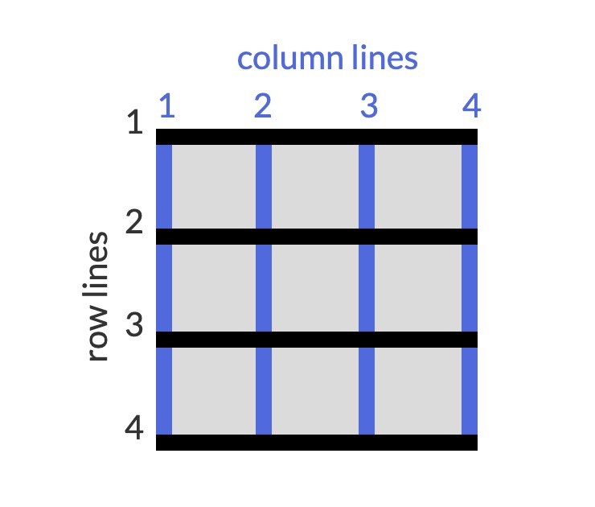

# CSS Grid

1. Add Columns with grid-template-columns

    ```html
    <style>
        /* creates three columns with 100px*/
        .container {
            display: grid;
            grid-template-columns: 100px 100px 100px;
        }
    </style>
    ```

1. Add Rows with grid-template-rows

    ```html
    <style>
        /* creates three columns with 100px and two rows of height 50px*/
        .container {
            display: grid;
            grid-template-columns: 100px 100px 100px;
            grid-template-rows: 50px 50px;
        }
    </style>
    ```

1. CSS Grid units to Change the Size of Columns and Rows

    ```html
    <style>
        .container {
            display: grid;
            grid-template-columns: auto 50px 10% 2fr 1fr;
            grid-template-rows: 50px 50px;
        }
    </style>
    ```

1. Create a Column Gap Using grid-column-gap

    ```html
    <style>
        .container {
            display: grid;
            grid-template-columns: auto 50px 10% 2fr 1fr;
            grid-template-rows: 50px 50px;
            grid-column-gap: 10px;
        }
    </style>
    ```

1. Create a Row Gap using grid-row-gap

    ```html
    <style>
        .container {
            display: grid;
            grid-template-columns: auto 50px 10% 2fr 1fr;
            grid-template-rows: 50px 50px;
            grid-column-gap: 10px;
            grid-row-gap: 5px;
        }
    </style>
    ```

1. Add Gaps Faster with grid-gap

    ```html
    <style>
        /* grid-row-gap , grid-column-gap*/
        .container {
            display: grid;
            grid-template-columns: auto 50px 10% 2fr 1fr;
            grid-template-rows: 50px 50px;
            grid-gap: 5px 10px;
        }
    </style>
    ```

1. Use grid-column to Control Spacing
    * 

    ```html
    <style>
        .item {
            grid-column: 2/4; /* starts at 2nd columnd and ends att 4th*/
        }
    </style>
    ```

1. Use grid-row to Control Spacing

    ```html
    <style>
        .item {
            grid-row: 2/4; /* starts at 2nd row and ends att 4th*/
        }
    </style>
    ```

1. Align an Item Horizontally using justify-self
    * In grid all items are cells and justify-self will position wintin the cell.
    * **start**:aligns the content at the left of the cell.
    * **center**:aligns the content in the center of the cell.
    * **end**:aligns the content at the right of the cell.
    * **stretch**: it is default.

    ```html
    <style>
        .item {
            grid-row: 2/4; /* starts at 2nd row and ends att 4th*/

        }
    </style>
    ```

1. Align an Item Vertically using align-self

    ```html
    <style>
        .item {
            grid-row: 2/4; /* starts at 2nd row and ends att 4th*/
            align-self: end; /* can be center, start or stretch also*/
        }
    </style>
    ```

1. Align All Items Horizontally using justify-items

    ```html
    <style>
        .container {
            display: grid;
            grid-template-columns: auto 50px 10% 2fr 1fr;
            grid-template-rows: 50px 50px;
            grid-gap: 5px 10px;
            justify-items: center; /* can be center, start or stretch also*/
        }
    </style>
    ```

1. Align All Items Vertically using align-items

    ```html
    <style>
        .container {
            display: grid;
            grid-template-columns: auto 50px 10% 2fr 1fr;
            grid-template-rows: 50px 50px;
            grid-gap: 5px 10px;
            justify-items: center; /* can be end, start or stretch also*/
            align-items: end; /* can be center, start or stretch also*/
        }
    </style>
    ```

1. Divide the Grid Into an Area Template

    ```html
    <style>
        .container {
            display: grid;
            grid-template-columns: auto 50px 10% 2fr 1fr;
            grid-template-rows: 50px 50px;
            grid-gap: 5px 10px;
            justify-items: center; /* can be end, start or stretch also*/
            align-items: end; /* can be center, start or stretch also*/
            grid-template-areas:
                "header header header"
                ". content content" /* period means empty cell*/
                "footer footer footer";
        }
    </style>
    ```

1. Place Items in Grid Areas Using the grid-area Property

    ```html
    <style>
        .container {
            display: grid;
            grid-template-columns: auto 50px 10% 2fr 1fr;
            grid-template-rows: 50px 50px;
            grid-gap: 5px 10px;
            justify-items: center; /* can be end, start or stretch also*/
            align-items: end; /* can be center, start or stretch also*/
            grid-template-areas:
                "header header header"
                ". content content" /* period means empty cell*/
                "footer footer footer";
        }
        .item {
            grid-area: footer;
        }
    </style>
    ```

1. Use grid-area Without Creating an Areas Template

    ```html
    <style>
        .item {
             grid-area: 3/1/4/4; /* points on the above picture x/y/x/y*/
        }
    </style>
    ```

1. Reduce Repetition Using the repeat Function

    ```html
    <style>
        .container {
            display: grid;
            grid-template-columns: auto 50px 10% 2fr 1fr;
            grid-template-rows: repeat(2, 50px);
        }
        .item {
            grid-area: footer;
        }
    </style>
    ```

1. Limit Item Size Using the minmax Function

    ```html
    <style>
        .container {
            display: grid;
            grid-template-columns: repeat(3, minmax(90px, 1fr));
            grid-template-rows: repeat(2, 50px);
        }
    </style>
    ```

1. Create Flexible Layouts Using auto-fill
    * similar to wrap in flex
    * does not fill the entire container

    ```html
    <style>
        .container {
            display: grid;
            grid-template-columns: repeat(auto-fill, minmax(90px, 1fr));
            grid-template-rows: repeat(2, 50px);
        }
    </style>
    ```

1. Create Flexible Layouts Using auto-fit
    * fits the entire container

    ```html
    <style>
        .container {
            display: grid;
            grid-template-columns: repeat(auto-fit, minmax(90px, 1fr));
            grid-template-rows: repeat(2, 50px);
        }
    </style>
    ```

1. Use Media Queries to Create Responsive Layouts

    