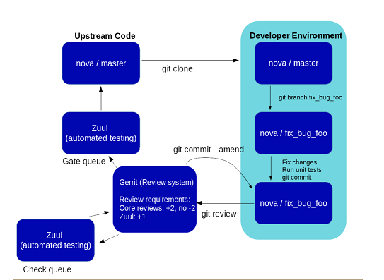
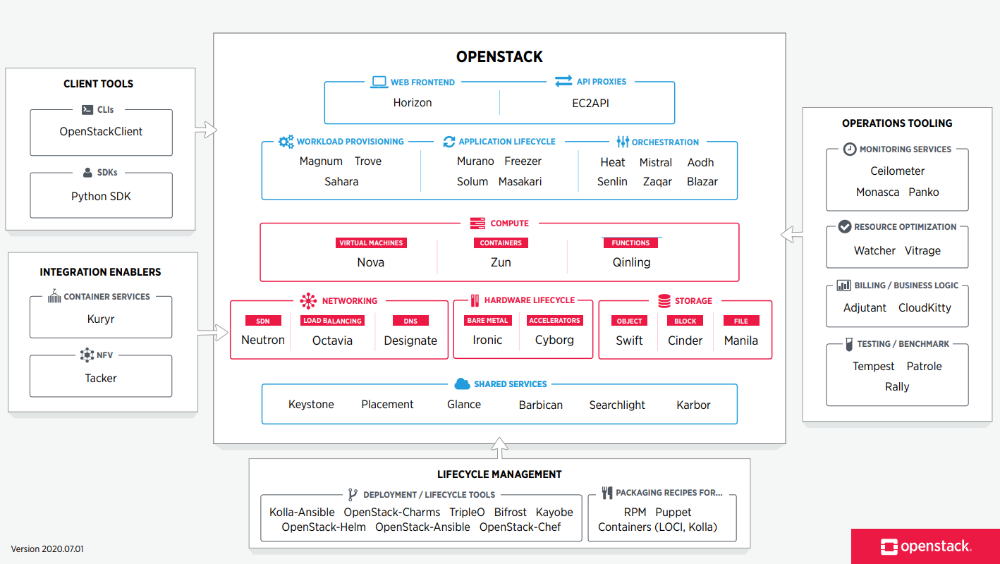

# OpenStack

## Apache License Version 2.0

1. Can
   1. Commercial user
   2. Modify
   3. Distribute
   4. Sublicense
   5. Private Use
   6. Use Patent Claims
   7. Place Warranty
2. Cannot
   1. Hold liable
   2. Use trademark
3. Must
   1. Include Copyright
   2. Include license
   3. State changes
   4. Include notice

## Development, contribution, issue tracking and community

1. Links
   1. [Openstack Source](https://opendev.org/openstack/)
   2. [Mirror of Openstack in GitHub](https://github.com/openstack)
2. Workflow
   1. Uses concept of **changes** rather than pull requests
   2. **[Gerrit](https://www.gerritcodereview.com/)** is used for reviews
   3. Steps to perform a change
      1. Clone the repository
      2. Create a new branch
      3. Make changes and commit
      4. Then propose to Gerrit using   **git-review**
      5. After this Zuul is used for continuous integration and runs tests
      6. Human review
      7. If issues found, ammend for commit is called
      8. Once changes approved by Zuul and human reviewers, Zuul performs gate tests and merges it
      9. 
3. Account Setup
   1. Uses **[Ubuntu One](https://login.ubuntu.com/)** as SSO provider
   2. **[Launch Pad](https://launchpad.net/)** is used for bug tracking
   3. **[Openstac Gerrit](https://review.opendev.org/)** is logged in using Ubuntu One SSO
   4. Should upload ssh keys **[Here](https://review.opendev.org/#/settings/ssh-keys)** to propose changes
4. Git Setup
   1. configure user.name and user.email
   2. install git-review
   ```apt-get install git-review```
   3. Setup gerrit configurations
   ```git config --global gitreview.username yourgerritusername```
5. IRC Setup (Internet Relay Chat) for community interaction
   1. This channel can be used to clarifies doubts and issues in openstack
   2. It is based on **[FreeNode](https://freenode.net/kb/answer/chat)**
   3. Connecting to FreeNode
      1. Can be accessed with any IRC clients or **[FreeNode Webchat](https://webchat.freenode.net/)**
      2. We need to have registered nick to join #pendev channel
      3. Channels to join - #opendev, #opendev-meeting, #openstack-infra and #openstack-infra-incident

## OpenStack Overview

1. Cloud operating system that controls large pool of
   1. compute
   2. storage
   3. network
2. These are all managed and provisioned through APIs with common authentication mechanisms.
3. An admin dashboard is available and user view to provision resources through web interface
4. 

## Components

1. Compute
   1. Nova (Compute service)
      1. [Source](https://github.com/openstack/nova)
      2. Nova is used to provide bare metal, virtual machines, containers and on demand scaling of applications, it's services and libraries.
      3. Depends on
         1. Keystone
         2. Neutron
         3. Glance
   2. Zun (Container service)
      1. [Source](https://github.com/openstack/zun)
      2. Provides APIs for launching and managing containers backed by different technologies.
      3. Zun is supposed to integrate well with openstack resources such as, Neutron and Cinder.
      4. Provides simple API for containers abstracting each container technologies.
      5. Depends on
         1. Keystone
         2. Neutron
         3. Kuryr
   3. Qinling (Function service)
      1. [Source](https://github.com/openstack/qinling)
      2. Provides platform to support serverless functions
      3. Depends on
         1. Keystone
2. Hardware Lifecycle
   1. Ironic (Bare metal)
      1. [Source](https://github.com/openstack/ironic)
      2. Consists of APIs and plugins for managing and provisioning physical machines in a fault tolerant manner
   2. Cyborg (Accelerators)
      1. [Source](https://github.com/openstack/cyborg)
      2. provides a general management framework for accelerators such as FPGA, GPU, SoCs, NVMe SSDs, CCIX caches, DPDK/SPDK, pmem and so forth.
      3. Depends on
         1. Keystone
         2. Glance
3. Storage
   1. Swift (Object storage)
      1. [Source](https://github.com/openstack/swift)
      2. It is distributed object storage system designed to scale from a single machine to thousands of servers.
      3. optimized for multi-tenancy and high concurrency.
      4. Ideal for backups, web and mobile content, and any other unstructured data that can grow without bound.
   2. Cinder (Block storage)
      1. [Source](https://github.com/openstack/cinder)
      2. Cinder is a Block Storage service for OpenStack.
      3. It virtualizes the management of block storage devices and provides simple end user apis
      4. Depends on
         1. Keystone
   3. Manila (File)
      1. [Source](https://github.com/openstack/manila)
      2. It provides coordinated access to shared or distributed file system.
      3. Depends on
         1. Keystone
4. Networking
   1. Neutron (SDN - Software Defined Network)
      1. [Source](https://github.com/openstack/neutron)
      2. It provides network connectivity as a service in virtual computer environment
      3. Depends on
         1. Keystone
   2. Octavia (Load Balancer)
      1. [Source](https://github.com/openstack/octavia)
      2. operator-scale load balancing solution designed to work with OpenStack.
      3. It delivery of load balancing services by managing a fleet of virtual machines, containers, or bare metal servers —collectively known as amphorae
      4. This on-demand, horizontal scaling feature differentiates Octavia from other load balancing solutions
      5. Depends on
         1. Keystone
         2. Neutron
         3. Nova
         4. Glance
   3. Designate (DNS service)
      1. [Source](https://github.com/openstack/designate)
      2. It provides DNS as a service
      3. Depends on
         1. Keystone
5. Shared Services
   1. Keystone (Identity Service)
      1. [Source](https://github.com/openstack/keystone) 
      2. It provides authentication, authorization and service discovery mechanisms via HTTP primarily for use by projects in the OpenStack family.
      3. It is most commonly deployed as an HTTP interface to existing identity systems, such as LDAP.
      4. It supports LDAP, OAuth, OpenID Connect, SAML and SQL.
   2. Placement (Placement Service)
      1. [Source](https://github.com/openstack/placement)
      1. It provides an HTTP API for tracking cloud resource inventories and usages to help other services effectively manage and allocate their resources.
   3. Glance (VM Images)
      1. [Source](https://github.com/openstack/glance)
      1. It provides services and associated libraries to store, browse, share, distribute and manage bootable disk images, other data closely associated with initializing compute resources, and metadata definitions.
      1. Depends on
         1. Keystone
   4. Barbican (Key management)
      1. [Source](https://github.com/openstack/barbican)
      1. It is used for the secure storage, provisioning and management of secrets.
      1. It can handle following,
         1. Symmetric keys
         2. Asymmetric Keys
         3. Raw Secrets
      1. For the symmetric and asymmetric key types, Barbican supports full life cycle management including provisioning, expiration, reporting, etc.
      1. Depends on
         1. Keystone
   5. Karbor (Application Data Protection as a Service)
      1. [Source](https://github.com/openstack/karbor)
      2. Karbor deals with protecting the Data and Meta-Data that comprises an OpenStack-deployed application against loss/damage (e.g. backup, replication)
      3. Depends on
         1. Keystone
   6. Searchlight (Indexing and search)
      1. [Source](https://github.com/openstack/SEARCHLIGHT)
      2. It provides indexing and search capabilities across OpenStack resources
      3. It uses Elasticsearch, a real-time distributed indexing and search engine built on Apache Lucene, but adds OpenStack authentication and Role Based Access Control to provide appropriate protection of data.
      4. Depends on
         1. Keystone
6. Orchestration
   1. Heat (Orchestration)
      1. [Source](https://github.com/openstack/HEAT)
      2. It orchestrates the infrastructure resources for a cloud application based on templates in the form of text files that can be treated like code
      3. It is a service to orchestrate multiple composite cloud applications using templates, through both an OpenStack-native REST API and a CloudFormation-compatible Query API.
      4. Depends on
         1. Keystone
   2. Senlin (Clustering Service)
      1. [Source](https://github.com/openstack/senlin)
      2. It creates and operates clusters of homogeneous objects exposed by other OpenStack services
      3. Senlin provides RESTful APIs to users so that they can associate various policies to a cluster like load balancing policy, health policy, scaling policy, update policy and so on.
      4. Depends on
         1. Keystone
   3. Mistral (Workforce service)
      1. [Source](https://github.com/openstack/mistral)
      2. It provide a mechanism to define tasks and workflows in a simple YAML-based language, manage and execute them in a distributed environment.
      3. Depends on
         1. Keystone
   4. Zaqar (Messaging Service)
      1. [Source](https://github.com/openstack/zaqar)
      2. It is used to send messages between various components of their SaaS and mobile applications, by using a variety of communication patterns.
      3. Other OpenStack components can integrate with Zaqar to surface events to end users and to communicate with guest agents that run in the "over-cloud" layer
      4. Depends on
         1. Keystone
   5. Blazar (Resource Reservation Service)
      1. [Source](https://github.com/openstack/blazar)
      2. Blazar enables users to reserve a specific type/amount of resources for a specific time period and it leases these resources to users based on their reservations.
      3. Depends on
         1. Keystone
         2. Nova
   6. Aodh (Alarming Service)
      1. [Source](https://github.com/openstack/aodh)
      2. Aodh's goal is to enable the ability to trigger actions based on defined rules against sample or event data collected by Ceilometer.
      3. Depends on
         1. Keystone
7. Workload Provisioning
   1. Magnum (Container Orchestration)
      1. [Source](https://github.com/openstack/magnum)
      2. Magnum makes container orchestration engines such as Docker Swarm, Kubernetes, and Apache Mesos available as first class resources in OpenStack
      3. Magnum uses Heat to orchestrate an OS image which contains Docker and Kubernetes and runs that image in either virtual machines or bare metal in a cluster configuration.
      4. Depends on
         1. Keystone
         2. Heat
         3. Nova
         4. Neutron
         5. Glance
   2. Sahara (Big data)
      1. [Source](https://github.com/openstack/sahara)
      2. The sahara project aims to provide users with a simple means to provision data processing frameworks (such as Hadoop, Spark and Storm) on OpenStack
      3. This is accomplished by specifying configuration parameters such as the framework version, cluster topology, node hardware details and more.
      4. Depends on
         1. Keystone
         2. Glance
         3. Cinder
         4. Heat
         5. Neutron
         6. Nova
   3. Trove (Database as a service)
      1. [Source](https://github.com/openstack/trove)
      2. Trove is a database-as-a-service provisioning relational and non-relational database engines.
      3. Depends on
         1. Cinder
         2. Keystone
         3. Glance
         4. Nova
         5. swift
8. Application Lifecycle
   1. Masakari (Instance High Availability as service)
      1. [Source](https://github.com/openstack/masakari)
      2. It provides Virtual Machine High Availability (VMHA) service for OpenStack clouds by automatically recovering the KVM-based Virtual Machine(VM)s from failure events such as VM process down, provisioning process down, and nova-compute host failure.
      3. Depends on
         1. Keystone
         2. Nova
   2. Murano (Application catalog)
      1. [Source](https://github.com/openstack/murano)
      2. Murano Project introduces an application catalog, which allows application developers and cloud administrators to publish various cloud-ready applications in a browsable categorised catalog
      3. Depends on
         1. Keystone
         2. Heat
   3. Solumn (Software Development Lifecycle Automation)
      1. [Source](https://github.com/openstack/solum)
      2. To make cloud services easier to consume and integrate with your application development process by automating the source-to-image process
      3. Depends on
         1. Heat
   4. Freezer (Backup, Restore and Disaster Recovery)
      1. [Source](https://github.com/openstack/freezer)
      2. It is a Backup Restore DR as a Service platform that helps you to automate the data backup and restore process.
      3. Depends on
         1. Keystone
9. API Proxies
   1. EC2API (EC2 API Proxy)
      1. [Source](https://github.com/openstack/ec2api-tempest-plugin)
      2. Provides an EC2-compatible API to OpenStack Nova.
      3. Depends on
         1. Keystone
         2. Nova
         3. Neutron
         4. Cinder
         5. Glance
10. Web Frontend
    1. Horizon(Dashboard)
       1. [Source](https://github.com/openstack/horizon)
       2. Horizon is a Django-based project aimed at providing a complete OpenStack Dashboard along with an extensible framework for building new dashboards from reusable components.
       3. The openstack_dashboard module is a reference implementation of a Django site that uses the horizon app to provide web-based interactions with the various OpenStack projects.
       4. Depends on
          1. Keystone

## Client tools

1. CLI
   1. openstackclient (CLI)
      1. [Source](https://github.com/openstack/openstackclient)
      2. OpenStackClient (aka OSC) is a command-line client for OpenStack that brings the command set for Compute, Identity, Image, Network, Object Store and Block Storage APIs together in a single shell with a uniform command structure.
2. SDK
   1. openstacksdk (Python SDK)
      1. [Source](https://github.com/openstack/openstacksdk)
      2. openstacksdk is a client library for building applications to work with OpenStack clouds
      3. It also contains an abstraction interface layer. Clouds can do many things, but there are probably only about 10 of them that most people care about with any regularity
      4. If you want to do complicated things, the per-service oriented portions of the SDK are for you. However, if what you want is to be able to write an application that talks to clouds no matter what crazy choices the deployer has made in an attempt to be more hipster than their self-entitled narcissist peers, then the Cloud Abstraction layer is for you.
