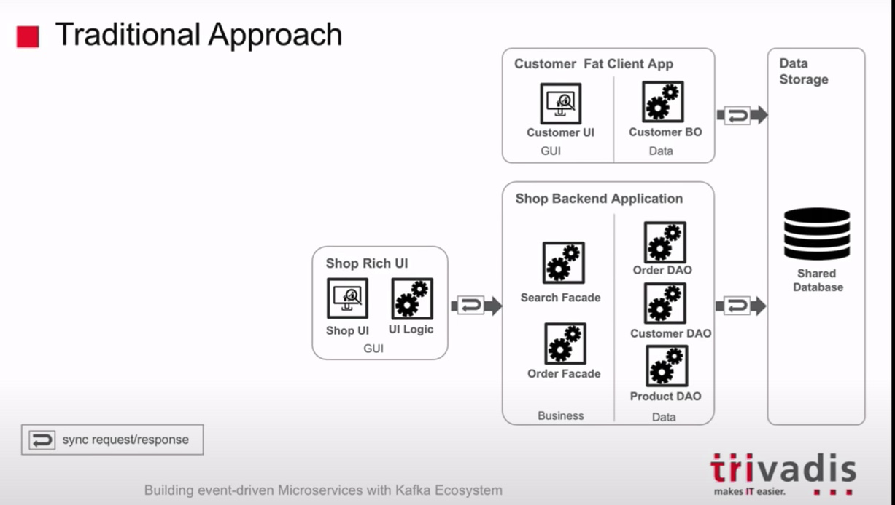
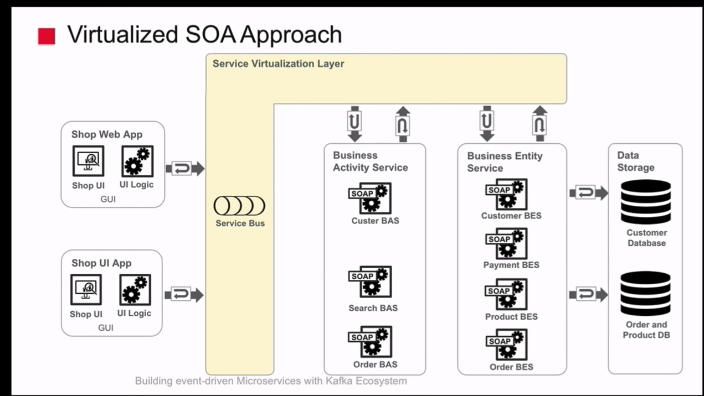
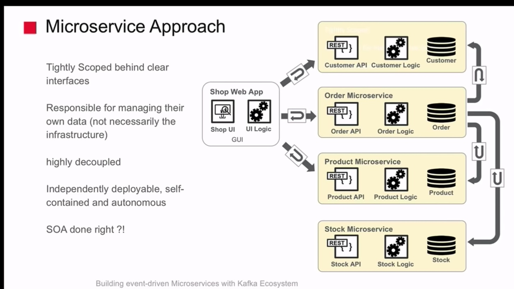
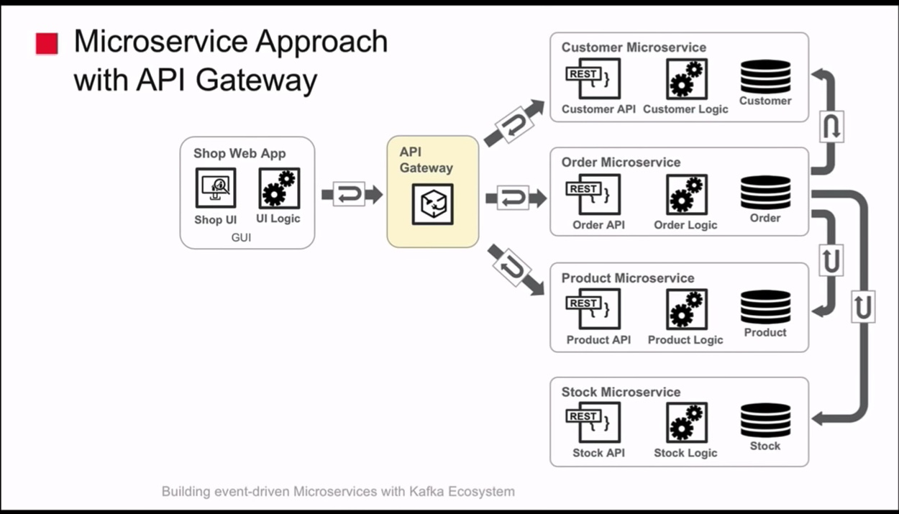
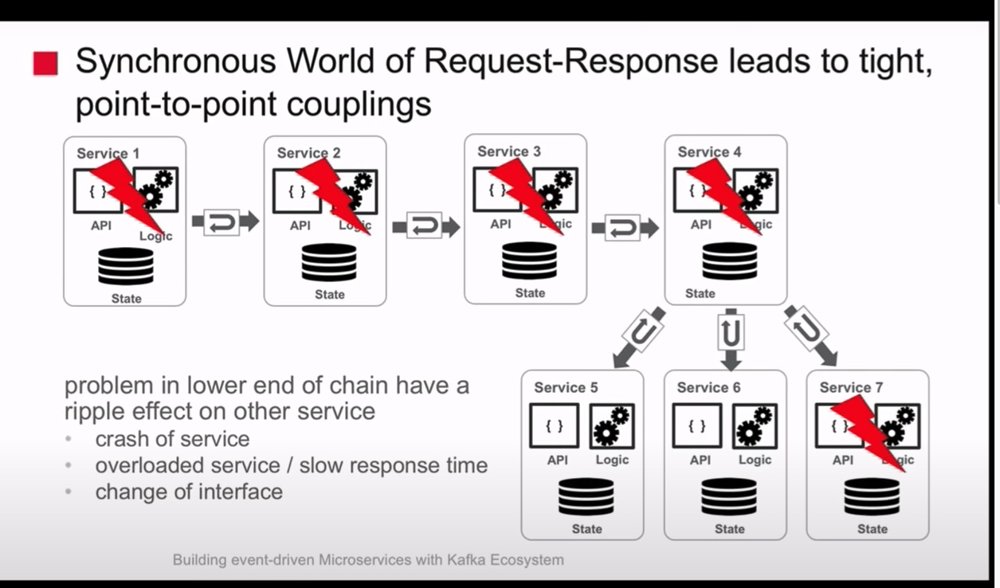
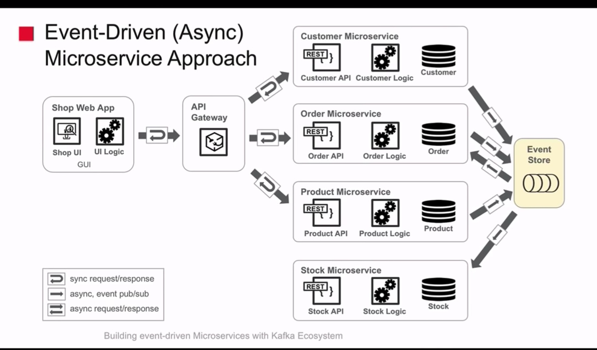
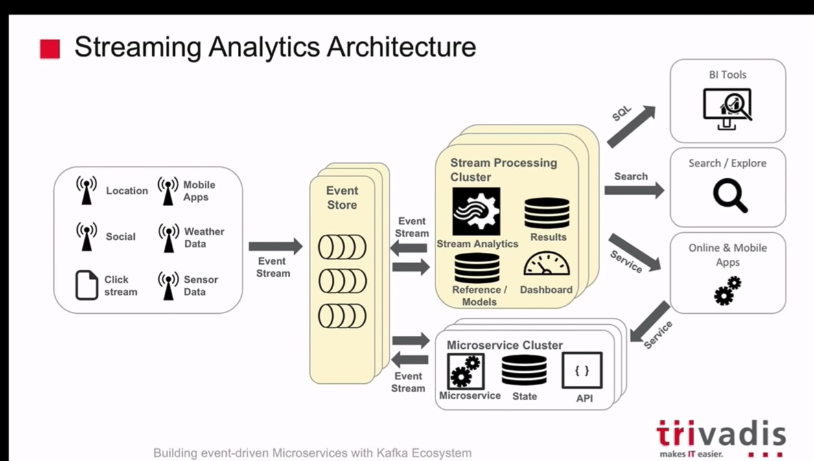
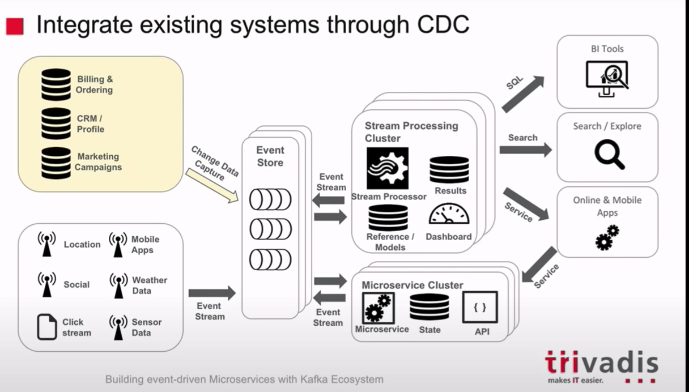

# Event Driven Microservices using Kafka

## Intro

1. History
   1. Traditional Approach (Sync request response)
   2. 
   3. SOA architecture
   4. 
   5. Virtualized SOA
   6. 
   7. Microservices
      1. Microservices (Decoupling of SOA) -> Sync
      2. 
      3. Microservice (api gateway/ virtualized SOA) -> Sync
      4. 
      5. Sync problem with failure
      6. 
2. Event-Driven
   1. Sync at front end and inter process communication is event based
   2. 
   3. Streaming analytics
   4. 
   5. Legacy system integration
   6. 
3. Pub/Sub
   1. Messaging pattern
      1. Senbder publishes message without knowing about receivers
      2. Receiver subscribes to the topic without knowing if there are any senders
   2. They have a broker to decouple
4. Distributed Event log
   1. Messages are persisted on disk
   2. Retention Policy
