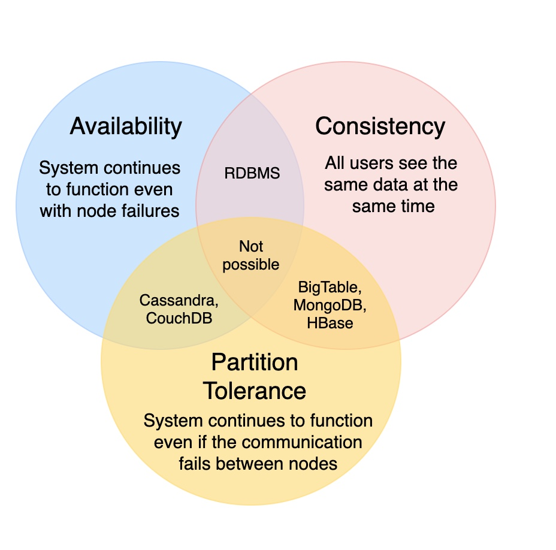

# System Design Glossary

## Key Characteristics

1. Scalability
   1. Horizontal vs. Vertical Scaling
2. Reliability
   1. reliability is the probability a system will fail in a given period.
3. Availability
   1. availability is the time a system remains operational to perform its required function in a specific period.
4. Reliability vs Availability
   1. If a system is reliable, it is available.
   2. if it is available, it is not necessarily reliable.
5. Efficiency
6. Serviceability or Manageability

## Load Balancing

1. Least Connection Method
2. Least Response Time Method
3. Least Bandwidth Method
4. Round Robin Method
5. Weighted Round Robin Method
6. IP Hash

## Caching

1. Cache Invalidation
   1. Write-through cache
   2. Write-around cache
   3. Write-back cache
2. Cache Eviction
   1. FIFO
   2. LIFO
   3. LRU
   4. MRU
   5. LFU
   6. RR

## Data Partitioning

1. Types
   1. Horizontal partitioning
   2. Vertical Partitioning
   3. Directory Based Partitioning
2. Paritioning Criteria
   1. Key or Hash-based partitioning
   2. List partitioning
   3. Round-robin partitioning
   4. Composite partitioning -> combining any of the above 2
3. Problems
   1. Joins and Denormalization
   2. Referential integrity
   3. Rebalancing

## Indexes

1. Increases read performance
2. Decreases write performance
3. Increases size of column

## Redundancy and Replication

1. Active Passive Replication
2. Active Active Replication

## SQL vs NoSQL

1. Reasons to use SQL database
   1. We need to ensure ACID compliance.
   2. Your data is structured and unchanging.
2. Reasons to use NoSQL database
   1. Storing large volumes of data that often have little to no structure.
   2. Making the most of cloud computing and storage.
   3. Rapid development

## CAP Theorem

1. 

## Consistent Hashing

1. distributed caching systems and DHTs.
2. distribute data across a cluster with minimize reorganization when nodes are added or removed
3. k/n keys need to remapped when the hashtable is resized
