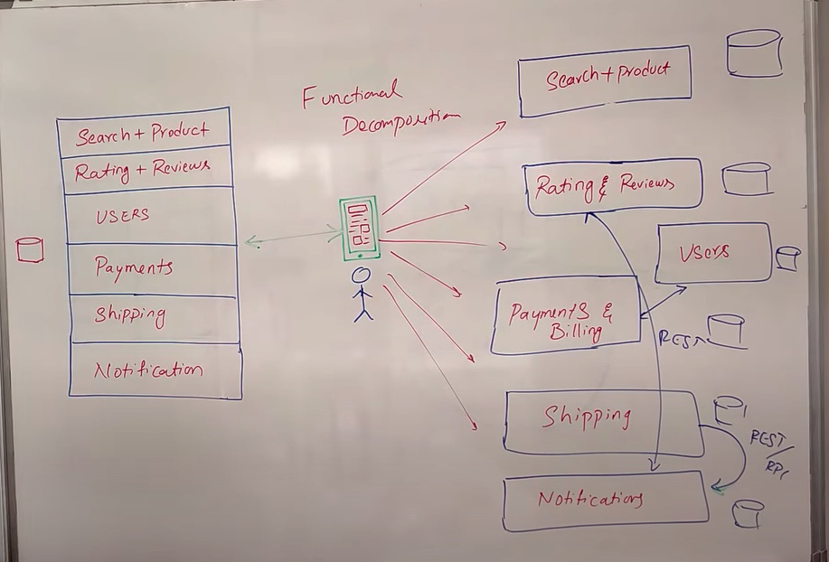
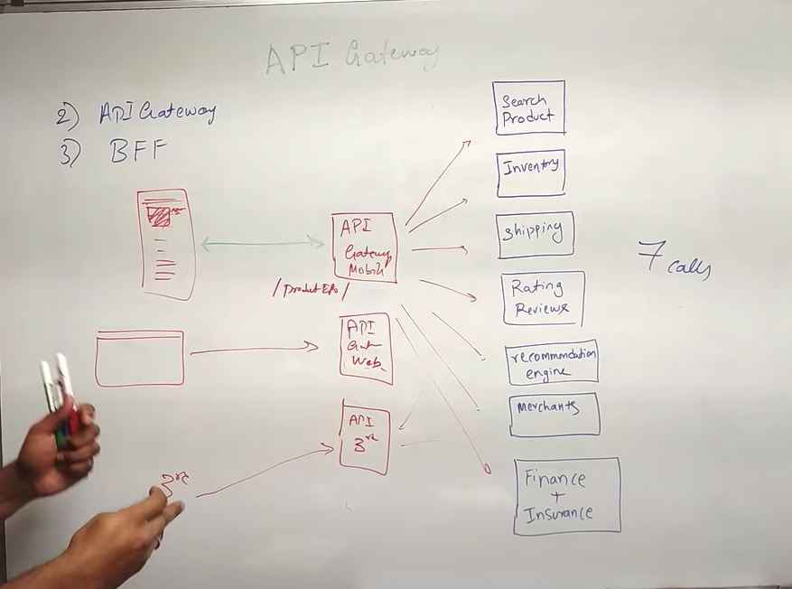
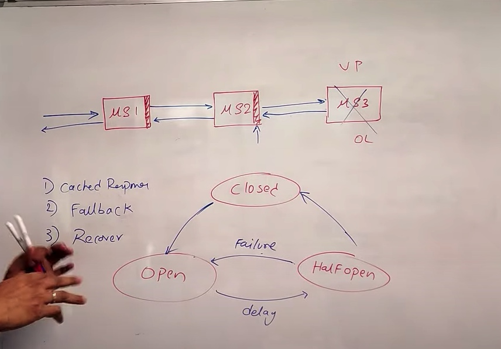
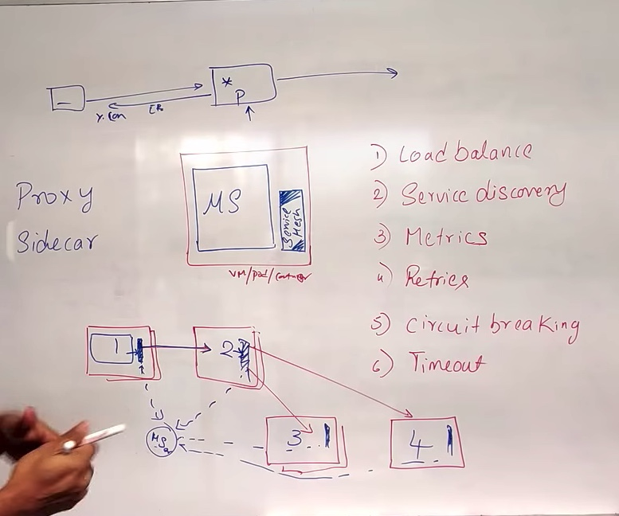

# Microservices

1. Functional Decomposition
   1. It is the process of decomposing the components into smaller components
   2. Decoupling the components
   3. 
2. API Gateway
   1. API gateway can be used for following
      1. Load balacning
      2. Authentication
      3. SSL termination
   2. 
3. Service Discovery
   1. A pattern to identify the network information of all the services that are running
   2. It makes use of service registry
   3. Service Registry
      1. A serperate service that has a db
      2. It has the list of all the instances of services
      3. Two ways to update data
         1. Self registry
            1. Services update health at time interval
         2. third party
            1. Service registry talks to each service
            2. It is updated when a server is provisioned by 3rd party
            3. It keeps on checking in time intervals
   4. Discovery
      1. Service Discovery service has endpoints and REST API to discover the services
4. Inter Service communication
   1. Two ways to do inter process communication
      1. Sync
         1. using REST/RPC
         2. It is simple
         3. Microservice have a dependency for the other service to be available
      2. Async
         1. using Message Queues
         2. Complex
         3. Additional component
5. Circuit Breaking
   1. Electrical trip in home electric supply
   2. Features
      1. Caching response
      2. Fallback mechanism to 3rd party
      3. Lets service recover
   3. 
6. Service Mesh
   1. It is a sidecar pattern and proxy pattern
   2. 
   3. It is an extension of circuit breakingg
   4. Data Plane
      1. Group of all proxies
      2. They don't know existence of other proxy services
   5. Control Plane
      1. Centralized hub to configure all proxy
