# NoSQL Databases

## Cassandra

### Distributed Data Store (Cassandra)

1. Intro
   1. Distributed datastore like cassandra and various NoSQL databases have eventual consistency
   2. They offer horizontal scalability and efficient read and write
   3. They have a cluster of nodes serving request
2. Node responsiblity in cluster
   1. They serve request
   2. They have backup of another node
3. Data partitioning
   1. The logic of storing part of data in different machines is called partitioning
4. Consisten hashing
   1. Data is stored in nodes in ring format
   2. Every NoSQL database had a partition key to store data
   3. Partition key is hashed and the resultant value is stored in node resposible
5. Replication  
   1. The data is replicated across nodes for fault tolerance based on replication factor
   2. The replication can be sequential or other stratergy
6. Rebalancing (Gossip)
   1. When I want to add new node in the cluster rebalancing happens
   2. The responsibility range is changed and shared with the nodes
   3. They gossip to understand state of each node
   4. The data is transferred to the new node
7. Node failure
   1. Gossip is not heard from the node
   2. Responsibility is shifted to the new Node
   3. New node gets data from redundant places and serves request

### Cassandra Data Modeling

1. RDMS Modelling vs Cassandra Modelling
   1. It is an application database
   2. 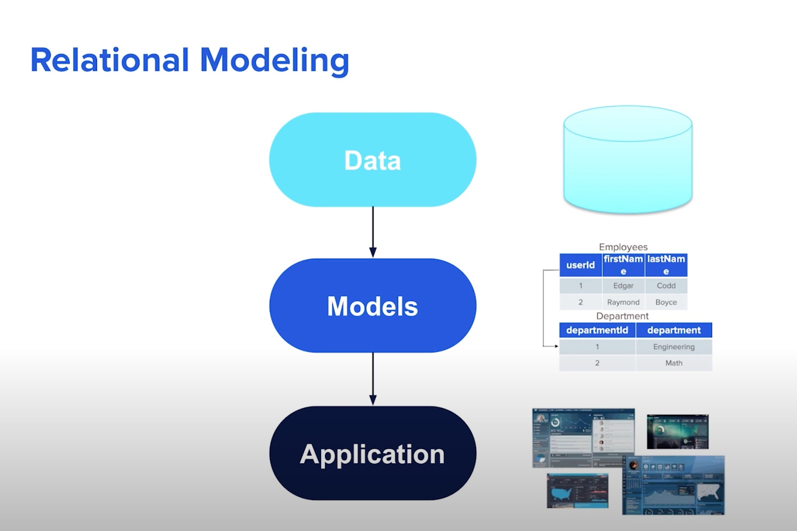
   3. 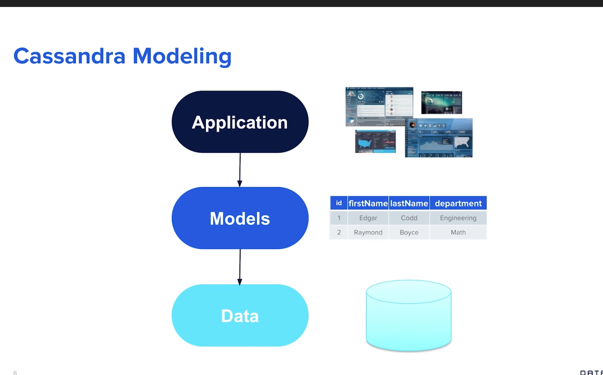
2. Optimize for reads
   1. Design to get exactly the data that we want to get out
3. Data Model
   1. 
   2. Every row has a primary key made up of
      1. Partition Key (Required)
         1. this is what is used to partition data into different nodes in cluster
      2. Clustering Column (Optional)
         1. This is used to sort the data in the partition
         2. Uniquely identifies each row
   3. 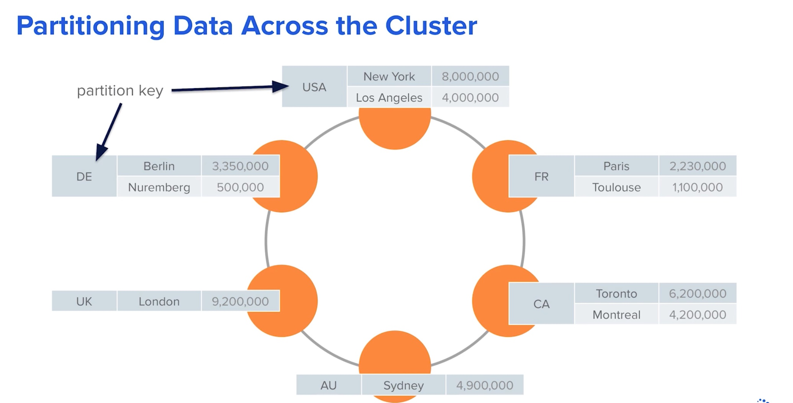
4. Dont Normalize!
   1. Try to follow store/retrieve data as such
   2. Allow redundancy
5. What if I normalize?
   1. Join at client
   2. Denormalize
6. Features
   1. Custom data types
   2. Collections as data type

## Kafka

1. Reliable and high throughput platforms for
   1. Real-Time Data Streams
   2. Data Pipelines
   3. Single place for storing and distributing events
2. Can be used to do
   1. ETL
   2. CDC
   3. Big data injest system
3. Architecture
   1. Producer publish message to a topic
   2. Topic is split into partitions for redundancy and scaling
   3. 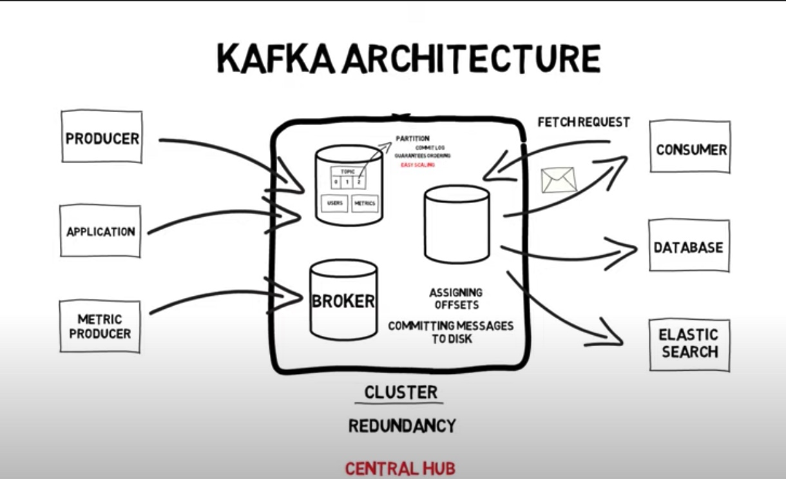
4. Message
   1. Single unit of data
   2. It is just a byte array
   3. Optional Key
      1. To choose partition (ordering is guaranteed within partitions)
      2. This key can be used to make sure the producer's data are ordered
5. Batches
   1. A collection of message produced for the same topic and partition
   2. Tradeoff between latency and throughput
   3. Batches can be compressed
6. Schema
   1. JSON
   2. XML
   3. PROTOBUF
7. Ordering
   1. Ordering is guaranteed for a topic only when there is single partition
   2. Ordering is guaranteed inside a partition
8. Partition
   1. Each partition can be hosted on a different server
   2. Provides horizontal scaling
9. Clients
   1. Producers will keep on producing data and pushing into topic and partition
   2. Each parition will have different offset
   3. Each consumer will have it's offset which it can sync in kafka or zookeeper
   4. 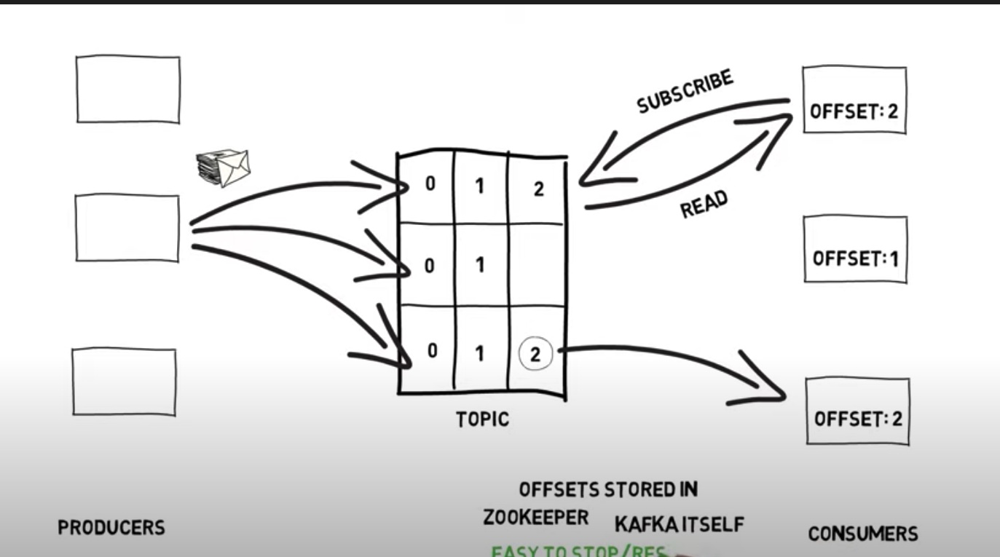
10. Consumer Group
    1. Consumer Groups are used to make sure consumers in same group don't do double read
    2. Each node in a consumer group will process in different partition
    3. 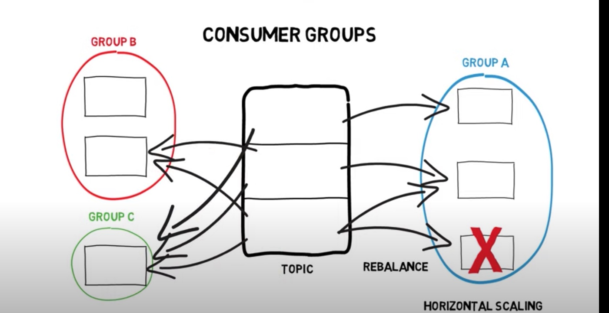
11. Brokers
    1. Each broker is capable of handling millions of request
    2. Cluster controller is a broker that assigns partitioning amd monitoring
    3. Each partition has a partition leader
    4. Every operation is done on the partition leader
    5. Partition is replicated in other brokers for redundancy
    6. 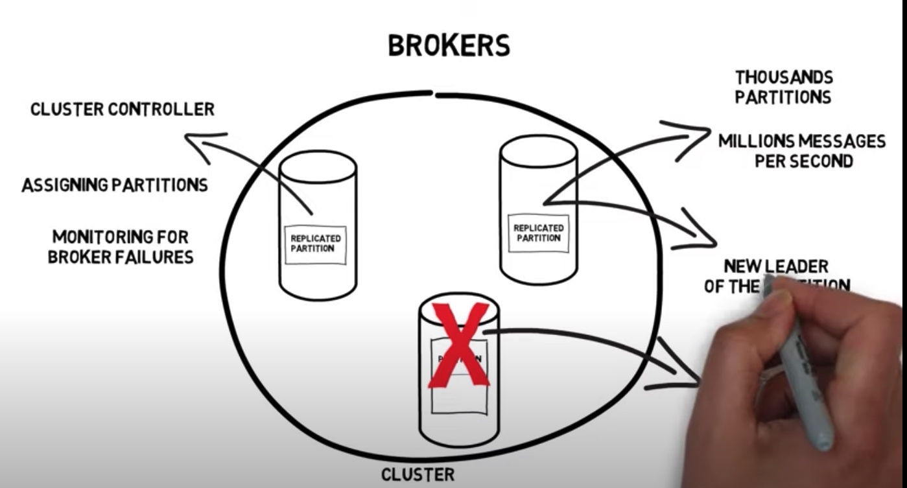
12. Retention
    1. Time
       1. 7 days default
       2. configarable
    2. Size
       1. 1GB
       2. configurable
13. Reliability Guarantees
    1. No Exactly-Once Semantics
    2. Ordering in partition based on offset
    3. Committed and replicated messages are only read by the consumers
    4. 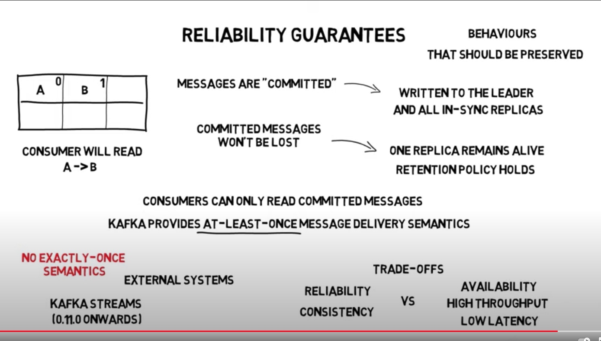
14. Pros
    1. Tackles integration complexity
    2. ETL/CDC
    3. Big data ingestion
    4. High Throughput
    5. Disk based retention
    6. Multiple producers/ consumers
    7. Highly Scalable
    8. Fault tolerant
    9. Fairly Low-Latency
    10. Highly Configurable
    11. Provides Backpressure
15. Cons
    1. less efficeint Real low-latency systems

## TimescaleDB

1. Time series database
   1. It has append heavy work loads
   2. Lot of writes per second
   3. Partition is done on time
2. TimescaleDB
   1. built on top of postgres
   2. automatic partitioning within seconds
   3. 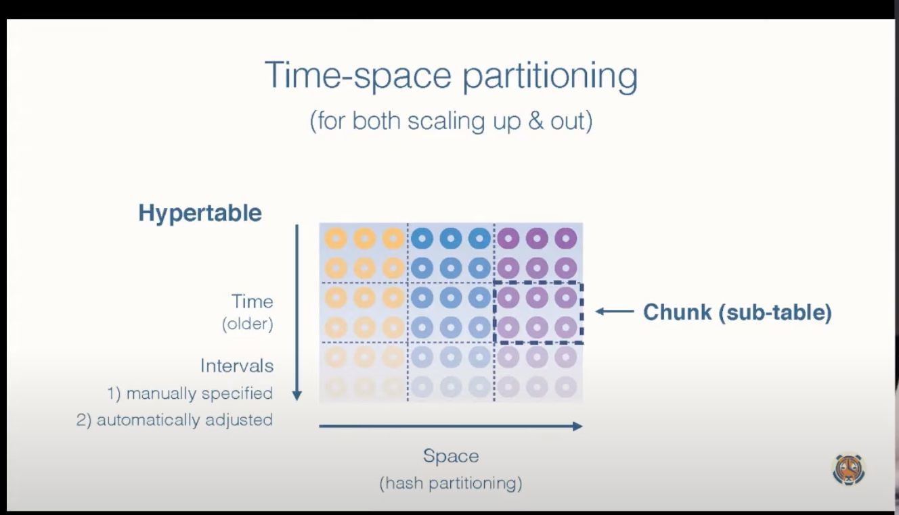
   4. 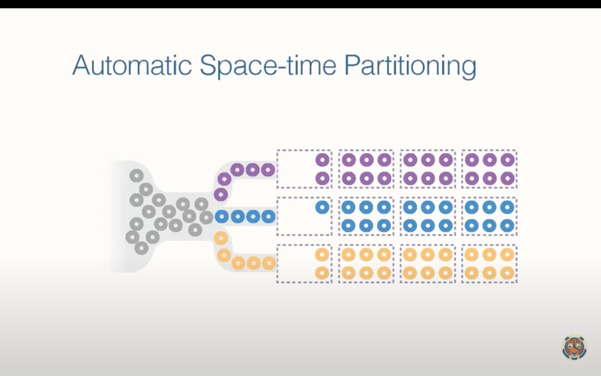
3. Chunking
   1. It is easy to delete
   2. It is easy to index inside chunks
   3. Scale with disks
   4. 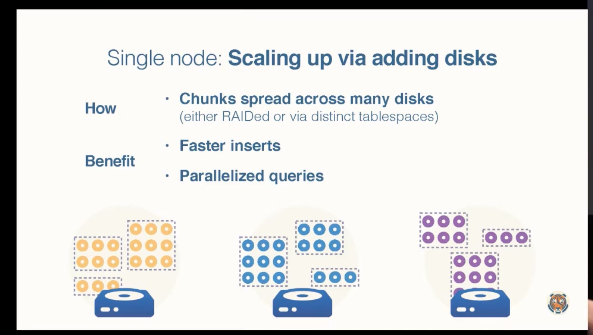
   5. Parallel queries
   6. Distributed nodes
   7. 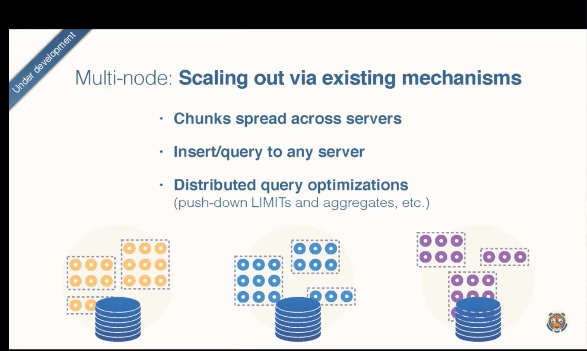

## Elasticsearch

1. What?
   1. Full distributed
   2. Analytics engine
   3. Full text search
   4. Inverted indices
   5. RESTful
   6. Real-time
2. 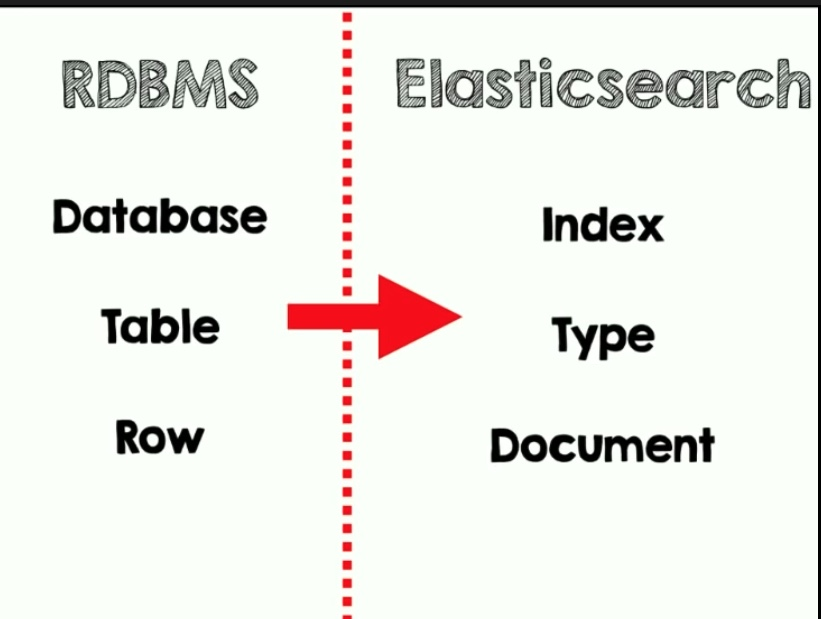
3. It guesses schema automatically
4. We can do Explicit mapping
