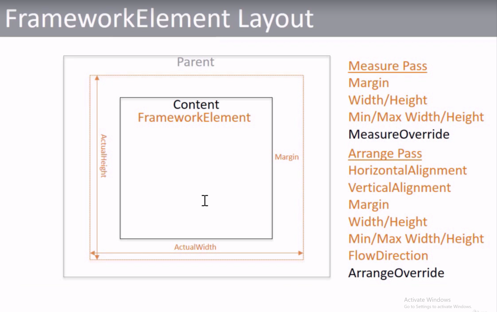

# Udemy course notes on UWP

## Section 1 (UI)

### Displaying Contents

1. TextBlock
    1. FontSize
    2. FontFamily
    3. FontStyle
    4. FontWeight
    5. ForeGround
    6. Wrapping
    7. Content
        1. Each Span can have different attributes
        2. Each run can also have difference properties
        3. Heperlink can also be used
    8. Uid (Localization)
        1. This id is used to reference in resw file
        2. Windows.Globalization.applicationLanguage is used to set the applciation language for testing
        3. Create folders for languages like en-ES,en-US etc and it will be automatically selected 
        4. **MultiLingual app toolkit**
    9. FlowDirection
2. Image
    1. Source
        1. deault is ms-appx://
        2. can reference assests in other projects as well
    2. Streatch
        1. UniformToFill (no aspect ratio changes and  fill)
        2. Fill (aspect ratio changes and fill)
        3. Content
            1. Image.Source
                1. BitmapImage
                    1. UriSource (can use URL too)
                    2. DecodePixelWidth
                    3. DecodePixelHeight
        4. Supported Image Formats
            1. PNG
            2. BMP
            3. GIF
            4. TIFF
            5. JPEG
            6. ICO
3. MediaElement
    1. Source (Same as for Image)
4. Scaling
    1. picname.scale-100.png
    2. Runtime will take the nearest scale image
5. Shapes
    1. Rectangle
    2. Ellipse
    3. Line
    4. Path
    5. Polygon
    6. Polyling
6. Rectangle
    1. Fill
    2. RadiusX and RadiusY
    3. Stroke (Color)
    4. Stroke Thickness
    5. StrokeDashArray
    6. StrokeDashCap
7. Icons
    1. SymbolIcon
        1. Symbol (Soegoe ML2 icons with name)
        2. Foreground
    2. FontIcon
        1. FontFamily
        2. Glyph (The code)
    3. PathIcon (Vector)
        1. Data (Contains the path)
    4. BitmapIcon
        1. UriSource
        2. Used to convert an iamge to icon

### Layouts

1. VerticalAlignment and HorizontalAlignment
    1. Stretch
    2. Center
    3. Bottom
    4. Top
    5. Left
    6. Right
2. Height, Width, Max and Min Height and Width
    1. 2 values (Left and right)
    2. 4 values (left, top, right and bottom)
3. Measure and Arrange pass
    1. 

### Panels

1. Border
   1. BorderBrush
   2. BorderThickness
   3. CornerRadius
2. Panels
   1. These use a list of UIElements
   2. These are used to arrange the elements in screen
   3. The following are various panels
        1. StackPanel
           1. Orientation
        2. Grid
           1. Grid.RowDefinitions
           2. Grid.ColumnDefinitions
           3. * -> fill and ratio
           4. Auto -> depend on child
        3. Canvas
           1. Width and height mandotary
           2. ZIndex For Depth
           3. Left -> left value distance
           4. Top -> right value distance
           5. Effective pixel layout
3. RoutedEventHandler
   1. These events can be forwarded and can be stopped by handled boolean.
   2. These events are bubbled through the various elements

### User interactive controls

1. Render and interaction are 2 types of UIElement properties
2. RenderTransform (Rendering)
   1. TransformGroup
      1. Contains a group of transforms which will be applied to the UIElement
   2. RotateTransform
   3. TranslateTransform
3. Interactivity
   1. mouse click ,touch all will be pointer
   2. IsHitTestVisible to ignore pointer click
   3. ManipulationMode
      1. Rotate
      2. All
      3. Scale
   4. All these are routed event handlers
   5. Various UIElement Routed Events are
      1. DoubleTappedEvent
      2. DragEnterEvent
      3. DragLeaveEvent
      4. DragOverEvent
      5. HoldingEvent
      6. KeyDownEvent
      7. KeyUpEvent
      8. ManipulationCompleteEvent
      9. ManipulationDeltaEvent
      10. ManipulationInertiaStartingEvent
      11. ManipulationStartedEvent
      12. ManipulationStartingEvent
      13. PointerCanceledEvent
      14. PointerCaptureLostEvent
      15. PointerEnteredEvent
      16. PointerExitedEvent
      17. PointerMovedEvent
      18. PointerPressedEvent
      19. PointerReleasedEvent
      20. PointerWheelChangedEvent
      21. RightTappedEvent
      22. TappedEvent
   6. Control Class has TabIndex and IsTabStop
   7. Button ClickMode -> release Hover etc
   8. TextBox has text selection and event handling

### Styling

1. All the FrameWork Elements have resources
2. Resources can be declared within FrameworkElements, Application or separate ResourceDictionary file
3. For merging with separate file ResourceDictionary use <ResourceDictionary.MergeDictionaries>
4. The order of cascade is as follows external -> app -> page -> panel -> Inline
5. Style can be used to apply a number of resources at once but we must provide **TargetType**
6. We should use Setter tags for applying styles and we wil lget intellisense for the TargetType
7. Inheritance in Style can be done by using BasedOn
8. If we dont provide a key then we will apply it to all TargetType elements
9. Animated -> local value -> templated properties -> Style Setters -> Default values
10. All these works with the magic of dependancy properties

### Animations

1. Animation Types
   1. ColorAnimation (or) ColorAnimationUsingKeyFrames
   2. DoubleAnimation (or) DoubleAnimationUsingKeyFrames
   3. ObjectAnimationUsingKeyFrames
   4. PointAnimation (or) PointAnimationUsingKeyFrames
2. Animation is done with StoryBoard
3. Various animation attributes are 
   1. Duration
   2. From
   3. To
   4. AutoReverse
   5. BeginTime
4. ColorAnimationUsingKeyFrame animations can have the following
   1. DiscreteColorKeyFrame
   2. LinearColorKeyFrame
   3. EasingColorKeyFrame
      1. BackEase
      2. BounceEase
      3. CircleEase
      4. Cubicease
      5. ElasticEase
      6. ExponentialEase
      7. PowerEase
      8. QuadraticEase
      9. QunticEase
      10. QuarticEase
      11. SineEase
   4. All these can have EaseIn and EaseOut
5. StoryBoard can also be moved to Resources

### Advanced cotrol

1. CommandBar
   1. AppBarButton
   2. AppBarToggleButton
   3. AppBarSeparator
   4. Content
   5. Minimal
   6. SecondaryCommands
2. It can also be placed in Page.Bottom
3. WebView
   1. Source
   2. Can render Html as String or file
4. Maps
   1. Add namespace Windows.UI.Xaml.Controls.Maps
   2. Other Zooming Moving and Icon Stuff

### Sample App UI

