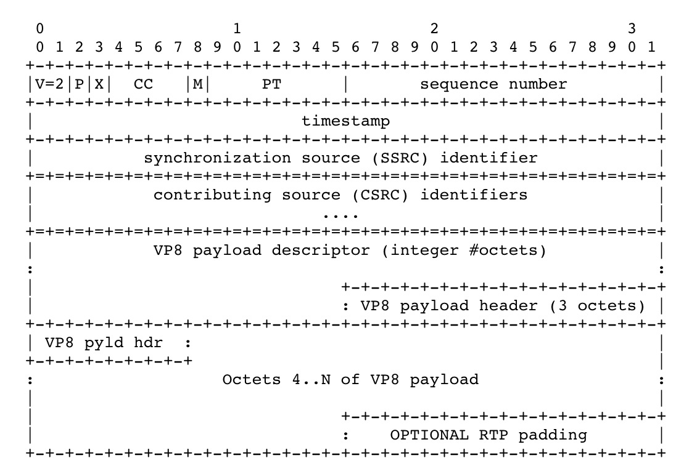

# RTP payload format for VP8

## Intro

1. Based on decomposition of frames into square sub-blocks of pixels - **"macroblocks"**.
1. Prediction of macroblocks using previously constructed blocks and adjusting such predictions is done using **Discrete Consine Transform(DCT)**
1. One special case it uses **"Walsh-Hadamard" (WHT)** instead of DCT
1. First partition contains prediction mode parameters and motion vectors for all macroblocks
1. Remaining partitions contain quantized DCT/WHT coefficients for the residuals.
1. There can be 1,2,4 or 8 DCT/WHT partitions per frame.
1. Key features of VP8 that are supported in rtp
    1. Taking partition boundaries into consideration, to improve loss robustness and facilitate efficient packet loss concealment
    1. Temporal scalability
    1. Advanced use of reference frames to enable efficient error recovery
    1. **Marking of frames that have no impact on the decoding of any other frame, so that these non-reference frames can be discarded in a server.**

## Conventions, Definitions and Acronyms

1. Key frames
    1. Frames that are decoded without reference to any other frame in a sequence. Alias - **Interframes or I-frames**
1. Interframes
    1. Frames that are encoded with reference to prior frames, specifically all prior frames up to and including most recent key frame. Alias - **prediction frames and P-frames**
1. Golden and alterf frames
    1. alternate prediction frames. Blocks in an interframe may be predicted using blocks in the immediately previous frame as well as the most recent golden frame or altref frame. Every key frame is automatically golden and altref.
1. Macroblock
    1. A square array of pixels whose Y (luminance) dimentions are 16x16 pixels and whose U anv V (chrominance) dimentions are 8x8 pixels.
1. RPSI
    1. Reference picture selection index. A feedback message to let the encoder know that the decoder has correctly decoded a certain frame
1. SLI
    1. Slice loss indication. A feedback message to let a decoder inform an encoder that it has detected the los or corruption of one or several macroblocks(s)

## Media Format Description

1. 3 different frames used for interframe prediction
    1. Previous frame
    1. Most recent Golden frame
    1. Most recent altref frame
1. Every key frame is a golden frame and altref frame
1. To increase tolerance to dropped frames - Golden frames and altref frames must be used more
1. Temporal scalability
1. Data partitioning
    1. An encoded VP8 frame can be divided into two or more partitions
    1. The first partition
        1. (prediction or mode) contains prediction mode parameters and motion vectors for all macroblocks
        1. Can be decoded without remaining residual partitions
    1. The remaining partitions all contain transform coefficients for the residuals.
    1. Transmission types
        1. Each partition in one seperate packet
        1. One single stream without considering partition boundaries, decoder can use the length info in first partition to identify paritions
    1. Fields
        1. PID - Partition ID
        1. 1st partition size
        1. PictureID
        1. TL0PICIDX
        1. TID

## Payload Format

1. General RTP payload format
    1. 
1. The pic shows the format for first packet in frame and other packets can optionally not have the VP8 payload header
1. Explanation
    1. Padding (P) -> if set optional rtp padding can be included and if not set it must not be included
    1. Marker bit (M) -> Must be set for very last packet of each encoded frame
    1. Payload type (PT) -> type
    1. Timstamp -> the time when the frame was sampled
    1. Sequence number -> seq number
1. VP8 payload Descriptor
    1. First octet after RTP header
    1. 
    1. Explanation
        1. X -> Extended control bit, when 1, the extension octet must be provided immediately after the mandatory first octet.
        1. R -> Bit reversed for future
        1. N -> Non-reference frame which can be deleted
        1. S -> Start of VP8 partition for each frame
        1. PartID -> Partition Index <= 8