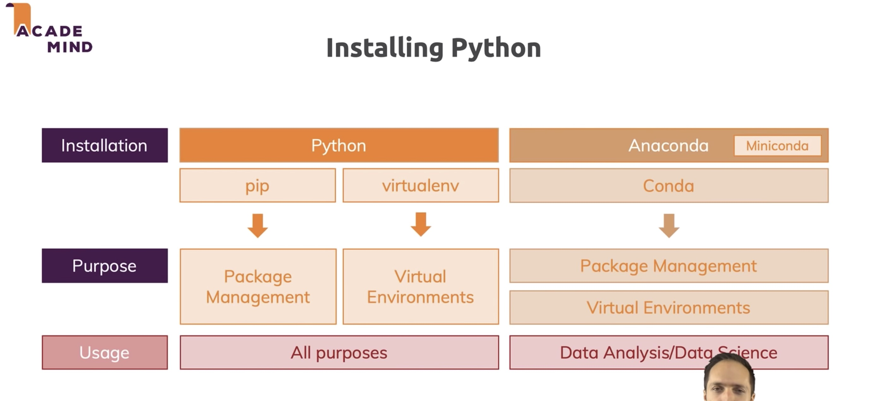

# Creating and managing virual environments with conda

1. Basic Commands
    1. conda **info** -> Verify conda is installed, check version number
    1. conda **update conda** -> Update conda to the current version
    1. conda **install** PACKAGENAME -> Install a package included in Anaconda
    1. **spyder** -> Run a package after install, example Spyder*
    1. conda **update** PACKAGENAME -> Update any installed program
    1. COMMANDNAME **--help** -> Command line help

1. Using environments
    1. conda **create --name** py35 **python**=3.5  -> Create a new environment named py35, install Python 3.5
    1. **source activate** py35 -> Activate the new environment to use it (MacOS), **activate** py35 -> Activate the new environment to use it (Windows)
    1. conda **env list** -> Get a list of all my environments, active
environment is shown with *.
    1. conda create **--clone** py35 **--name py35-2** -> Make exact copy of an environment
    1. conda list -> List all packages and versions installed in active environment
    1. conda list **--revisions** -> List the history of each change to the current environment
    1. conda install **--revision** 2 -> Restore environment to a previous revision
    1. conda list **--explicit** > bio-env.txt -> Save environment to a text file
    1. conda env **remove** --name bio-env -> Delete an environment and everything in it
    1. source **deactivate** ->  Deactivate the current environment
    1. conda env create --file bio-env.txt  -> Create environment from a text file
    1. conda create --name bio-env biopython -> **Stack commands**: create a new environment, name it bio-env and install the biopython package.

1. Finding conda packages
    1. conda **search** PACKAGENAME -> Use conda to search for a package
    1. **jupyter-notebook** -> Run an installed package (Jupyter Notebook)
    1. conda install **--name bio-env** toolz -> Install a new package (toolz) in a different environment (bio-env).
    1. conda **update** scikit-learn -> Update a package in the current environment
    1. conda install **--channel conda-forge** boltons -> Install a package (boltons) from a specific channel
    1. **pip** install boltons ->Install a package directly from PyPI into the current active environment using pip
    1. conda remove **--name bio-env** toolz boltons -> Remove one or more packages (toolz, boltons) from a specific environment (bio-env)

1. Managing multiple versions of Python
    1. conda create --name py34 **python=3.4** -> Install different version of Python in a new environment named py34
    1. source activate py34 -> **Switch** to the new environment that has
a different version of Python
    1. **which** -a python -> Show the locations of all versions of Python that are currently in the path
    1. python --version -> Show version information for the current active Python

1. Specifying version numbers
    1. Fuzzy numpy=1.11 1.11.0, 1.11.1, 1.11.2, 1.11.18 etc.
    1. Exact numpy==1.11 1.11.0
    1. Greater than or equal to "numpy>=1.11" 1.11.0 or higher
    1. OR "numpy=1.11.1|1.11.3" 1.11.1, 1.11.3
    1. AND "numpy>=1.8,<2" 1.8, 1.9, not 2.0
